# concept model: Person Domain, Concept Model

> ## Version: Person Domain, Concept Model V1 02/06/2026
>
> *Created: 2 June 2026*
>

Person Concept Domain Model V1.&#x20;

Model ID: DEPoP012.&#x20;

Published as part of the Person Data Standard (Alpha), PRG202602.

An individual human who participates in business activities or interactions. The Person concept represents the identity of a human being independent of the roles they may perform, the relationships they may have, or the contexts in which they act.

The Department for Science, Innovation and Technology

The entire Model is also viewable on [Digital Service Designer](https://www.digitalservicedesigner.com/dsdpublish/deg-person-concept-model/version-1/).

## Index

### Concepts

| Concept | Description |
|---------|-------------|
| [Biological Attributes](#69945ad7f751de507ccc3db5) | Inherent physical, physiological, or genetic characteristics of a Natural Person that arise from biology rather than social, cultural, or legal identity.&#x20; Biological Attributes describe intrinsic properties of the human body and are distinct from personal identity attributes (e.g., name), demographic identity (e.g., ethnicity), or legal identity (e.g., citizenship). |
| [Biometric Identifiers](#69987964f751de507ccfcab4) | Biometric Identifiers are data elements that capture a person’s unique biological or behavioural traits for the purpose of identification, authentication, or verification. This includes raw biometric measurements (e.g., fingerprints), biometric templates derived from those measurements, and any metadata required to process or match them. |
| [Birth](#699878a9f751de507ccf966e) | Birth covers data elements that record the circumstances of an individual’s birth. It includes factual, verifiable attributes such as date, place, and conditions of birth, along with any official registration details issued by an authority. |
| [Citizenship](#69945984f751de507ccc2ced) | A person’s legal relationship with a state, which grants rights, protections, and obligations under that state’s laws. In a conceptual model, Citizenship is a legal‑status attribute of a Natural Person that identifies the country or sovereign entity recognising them as a citizen. |
| [Civil Social Titles](#699878dff751de507ccfa7ab) | Civil Social Titles are non‑professional, non‑noble honorifics used in everyday civil contexts to address or refer to individuals (e.g., Mr, Mrs, Miss, Ms, Mx). They facilitate respectful forms of address, correspondence, and identity presentation but do not indicate rank, role, or qualification. |
| [Date of Birth](#69fb66b0ea1f7a349307cbcf) | Date of Birth (DOB) is the official calendar date on which an individual was born, as recognised by the appropriate civil authority or as evidenced by legally accepted documentation. It is a core identity anchor, used across legal, administrative, operational, and analytical systems, and is typically immutable once verified. DOB is distinct from the Birth Registration Date (administrative) and the Birth Notification Date (clinical/operational). It may be an estimate.&#x20; |
| [Death](#699878b6f751de507ccf9c28) | The factual, legally recognised details surrounding the end of an individual’s life. It includes authoritative attributes such as the date, time, and location of death, as well as official registration information issued by a competent authority. This event provides a definitive closure point for identity records and downstream operational processes. |
| [Ethnicity (Cultural identify)](#69945a48f751de507ccc3159) | Ethnicity is a cultural identity concept that reflects a person’s connection to a group or community defined by shared heritage, ancestry, traditions, culture, language, and/or social experience. It describes how people identify culturally, socially, or historically, not their legal status or nationality. In a conceptual model, Ethnicity is a self‑identified, culturally grounded attribute of a Natural Person and is separate from Nationality (cultural/national belonging) and Citizenship (legal status). |
| [Formal Name](#69987879f751de507ccf8939) | Formal Name represents the official, legally recognised version of an individual’s name, as recorded by an authoritative source such as a civil registry, passport, birth certificate, or government-issued identity document. It is the canonical name used in contexts requiring legal identity, compliance, or formal verification. |
| [Formally Recognised Citizenship](#69987a14f751de507ccfe26e) | Formally Recognised Citizenship captures a person’s legally conferred nationality status as recognised by a sovereign state or authority. It reflects official citizenship(s) in force, with provenance to authoritative sources (e.g., passport, national identity registry, certificate of naturalisation). |
| [Full Name](#69a49213f751de507cd52799) | Full Name represents a combined or displayable expression of a person’s name. It may be formed from formal name components, informal name components, or both, depending on context. In some cases, Full Name may reflect the authoritative identity as it is presented or used. However, it is not the authoritative structured identity record and must not replace Formal Name or Informal Name in the underlying model |
| [Genetic Ethnicity](#69945a9ff751de507ccc35ed) | A scientific estimate of a person’s ancestral origins based on the analysis of their DNA. It represents inferred biological population groups, expressed as probabilities or percentages, and reflects patterns of genetic similarity shared with reference populations. It does not represent cultural identity, heritage, nationality, or citizenship—it is a biologically inferred attribute, not a social or legal one. |
| [Identifiers](#69945b19f751de507ccc4842) | Unique references that distinguish one Natural Person from all others within a given context, system, or jurisdiction. They are assigned by an authority (e.g., a government, organisation, or system) for the purpose of uniquely recognising, managing, or relating to that person across processes and datasets. Identifiers are not the person, and they are not personal attributes (like name, gender, or date of birth). They are tokens that point to the person. |
| [Informal Name](#6998788df751de507ccf90b9) | The Informal Name sub‑domain captures non‑legal, non‑official name forms that an individual uses in everyday social, cultural, or operational contexts. These names support familiarity, personal preference, and communication ease but hold no legal standing and should not be used for identity verification or regulatory decisioning. It may be used as formal name, informal name, or family name. It can be a shortened version of the formal given name or middle name, or family name.&#x20; |
| [Military Titles](#69987904f751de507ccfb34a) | Military Titles represent the official ranks, grades, and honorific forms of address assigned to individuals within armed forces or uniformed services (e.g., Lieutenant, Captain, Colonel). These titles indicate hierarchical position, authority, and command responsibility. They are role‑based, not personal, and may change throughout a career. |
| [Name](#69945770f751de507ccc13f5) | A textual identifier used to refer to or represent a Natural Person, Organisation, Place, or other entity. In conceptual modelling, a Name describes how something is known or addressed, not what it is. Names may consist of multiple components, may vary by context, and may change over time. |
| [Nationality](#69945875f751de507ccc2095) | A person’s formal affiliation to a nation or cultural identity, typically associated with the country or nation with which they identify or are recognised as belonging. In a conceptual model, Nationality represents a descriptive, identity‑based attribute of a Natural Person that may be based on heritage, birth, culture, or personal identification. |
| [Person](#69945d25f751de507ccc6be5) | An individual human who participates in business activities or interactions. The Person concept represents the identity of a human being independent of the roles they may perform, the relationships they may have, or the contexts in which they act. |
| [Person Event](#699457cbf751de507ccc19df) | An occurrence or change in circumstance that happens to a specific Natural Person at a point in time (or over a period of time) and is relevant to business processes, reporting, or understanding that person’s history. It captures something that happens to or is experienced by the person, rather than a role or relationship they hold. |
| [Personal Identifiers](#699d8376f751de507cd19d27) | Personal Identifier IDs are unique identifiers assigned to a person by an authority or system for identification, linkage, or entitlement. This domain includes government‑issued IDs (e.g., national IDs), organisational master IDs, and cross‑system surrogate keys used to unambiguously reference a person across processes and systems. |
| [Physical Characteristics](#6998794cf751de507ccfc4d2) | Physical Characteristics refers to observable, measurable, and non‑biometric biological traits of an individual. These features describe physical form or appearance but do not uniquely identify a person on their own. The sub‑domain includes raw descriptive attributes and standardised measurements recorded for classification, profiling, or operational purposes. |
| [Physiological Information](#69987985f751de507ccfd09b) | Physiological Information in the Person domain represents non‑clinical, non‑diagnostic information about an individual’s biological and bodily functions. This includes measurable or observable physiological attributes that describe how the body operates (for example blood type, genetic traits, or organ donor status), rather than cognitive, emotional, or behavioural characteristics. These attributes are descriptive and operational in nature and do not, by themselves, uniquely identify a person |
| [Post-Nominal Titles](#69987929f751de507ccfbef5) | Post‑Nominal Titles are letters placed after a person’s name that denote orders, decorations, honours, academic degrees, professional memberships, licensure, or fellowships (e.g., OBE, PhD, FRCS, CPA). They confer recognition or qualification, not forms of address, and are typically governed by awarding bodies with formal usage rules. |
| [Pregnancy](#699878c6f751de507ccfa1e7) | Pregnancy is a time‑bound life event that records the fact that an individual is pregnant, including the start, expected milestones, and outcome of the pregnancy where relevant for operational, safeguarding, or service‑eligibility purposes. It captures non‑clinical, administrative facts only—not medical diagnoses, treatment notes, or clinical assessments. |
| [Professional Occupational Titles](#699878f5f751de507ccfad7c) | Professional Occupational Titles are titles or prefixes associated with a person’s profession, occupation, or accredited role, used to indicate an individual’s professional standing, qualification, or occupational function. They are not academic degrees or post‑nominals, but pre‑nominal markers tied to recognised professions (e.g., Dr, Prof, Eng, Nurse, Architect). These titles support appropriate address, professional recognition, and role‑based communication. |
| [Psychological Characteristics](#699879def751de507ccfd687) | Psychological Characteristics refer to non‑clinical, non‑diagnostic attributes that describe an individual’s typical cognitive, emotional, and behavioural tendencies. These characteristics represent stable patterns of thinking and behaviour, not mental health conditions, and do not uniquely identify a person. They may include personality traits, cognitive style descriptors, and general behavioural dispositions. |
| [Religious Titles](#69987917f751de507ccfb91d) | Religious Titles are formal honorifics, ranks, or styles of address associated with roles, positions, or consecrated statuses within recognised religious traditions (e.g., Reverend, Rabbi, Imam, Sister, Monsignor, Guru). These titles indicate spiritual authority, clerical office, or religious vocation, and are used in formal or community contexts to show respect and denote role-based standing. |
| [Residence](#69b2a1bcc3a89f06e1a0948e) | A time‑bounded assertion that a Person resides at a Location with a specified Residence. Includes legal/primary residence, secondary residences, historical changes, validation against jurisdictional reference data. Excludes temporary contact addresses, delivery addresses, lodging/travel events, property ownership details (unless used to evidence residence). |
| [Residence Handling](#69b2a480c3a89f06e1a0a2cf) | Residence Handling refers to the governed rules, behaviours, and constraints that define how residency data may be collected, processed, stored, shared, updated, retained, secured, and used within a data domain. |
| [Residence Status](#69b2a417c3a89f06e1a0a195) | Residence Type specifies the role, purpose, and legal/operational meaning of a residency relationship between a place or property and a person. |
| [Residence Verification](#69b2a451c3a89f06e1a0a231) | Residence Verification describes the degree of confidence, method, and evidence supporting the assertion that a Party (Person or Legal Entity) resides at a given Location. |
| [Residence identification](#69b2a3e0c3a89f06e1a0a0fb) | Residence Identification refers uniquely and consistently identify, reference, and distinguish one residence fact from another within a Party domain. |
| [Self-Identified Nationality](#69987a29f751de507ccfe869) | Self‑Identified Nationality represents how an individual personally defines or expresses their own national identity, independent of citizenship, passport, or legal status. It reflects cultural affiliation, heritage, or personal identification, and is self‑reported, non‑authoritative, and used solely for demographic, engagement, or inclusion‑related purposes. This attribute does not confer any legal rights or obligations. |
| [Sex and Gender](#699879eff751de507ccfdc78) | The Sex and Gender sub‑domain covers data elements that describe an individual’s biological sex characteristics and gender identity attributes for the purposes of identity management, demographic classification, and service personalisation. It differentiates between sex‑related biological attributes and self‑described gender identity, reflecting both regulatory expectations and modern data‑standards practice. It also include how these relate to and define Legal Sex. |
| [Titles](#6994574ff751de507ccc0fa3) | An honorific or form of address associated with a Natural Person, used to indicate courtesy, social status, professional standing, or preference. It does not identify the person and does not imply any legal role or relationship—it's simply an attribute describing how the person chooses (or is required) to be addressed. |

### Concepts from Party Landscape, Concept Model V1

| Concept | Description |
|---------|-------------|
| [Person](#699454b7f751de507ccbe9c2) | An individual human who participates in business activities or interactions. The Person concept represents the identity of a human being independent of the roles they may perform, the relationships they may have, or the contexts in which they act. |

### Links

| From | Link | To | Description |
|------|------|----|-------------|
| [Person](#69945d25f751de507ccc6be5) | [Biological Attributes of Person](#69945df5f751de507ccc8762) | [Biological Attributes](#69945ad7f751de507ccc3db5) | Indicates the biological attributes associated with a person. |
| [Identifiers](#69945b19f751de507ccc4842) | [Biometric Identifiers as Person's Identifier](#69a477bff751de507cd46b9a) | [Biometric Identifiers](#69987964f751de507ccfcab4) |  |
| [Birth](#699878a9f751de507ccf966e) | [Birth - Date of Birth](#69fb66edea1f7a349307d72d) | [Date of Birth](#69fb66b0ea1f7a349307cbcf) |  |
| [Person Event](#699457cbf751de507ccc19df) | [Birth of Person](#69945e2ff751de507ccc9092) | [Birth](#699878a9f751de507ccf966e) |  |
| [Person](#69945d25f751de507ccc6be5) | [Citizenship of Person](#69a4639df751de507cd2ce61) | [Citizenship](#69945984f751de507ccc2ced) |  |
| [Titles](#6994574ff751de507ccc0fa3) | [Civil Social Titles for Title](#69a4760af751de507cd4136f) | [Civil Social Titles](#699878dff751de507ccfa7ab) |  |
| [Person Event](#699457cbf751de507ccc19df) | [Death of Person](#699dd3f5f751de507cd25754) | [Death](#699878b6f751de507ccf9c28) |  |
| [Person](#69945d25f751de507ccc6be5) | [Ethnicity CI of Person](#69945e4ef751de507ccc96b9) | [Ethnicity (Cultural identify)](#69945a48f751de507ccc3159) |  |
| [Citizenship](#69945984f751de507ccc2ced) | [Formal Citizenship as Citizenship](#69a471c6f751de507cd3b354) | [Formally Recognised Citizenship](#69987a14f751de507ccfe26e) |  |
| [Name](#69945770f751de507ccc13f5) | [Formal name of Name](#69a47339f751de507cd3e0d6) | [Formal Name](#69987879f751de507ccf8939) |  |
| [Informal Name](#6998788df751de507ccf90b9) | [Formal name to Informal name](#69d4edc19f84c55e2993987c) | [Formal Name](#69987879f751de507ccf8939) |  |
| [Formal Name](#69987879f751de507ccf8939) | [Full Name of Formal name](#69a49278f751de507cd53bcd) | [Full Name](#69a49213f751de507cd52799) | Formal Name may contribute to a Full Name representation. Full Name is a contextual or temporal expression of a person’s name and may be formed from formal name components depending on context and use |
| [Person](#69945d25f751de507ccc6be5) | [Genetic Ethnicity of Person](#69945e69f751de507ccc9cd6) | [Genetic Ethnicity](#69945a9ff751de507ccc35ed) |  |
| [Informal Name](#6998788df751de507ccf90b9) | [Informal Name to Full Name.](#6a1841a44055a62b0ab5bfb1) | [Full Name](#69a49213f751de507cd52799) | Informal Name may contribute to a Full Name representation. Full Name is a contextual or temporal expression of a person’s name and may be formed from informal or preferred naming conventions depending on context and use |
| [Name](#69945770f751de507ccc13f5) | [Informal name for Name](#69a47364f751de507cd3e95c) | [Informal Name](#6998788df751de507ccf90b9) |  |
| [Titles](#6994574ff751de507ccc0fa3) | [Military Titles Included in Title](#69a4762df751de507cd41bff) | [Military Titles](#69987904f751de507ccfb34a) |  |
| [Person](#69945d25f751de507ccc6be5) | [Name of Person](#69945e7ef751de507ccca310) | [Name](#69945770f751de507ccc13f5) |  |
| [Person](#69945d25f751de507ccc6be5) | [Nationality of Person](#69945e94f751de507ccca937) | [Nationality](#69945875f751de507ccc2095) |  |
| [Person](#69945d25f751de507ccc6be5) | [Person Event of Person](#69945eadf751de507cccaf63) | [Person Event](#699457cbf751de507ccc19df) |  |
| [Person](#69945d25f751de507ccc6be5) | [Person's residence](#69b2a1e3c3a89f06e1a0a064) | [Residence](#69b2a1bcc3a89f06e1a0948e) |  |
| [Identifiers](#69945b19f751de507ccc4842) | [Personal Identifiers as Personal Identifier](#69a4776cf751de507cd45b2a) | [Personal Identifiers](#699d8376f751de507cd19d27) |  |
| [Person](#69945d25f751de507ccc6be5) | [Personal Identifiers of Person](#69945ec2f751de507cccb594) | [Identifiers](#69945b19f751de507ccc4842) |  |
| [Biological Attributes](#69945ad7f751de507ccc3db5) | [Physical Characteristics as Biological Attribute](#69a4773af751de507cd45058) | [Physical Characteristics](#6998794cf751de507ccfc4d2) |  |
| [Biological Attributes](#69945ad7f751de507ccc3db5) | [Physiological Information as Biological Attribute](#69a477f2f751de507cd47452) | [Physiological Information](#69987985f751de507ccfd09b) |  |
| [Titles](#6994574ff751de507ccc0fa3) | [Post-Nominal Titles included in Title](#69a4767ef751de507cd42dd2) | [Post-Nominal Titles](#69987929f751de507ccfbef5) |  |
| [Person Event](#699457cbf751de507ccc19df) | [Pregnancy of Person](#69a46753f751de507cd3741e) | [Pregnancy](#699878c6f751de507ccfa1e7) |  |
| [Titles](#6994574ff751de507ccc0fa3) | [Professional Titles Included in Title](#69a476e3f751de507cd447af) | [Professional Occupational Titles](#699878f5f751de507ccfad7c) |  |
| [Biological Attributes](#69945ad7f751de507ccc3db5) | [Psychological Characteristics as Biological Attributes](#69a47820f751de507cd47d0f) | [Psychological Characteristics](#699879def751de507ccfd687) |  |
| [Titles](#6994574ff751de507ccc0fa3) | [Religious Titles included in Title](#69a4769ff751de507cd4366c) | [Religious Titles](#69987917f751de507ccfb91d) |  |
| [Residence](#69b2a1bcc3a89f06e1a0948e) | [Residence Handling](#69b2a4b0c3a89f06e1a0ac71) | [Residence Handling](#69b2a480c3a89f06e1a0a2cf) |  |
| [Residence](#69b2a1bcc3a89f06e1a0948e) | [Residence Identification](#69b2cbefc3a89f06e1a11cd0) | [Residence identification](#69b2a3e0c3a89f06e1a0a0fb) |  |
| [Residence](#69b2a1bcc3a89f06e1a0948e) | [Residence type](#69b2a4e5c3a89f06e1a0bfc2) | [Residence Status](#69b2a417c3a89f06e1a0a195) |  |
| [Residence](#69b2a1bcc3a89f06e1a0948e) | [Residence verification](#69b2a4cfc3a89f06e1a0b617) | [Residence Verification](#69b2a451c3a89f06e1a0a231) |  |
| [Nationality](#69945875f751de507ccc2095) | [Self-Identified Nationality as Nationality](#69a4784ef751de507cd485d1) | [Self-Identified Nationality](#69987a29f751de507ccfe869) |  |
| [Biological Attributes](#69945ad7f751de507ccc3db5) | [Sex and Gender of Person](#69a476c2f751de507cd43f0b) | [Sex and Gender](#699879eff751de507ccfdc78) |  |
| [Person](#69945d25f751de507ccc6be5) | [Title of Person](#69945ed9f751de507cccbbca) | [Titles](#6994574ff751de507ccc0fa3) |  |

## Concepts

### Biological Attributes

Inherent physical, physiological, or genetic characteristics of a Natural Person that arise from biology rather than social, cultural, or legal identity.&#x20;

Biological Attributes describe intrinsic properties of the human body and are distinct from personal identity attributes (e.g., name), demographic identity (e.g., ethnicity), or legal identity (e.g., citizenship).

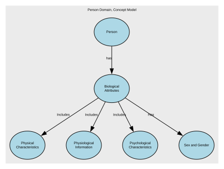

**Links:**

- [Person](#69945d25f751de507ccc6be5) → [Biological Attributes of Person](#69945df5f751de507ccc8762) → [Biological Attributes](#69945ad7f751de507ccc3db5)
- [Biological Attributes](#69945ad7f751de507ccc3db5) → [Physical Characteristics as Biological Attribute](#69a4773af751de507cd45058) → [Physical Characteristics](#6998794cf751de507ccfc4d2)
- [Biological Attributes](#69945ad7f751de507ccc3db5) → [Physiological Information as Biological Attribute](#69a477f2f751de507cd47452) → [Physiological Information](#69987985f751de507ccfd09b)
- [Biological Attributes](#69945ad7f751de507ccc3db5) → [Psychological Characteristics as Biological Attributes](#69a47820f751de507cd47d0f) → [Psychological Characteristics](#699879def751de507ccfd687)
- [Biological Attributes](#69945ad7f751de507ccc3db5) → [Sex and Gender of Person](#69a476c2f751de507cd43f0b) → [Sex and Gender](#699879eff751de507ccfdc78)

---

### Biometric Identifiers

Biometric Identifiers are data elements that capture a person’s unique biological or behavioural traits for the purpose of identification, authentication, or verification. This includes raw biometric measurements (e.g., fingerprints), biometric templates derived from those measurements, and any metadata required to process or match them.

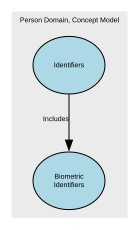

**Links:**

- [Identifiers](#69945b19f751de507ccc4842) → [Biometric Identifiers as Person's Identifier](#69a477bff751de507cd46b9a) → [Biometric Identifiers](#69987964f751de507ccfcab4)

---

### Birth

Birth covers data elements that record the circumstances of an individual’s birth. It includes factual, verifiable attributes such as date, place, and conditions of birth, along with any official registration details issued by an authority.

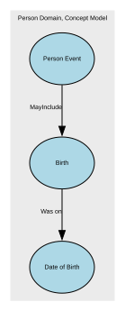

**Links:**

- [Birth](#699878a9f751de507ccf966e) → [Birth - Date of Birth](#69fb66edea1f7a349307d72d) → [Date of Birth](#69fb66b0ea1f7a349307cbcf)
- [Person Event](#699457cbf751de507ccc19df) → [Birth of Person](#69945e2ff751de507ccc9092) → [Birth](#699878a9f751de507ccf966e)

---

### Citizenship

A person’s legal relationship with a state, which grants rights, protections, and obligations under that state’s laws. In a conceptual model, Citizenship is a legal‑status attribute of a Natural Person that identifies the country or sovereign entity recognising them as a citizen.

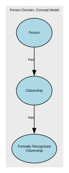

**Links:**

- [Person](#69945d25f751de507ccc6be5) → [Citizenship of Person](#69a4639df751de507cd2ce61) → [Citizenship](#69945984f751de507ccc2ced)
- [Citizenship](#69945984f751de507ccc2ced) → [Formal Citizenship as Citizenship](#69a471c6f751de507cd3b354) → [Formally Recognised Citizenship](#69987a14f751de507ccfe26e)

---

### Civil Social Titles

Civil Social Titles are non‑professional, non‑noble honorifics used in everyday civil contexts to address or refer to individuals (e.g., Mr, Mrs, Miss, Ms, Mx). They facilitate respectful forms of address, correspondence, and identity presentation but do not indicate rank, role, or qualification.

**Links:**

- [Titles](#6994574ff751de507ccc0fa3) → [Civil Social Titles for Title](#69a4760af751de507cd4136f) → [Civil Social Titles](#699878dff751de507ccfa7ab)

---

### Date of Birth

Date of Birth (DOB) is the official calendar date on which an individual was born, as recognised by the appropriate civil authority or as evidenced by legally accepted documentation.

It is a core identity anchor, used across legal, administrative, operational, and analytical systems, and is typically immutable once verified.

DOB is distinct from the Birth Registration Date (administrative) and the Birth Notification Date (clinical/operational).

It may be an estimate.&#x20;

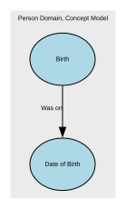

**Links:**

- [Birth](#699878a9f751de507ccf966e) → [Birth - Date of Birth](#69fb66edea1f7a349307d72d) → [Date of Birth](#69fb66b0ea1f7a349307cbcf)

---

### Death

The factual, legally recognised details surrounding the end of an individual’s life. It includes authoritative attributes such as the date, time, and location of death, as well as official registration information issued by a competent authority. This event provides a definitive closure point for identity records and downstream operational processes.

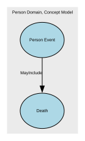

**Links:**

- [Person Event](#699457cbf751de507ccc19df) → [Death of Person](#699dd3f5f751de507cd25754) → [Death](#699878b6f751de507ccf9c28)

---

### Ethnicity (Cultural identify)

Ethnicity is a cultural identity concept that reflects a person’s connection to a group or community defined by shared heritage, ancestry, traditions, culture, language, and/or social experience. It describes how people identify culturally, socially, or historically, not their legal status or nationality.

In a conceptual model, Ethnicity is a self‑identified, culturally grounded attribute of a Natural Person and is separate from Nationality (cultural/national belonging) and Citizenship (legal status).

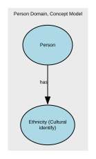

**Links:**

- [Person](#69945d25f751de507ccc6be5) → [Ethnicity CI of Person](#69945e4ef751de507ccc96b9) → [Ethnicity (Cultural identify)](#69945a48f751de507ccc3159)

---

### Formal Name

Formal Name represents the official, legally recognised version of an individual’s name, as recorded by an authoritative source such as a civil registry, passport, birth certificate, or government-issued identity document. It is the canonical name used in contexts requiring legal identity, compliance, or formal verification.

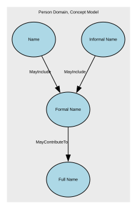

**Links:**

- [Name](#69945770f751de507ccc13f5) → [Formal name of Name](#69a47339f751de507cd3e0d6) → [Formal Name](#69987879f751de507ccf8939)
- [Informal Name](#6998788df751de507ccf90b9) → [Formal name to Informal name](#69d4edc19f84c55e2993987c) → [Formal Name](#69987879f751de507ccf8939)
- [Formal Name](#69987879f751de507ccf8939) → [Full Name of Formal name](#69a49278f751de507cd53bcd) → [Full Name](#69a49213f751de507cd52799)

---

### Formally Recognised Citizenship

Formally Recognised Citizenship captures a person’s legally conferred nationality status as recognised by a sovereign state or authority. It reflects official citizenship(s) in force, with provenance to authoritative sources (e.g., passport, national identity registry, certificate of naturalisation).

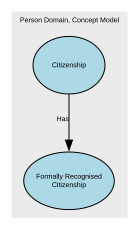

**Links:**

- [Citizenship](#69945984f751de507ccc2ced) → [Formal Citizenship as Citizenship](#69a471c6f751de507cd3b354) → [Formally Recognised Citizenship](#69987a14f751de507ccfe26e)

---

### Full Name

Full Name represents a combined or displayable expression of a person’s name. It may be formed from formal name components, informal name components, or both, depending on context. In some cases, Full Name may reflect the authoritative identity as it is presented or used. However, it is not the authoritative structured identity record and must not replace Formal Name or Informal Name in the underlying model

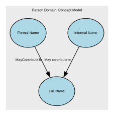

**Links:**

- [Formal Name](#69987879f751de507ccf8939) → [Full Name of Formal name](#69a49278f751de507cd53bcd) → [Full Name](#69a49213f751de507cd52799)
- [Informal Name](#6998788df751de507ccf90b9) → [Informal Name to Full Name.](#6a1841a44055a62b0ab5bfb1) → [Full Name](#69a49213f751de507cd52799)

---

### Genetic Ethnicity

A scientific estimate of a person’s ancestral origins based on the analysis of their DNA. It represents inferred biological population groups, expressed as probabilities or percentages, and reflects patterns of genetic similarity shared with reference populations.

It does not represent cultural identity, heritage, nationality, or citizenship—it is a biologically inferred attribute, not a social or legal one.

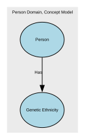

**Links:**

- [Person](#69945d25f751de507ccc6be5) → [Genetic Ethnicity of Person](#69945e69f751de507ccc9cd6) → [Genetic Ethnicity](#69945a9ff751de507ccc35ed)

---

### Identifiers

Unique references that distinguish one Natural Person from all others within a given context, system, or jurisdiction. They are assigned by an authority (e.g., a government, organisation, or system) for the purpose of uniquely recognising, managing, or relating to that person across processes and datasets.

Identifiers are not the person, and they are not personal attributes (like name, gender, or date of birth). They are tokens that point to the person.

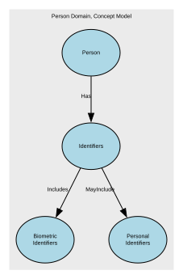

**Links:**

- [Identifiers](#69945b19f751de507ccc4842) → [Biometric Identifiers as Person's Identifier](#69a477bff751de507cd46b9a) → [Biometric Identifiers](#69987964f751de507ccfcab4)
- [Identifiers](#69945b19f751de507ccc4842) → [Personal Identifiers as Personal Identifier](#69a4776cf751de507cd45b2a) → [Personal Identifiers](#699d8376f751de507cd19d27)
- [Person](#69945d25f751de507ccc6be5) → [Personal Identifiers of Person](#69945ec2f751de507cccb594) → [Identifiers](#69945b19f751de507ccc4842)

---

### Informal Name

The Informal Name sub‑domain captures non‑legal, non‑official name forms that an individual uses in everyday social, cultural, or operational contexts. These names support familiarity, personal preference, and communication ease but hold no legal standing and should not be used for identity verification or regulatory decisioning. It may be used as formal name, informal name, or family name. It can be a shortened version of the formal given name or middle name, or family name.&#x20;

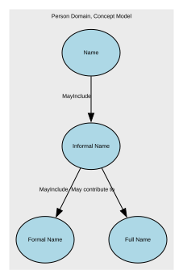

**Links:**

- [Informal Name](#6998788df751de507ccf90b9) → [Formal name to Informal name](#69d4edc19f84c55e2993987c) → [Formal Name](#69987879f751de507ccf8939)
- [Informal Name](#6998788df751de507ccf90b9) → [Informal Name to Full Name.](#6a1841a44055a62b0ab5bfb1) → [Full Name](#69a49213f751de507cd52799)
- [Name](#69945770f751de507ccc13f5) → [Informal name for Name](#69a47364f751de507cd3e95c) → [Informal Name](#6998788df751de507ccf90b9)

---

### Military Titles

Military Titles represent the official ranks, grades, and honorific forms of address assigned to individuals within armed forces or uniformed services (e.g., Lieutenant, Captain, Colonel). These titles indicate hierarchical position, authority, and command responsibility. They are role‑based, not personal, and may change throughout a career.

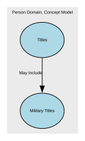

**Links:**

- [Titles](#6994574ff751de507ccc0fa3) → [Military Titles Included in Title](#69a4762df751de507cd41bff) → [Military Titles](#69987904f751de507ccfb34a)

---

### Name

A textual identifier used to refer to or represent a Natural Person, Organisation, Place, or other entity. In conceptual modelling, a Name describes how something is known or addressed, not what it is. Names may consist of multiple components, may vary by context, and may change over time.

**Links:**

- [Name](#69945770f751de507ccc13f5) → [Formal name of Name](#69a47339f751de507cd3e0d6) → [Formal Name](#69987879f751de507ccf8939)
- [Name](#69945770f751de507ccc13f5) → [Informal name for Name](#69a47364f751de507cd3e95c) → [Informal Name](#6998788df751de507ccf90b9)
- [Person](#69945d25f751de507ccc6be5) → [Name of Person](#69945e7ef751de507ccca310) → [Name](#69945770f751de507ccc13f5)

---

### Nationality

A person’s formal affiliation to a nation or cultural identity, typically associated with the country or nation with which they identify or are recognised as belonging. In a conceptual model, Nationality represents a descriptive, identity‑based attribute of a Natural Person that may be based on heritage, birth, culture, or personal identification.

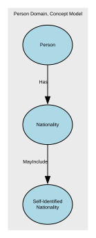

**Links:**

- [Person](#69945d25f751de507ccc6be5) → [Nationality of Person](#69945e94f751de507ccca937) → [Nationality](#69945875f751de507ccc2095)
- [Nationality](#69945875f751de507ccc2095) → [Self-Identified Nationality as Nationality](#69a4784ef751de507cd485d1) → [Self-Identified Nationality](#69987a29f751de507ccfe869)

---

### Person

An individual human who participates in business activities or interactions. The Person concept represents the identity of a human being independent of the roles they may perform, the relationships they may have, or the contexts in which they act.

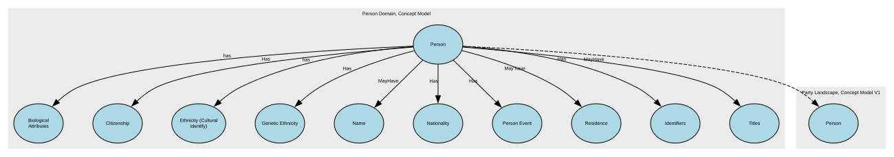

**Links:**

- [Person](#69945d25f751de507ccc6be5) → [Biological Attributes of Person](#69945df5f751de507ccc8762) → [Biological Attributes](#69945ad7f751de507ccc3db5)
- [Person](#69945d25f751de507ccc6be5) → [Citizenship of Person](#69a4639df751de507cd2ce61) → [Citizenship](#69945984f751de507ccc2ced)
- [Person](#69945d25f751de507ccc6be5) → [Ethnicity CI of Person](#69945e4ef751de507ccc96b9) → [Ethnicity (Cultural identify)](#69945a48f751de507ccc3159)
- [Person](#69945d25f751de507ccc6be5) → [Genetic Ethnicity of Person](#69945e69f751de507ccc9cd6) → [Genetic Ethnicity](#69945a9ff751de507ccc35ed)
- [Person](#69945d25f751de507ccc6be5) → [Name of Person](#69945e7ef751de507ccca310) → [Name](#69945770f751de507ccc13f5)
- [Person](#69945d25f751de507ccc6be5) → [Nationality of Person](#69945e94f751de507ccca937) → [Nationality](#69945875f751de507ccc2095)
- [Person](#69945d25f751de507ccc6be5) → [Person Event of Person](#69945eadf751de507cccaf63) → [Person Event](#699457cbf751de507ccc19df)
- [Person](#69945d25f751de507ccc6be5) → [Person's residence](#69b2a1e3c3a89f06e1a0a064) → [Residence](#69b2a1bcc3a89f06e1a0948e)
- [Person](#69945d25f751de507ccc6be5) → [Personal Identifiers of Person](#69945ec2f751de507cccb594) → [Identifiers](#69945b19f751de507ccc4842)
- [Person](#69945d25f751de507ccc6be5) → [Title of Person](#69945ed9f751de507cccbbca) → [Titles](#6994574ff751de507ccc0fa3)

**Super Concepts:**

- [Person](#699454b7f751de507ccbe9c2) *(Party Landscape, Concept Model V1)*

---

### Person Event

An occurrence or change in circumstance that happens to a specific Natural Person at a point in time (or over a period of time) and is relevant to business processes, reporting, or understanding that person’s history. It captures something that happens to or is experienced by the person, rather than a role or relationship they hold.

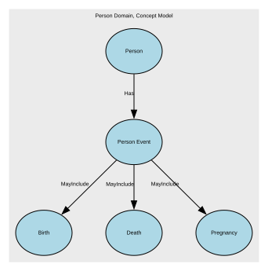

**Links:**

- [Person Event](#699457cbf751de507ccc19df) → [Birth of Person](#69945e2ff751de507ccc9092) → [Birth](#699878a9f751de507ccf966e)
- [Person Event](#699457cbf751de507ccc19df) → [Death of Person](#699dd3f5f751de507cd25754) → [Death](#699878b6f751de507ccf9c28)
- [Person](#69945d25f751de507ccc6be5) → [Person Event of Person](#69945eadf751de507cccaf63) → [Person Event](#699457cbf751de507ccc19df)
- [Person Event](#699457cbf751de507ccc19df) → [Pregnancy of Person](#69a46753f751de507cd3741e) → [Pregnancy](#699878c6f751de507ccfa1e7)

---

### Personal Identifiers

Personal Identifier IDs are unique identifiers assigned to a person by an authority or system for identification, linkage, or entitlement. This domain includes government‑issued IDs (e.g., national IDs), organisational master IDs, and cross‑system surrogate keys used to unambiguously reference a person across processes and systems.

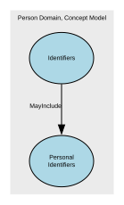

**Links:**

- [Identifiers](#69945b19f751de507ccc4842) → [Personal Identifiers as Personal Identifier](#69a4776cf751de507cd45b2a) → [Personal Identifiers](#699d8376f751de507cd19d27)

---

### Physical Characteristics

Physical Characteristics refers to observable, measurable, and non‑biometric biological traits of an individual. These features describe physical form or appearance but do not uniquely identify a person on their own. The sub‑domain includes raw descriptive attributes and standardised measurements recorded for classification, profiling, or operational purposes.

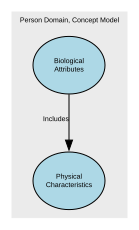

**Links:**

- [Biological Attributes](#69945ad7f751de507ccc3db5) → [Physical Characteristics as Biological Attribute](#69a4773af751de507cd45058) → [Physical Characteristics](#6998794cf751de507ccfc4d2)

---

### Physiological Information

Physiological Information in the Person domain represents non‑clinical, non‑diagnostic information about an individual’s biological and bodily functions. This includes measurable or observable physiological attributes that describe how the body operates (for example blood type, genetic traits, or organ donor status), rather than cognitive, emotional, or behavioural characteristics. These attributes are descriptive and operational in nature and do not, by themselves, uniquely identify a person

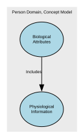

**Links:**

- [Biological Attributes](#69945ad7f751de507ccc3db5) → [Physiological Information as Biological Attribute](#69a477f2f751de507cd47452) → [Physiological Information](#69987985f751de507ccfd09b)

---

### Post-Nominal Titles

Post‑Nominal Titles are letters placed after a person’s name that denote orders, decorations, honours, academic degrees, professional memberships, licensure, or fellowships (e.g., OBE, PhD, FRCS, CPA). They confer recognition or qualification, not forms of address, and are typically governed by awarding bodies with formal usage rules.

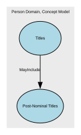

**Links:**

- [Titles](#6994574ff751de507ccc0fa3) → [Post-Nominal Titles included in Title](#69a4767ef751de507cd42dd2) → [Post-Nominal Titles](#69987929f751de507ccfbef5)

---

### Pregnancy

Pregnancy is a time‑bound life event that records the fact that an individual is pregnant, including the start, expected milestones, and outcome of the pregnancy where relevant for operational, safeguarding, or service‑eligibility purposes. It captures non‑clinical, administrative facts only—not medical diagnoses, treatment notes, or clinical assessments.

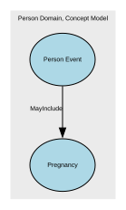

**Links:**

- [Person Event](#699457cbf751de507ccc19df) → [Pregnancy of Person](#69a46753f751de507cd3741e) → [Pregnancy](#699878c6f751de507ccfa1e7)

---

### Professional Occupational Titles

Professional Occupational Titles are titles or prefixes associated with a person’s profession, occupation, or accredited role, used to indicate an individual’s professional standing, qualification, or occupational function. They are not academic degrees or post‑nominals, but pre‑nominal markers tied to recognised professions (e.g., Dr, Prof, Eng, Nurse, Architect). These titles support appropriate address, professional recognition, and role‑based communication.

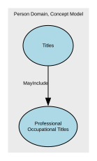

**Links:**

- [Titles](#6994574ff751de507ccc0fa3) → [Professional Titles Included in Title](#69a476e3f751de507cd447af) → [Professional Occupational Titles](#699878f5f751de507ccfad7c)

---

### Psychological Characteristics

Psychological Characteristics refer to non‑clinical, non‑diagnostic attributes that describe an individual’s typical cognitive, emotional, and behavioural tendencies. These characteristics represent stable patterns of thinking and behaviour, not mental health conditions, and do not uniquely identify a person. They may include personality traits, cognitive style descriptors, and general behavioural dispositions.

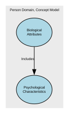

**Links:**

- [Biological Attributes](#69945ad7f751de507ccc3db5) → [Psychological Characteristics as Biological Attributes](#69a47820f751de507cd47d0f) → [Psychological Characteristics](#699879def751de507ccfd687)

---

### Religious Titles

Religious Titles are formal honorifics, ranks, or styles of address associated with roles, positions, or consecrated statuses within recognised religious traditions (e.g., Reverend, Rabbi, Imam, Sister, Monsignor, Guru). These titles indicate spiritual authority, clerical office, or religious vocation, and are used in formal or community contexts to show respect and denote role-based standing.

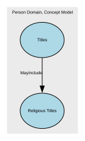

**Links:**

- [Titles](#6994574ff751de507ccc0fa3) → [Religious Titles included in Title](#69a4769ff751de507cd4366c) → [Religious Titles](#69987917f751de507ccfb91d)

---

### Residence

A time‑bounded assertion that a Person resides at a Location with a specified Residence. Includes legal/primary residence, secondary residences, historical changes, validation against jurisdictional reference data. Excludes temporary contact addresses, delivery addresses, lodging/travel events, property ownership details (unless used to evidence residence).

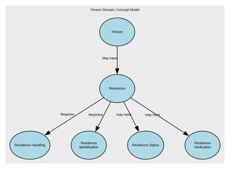

**Links:**

- [Person](#69945d25f751de507ccc6be5) → [Person's residence](#69b2a1e3c3a89f06e1a0a064) → [Residence](#69b2a1bcc3a89f06e1a0948e)
- [Residence](#69b2a1bcc3a89f06e1a0948e) → [Residence Handling](#69b2a4b0c3a89f06e1a0ac71) → [Residence Handling](#69b2a480c3a89f06e1a0a2cf)
- [Residence](#69b2a1bcc3a89f06e1a0948e) → [Residence Identification](#69b2cbefc3a89f06e1a11cd0) → [Residence identification](#69b2a3e0c3a89f06e1a0a0fb)
- [Residence](#69b2a1bcc3a89f06e1a0948e) → [Residence type](#69b2a4e5c3a89f06e1a0bfc2) → [Residence Status](#69b2a417c3a89f06e1a0a195)
- [Residence](#69b2a1bcc3a89f06e1a0948e) → [Residence verification](#69b2a4cfc3a89f06e1a0b617) → [Residence Verification](#69b2a451c3a89f06e1a0a231)

---

### Residence Handling

Residence Handling refers to the governed rules, behaviours, and constraints that define how residency data may be collected, processed, stored, shared, updated, retained, secured, and used within a data domain.

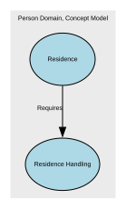

**Links:**

- [Residence](#69b2a1bcc3a89f06e1a0948e) → [Residence Handling](#69b2a4b0c3a89f06e1a0ac71) → [Residence Handling](#69b2a480c3a89f06e1a0a2cf)

---

### Residence Status

Residence Type specifies the role, purpose, and legal/operational meaning of a residency relationship between a place or property and a person.

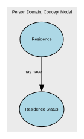

**Links:**

- [Residence](#69b2a1bcc3a89f06e1a0948e) → [Residence type](#69b2a4e5c3a89f06e1a0bfc2) → [Residence Status](#69b2a417c3a89f06e1a0a195)

---

### Residence Verification

Residence Verification describes the degree of confidence, method, and evidence supporting the assertion that a Party (Person or Legal Entity) resides at a given Location.

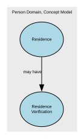

**Links:**

- [Residence](#69b2a1bcc3a89f06e1a0948e) → [Residence verification](#69b2a4cfc3a89f06e1a0b617) → [Residence Verification](#69b2a451c3a89f06e1a0a231)

---

### Residence identification

Residence Identification refers uniquely and consistently identify, reference, and distinguish one residence fact from another within a Party domain.

**Links:**

- [Residence](#69b2a1bcc3a89f06e1a0948e) → [Residence Identification](#69b2cbefc3a89f06e1a11cd0) → [Residence identification](#69b2a3e0c3a89f06e1a0a0fb)

---

### Self-Identified Nationality

Self‑Identified Nationality represents how an individual personally defines or expresses their own national identity, independent of citizenship, passport, or legal status. It reflects cultural affiliation, heritage, or personal identification, and is self‑reported, non‑authoritative, and used solely for demographic, engagement, or inclusion‑related purposes.

This attribute does not confer any legal rights or obligations.

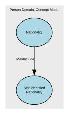

**Links:**

- [Nationality](#69945875f751de507ccc2095) → [Self-Identified Nationality as Nationality](#69a4784ef751de507cd485d1) → [Self-Identified Nationality](#69987a29f751de507ccfe869)

---

### Sex and Gender

The Sex and Gender sub‑domain covers data elements that describe an individual’s biological sex characteristics and gender identity attributes for the purposes of identity management, demographic classification, and service personalisation. It differentiates between sex‑related biological attributes and self‑described gender identity, reflecting both regulatory expectations and modern data‑standards practice. It also include how these relate to and define Legal Sex.

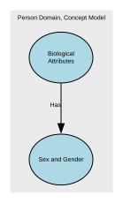

**Links:**

- [Biological Attributes](#69945ad7f751de507ccc3db5) → [Sex and Gender of Person](#69a476c2f751de507cd43f0b) → [Sex and Gender](#699879eff751de507ccfdc78)

---

### Titles

An honorific or form of address associated with a Natural Person, used to indicate courtesy, social status, professional standing, or preference. It does not identify the person and does not imply any legal role or relationship—it's simply an attribute describing how the person chooses (or is required) to be addressed.

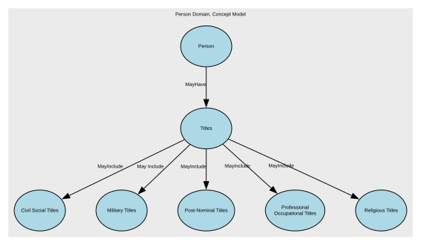

**Links:**

- [Titles](#6994574ff751de507ccc0fa3) → [Civil Social Titles for Title](#69a4760af751de507cd4136f) → [Civil Social Titles](#699878dff751de507ccfa7ab)
- [Titles](#6994574ff751de507ccc0fa3) → [Military Titles Included in Title](#69a4762df751de507cd41bff) → [Military Titles](#69987904f751de507ccfb34a)
- [Titles](#6994574ff751de507ccc0fa3) → [Post-Nominal Titles included in Title](#69a4767ef751de507cd42dd2) → [Post-Nominal Titles](#69987929f751de507ccfbef5)
- [Titles](#6994574ff751de507ccc0fa3) → [Professional Titles Included in Title](#69a476e3f751de507cd447af) → [Professional Occupational Titles](#699878f5f751de507ccfad7c)
- [Titles](#6994574ff751de507ccc0fa3) → [Religious Titles included in Title](#69a4769ff751de507cd4366c) → [Religious Titles](#69987917f751de507ccfb91d)
- [Person](#69945d25f751de507ccc6be5) → [Title of Person](#69945ed9f751de507cccbbca) → [Titles](#6994574ff751de507ccc0fa3)

## Links

### Biological Attributes of Person

**From:** [Person](#69945d25f751de507ccc6be5)  
**Link:** Biological Attributes of Person  
**To:** [Biological Attributes](#69945ad7f751de507ccc3db5)  
**Label:** has  
**Inverse Label:** isBiologicalAttributesOf  

*Indicates the biological attributes associated with a person.*

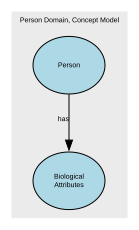

---

### Biometric Identifiers as Person's Identifier

**From:** [Identifiers](#69945b19f751de507ccc4842)  
**Link:** Biometric Identifiers as Person's Identifier  
**To:** [Biometric Identifiers](#69987964f751de507ccfcab4)  
**Label:** Includes  

---

### Birth - Date of Birth

**From:** [Birth](#699878a9f751de507ccf966e)  
**Link:** Birth - Date of Birth  
**To:** [Date of Birth](#69fb66b0ea1f7a349307cbcf)  
**Label:** Was on  
**Inverse Label:** For event  

---

### Birth of Person

**From:** [Person Event](#699457cbf751de507ccc19df)  
**Link:** Birth of Person  
**To:** [Birth](#699878a9f751de507ccf966e)  
**Label:** MayInclude  

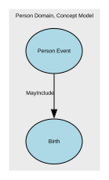

---

### Citizenship of Person

**From:** [Person](#69945d25f751de507ccc6be5)  
**Link:** Citizenship of Person  
**To:** [Citizenship](#69945984f751de507ccc2ced)  
**Label:** Has  
**Inverse Label:** IsCitizenshipOf  

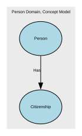

---

### Civil Social Titles for Title

**From:** [Titles](#6994574ff751de507ccc0fa3)  
**Link:** Civil Social Titles for Title  
**To:** [Civil Social Titles](#699878dff751de507ccfa7ab)  
**Label:** MayInclude  

---

### Death of Person

**From:** [Person Event](#699457cbf751de507ccc19df)  
**Link:** Death of Person  
**To:** [Death](#699878b6f751de507ccf9c28)  
**Label:** MayInclude  

---

### Ethnicity CI of Person

**From:** [Person](#69945d25f751de507ccc6be5)  
**Link:** Ethnicity CI of Person  
**To:** [Ethnicity (Cultural identify)](#69945a48f751de507ccc3159)  
**Label:** has  
**Inverse Label:** isEthnicityCulturalIdentityOf  

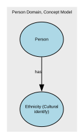

---

### Formal Citizenship as Citizenship

**From:** [Citizenship](#69945984f751de507ccc2ced)  
**Link:** Formal Citizenship as Citizenship  
**To:** [Formally Recognised Citizenship](#69987a14f751de507ccfe26e)  
**Label:** Has  

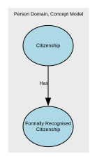

---

### Formal name of Name

**From:** [Name](#69945770f751de507ccc13f5)  
**Link:** Formal name of Name  
**To:** [Formal Name](#69987879f751de507ccf8939)  
**Label:** MayInclude  

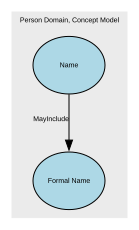

---

### Formal name to Informal name

**From:** [Informal Name](#6998788df751de507ccf90b9)  
**Link:** Formal name to Informal name  
**To:** [Formal Name](#69987879f751de507ccf8939)  
**Label:** MayInclude  
**Inverse Label:** from   

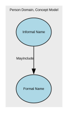

---

### Full Name of Formal name

**From:** [Formal Name](#69987879f751de507ccf8939)  
**Link:** Full Name of Formal name  
**To:** [Full Name](#69a49213f751de507cd52799)  
**Label:** MayContributeTo  
**Inverse Label:** May be formed from  

Formal Name may contribute to a Full Name representation. Full Name is a contextual or temporal expression of a person’s name and may be formed from formal name components depending on context and use

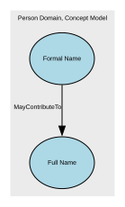

---

### Genetic Ethnicity of Person

**From:** [Person](#69945d25f751de507ccc6be5)  
**Link:** Genetic Ethnicity of Person  
**To:** [Genetic Ethnicity](#69945a9ff751de507ccc35ed)  
**Label:** Has  

---

### Informal Name to Full Name.

**From:** [Informal Name](#6998788df751de507ccf90b9)  
**Link:** Informal Name to Full Name.  
**To:** [Full Name](#69a49213f751de507cd52799)  
**Label:** May contribute to  
**Inverse Label:** May be formed from  

Informal Name may contribute to a Full Name representation. Full Name is a contextual or temporal expression of a person’s name and may be formed from informal or preferred naming conventions depending on context and use

**Notes:**

Full Name represents a name expression for a given context or point in time. It is not a structural decomposition of Informal Name, but a representation that may be derived from it

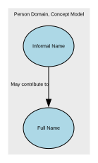

---

### Informal name for Name

**From:** [Name](#69945770f751de507ccc13f5)  
**Link:** Informal name for Name  
**To:** [Informal Name](#6998788df751de507ccf90b9)  
**Label:** MayInclude  

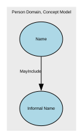

---

### Military Titles Included in Title

**From:** [Titles](#6994574ff751de507ccc0fa3)  
**Link:** Military Titles Included in Title  
**To:** [Military Titles](#69987904f751de507ccfb34a)  
**Label:** May Include  

---

### Name of Person

**From:** [Person](#69945d25f751de507ccc6be5)  
**Link:** Name of Person  
**To:** [Name](#69945770f751de507ccc13f5)  
**Label:** MayHave  

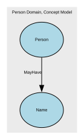

---

### Nationality of Person

**From:** [Person](#69945d25f751de507ccc6be5)  
**Link:** Nationality of Person  
**To:** [Nationality](#69945875f751de507ccc2095)  
**Label:** Has  
**Inverse Label:** isNationalityOf  

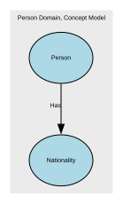

---

### Person Event of Person

**From:** [Person](#69945d25f751de507ccc6be5)  
**Link:** Person Event of Person  
**To:** [Person Event](#699457cbf751de507ccc19df)  
**Label:** Has  
**Inverse Label:** isPersonIdentifiersOf  

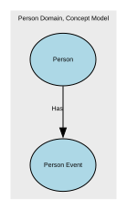

---

### Person's residence

**From:** [Person](#69945d25f751de507ccc6be5)  
**Link:** Person's residence  
**To:** [Residence](#69b2a1bcc3a89f06e1a0948e)  
**Label:** May have  

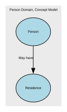

---

### Personal Identifiers as Personal Identifier

**From:** [Identifiers](#69945b19f751de507ccc4842)  
**Link:** Personal Identifiers as Personal Identifier  
**To:** [Personal Identifiers](#699d8376f751de507cd19d27)  
**Label:** MayInclude  

---

### Personal Identifiers of Person

**From:** [Person](#69945d25f751de507ccc6be5)  
**Link:** Personal Identifiers of Person  
**To:** [Identifiers](#69945b19f751de507ccc4842)  
**Label:** Has  
**Inverse Label:** isPersonIdentifiersOf  

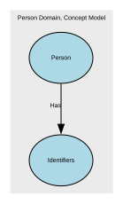

---

### Physical Characteristics as Biological Attribute

**From:** [Biological Attributes](#69945ad7f751de507ccc3db5)  
**Link:** Physical Characteristics as Biological Attribute  
**To:** [Physical Characteristics](#6998794cf751de507ccfc4d2)  
**Label:** Includes  

---

### Physiological Information as Biological Attribute

**From:** [Biological Attributes](#69945ad7f751de507ccc3db5)  
**Link:** Physiological Information as Biological Attribute  
**To:** [Physiological Information](#69987985f751de507ccfd09b)  
**Label:** Includes  

---

### Post-Nominal Titles included in Title

**From:** [Titles](#6994574ff751de507ccc0fa3)  
**Link:** Post-Nominal Titles included in Title  
**To:** [Post-Nominal Titles](#69987929f751de507ccfbef5)  
**Label:** MayInclude  

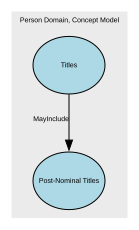

---

### Pregnancy of Person

**From:** [Person Event](#699457cbf751de507ccc19df)  
**Link:** Pregnancy of Person  
**To:** [Pregnancy](#699878c6f751de507ccfa1e7)  
**Label:** MayInclude  

---

### Professional Titles Included in Title

**From:** [Titles](#6994574ff751de507ccc0fa3)  
**Link:** Professional Titles Included in Title  
**To:** [Professional Occupational Titles](#699878f5f751de507ccfad7c)  
**Label:** MayInclude  

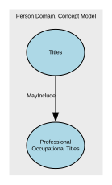

---

### Psychological Characteristics as Biological Attributes

**From:** [Biological Attributes](#69945ad7f751de507ccc3db5)  
**Link:** Psychological Characteristics as Biological Attributes  
**To:** [Psychological Characteristics](#699879def751de507ccfd687)  
**Label:** Includes  

---

### Religious Titles included in Title

**From:** [Titles](#6994574ff751de507ccc0fa3)  
**Link:** Religious Titles included in Title  
**To:** [Religious Titles](#69987917f751de507ccfb91d)  
**Label:** MayInclude  

---

### Residence Handling

**From:** [Residence](#69b2a1bcc3a89f06e1a0948e)  
**Link:** Residence Handling  
**To:** [Residence Handling](#69b2a480c3a89f06e1a0a2cf)  
**Label:** Requires  

---

### Residence Identification

**From:** [Residence](#69b2a1bcc3a89f06e1a0948e)  
**Link:** Residence Identification  
**To:** [Residence identification](#69b2a3e0c3a89f06e1a0a0fb)  
**Label:** MayHave  

---

### Residence type

**From:** [Residence](#69b2a1bcc3a89f06e1a0948e)  
**Link:** Residence type  
**To:** [Residence Status](#69b2a417c3a89f06e1a0a195)  
**Label:** may have  

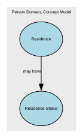

---

### Residence verification

**From:** [Residence](#69b2a1bcc3a89f06e1a0948e)  
**Link:** Residence verification  
**To:** [Residence Verification](#69b2a451c3a89f06e1a0a231)  
**Label:** may have  

---

### Self-Identified Nationality as Nationality

**From:** [Nationality](#69945875f751de507ccc2095)  
**Link:** Self-Identified Nationality as Nationality  
**To:** [Self-Identified Nationality](#69987a29f751de507ccfe869)  
**Label:** MayInclude  

---

### Sex and Gender of Person

**From:** [Biological Attributes](#69945ad7f751de507ccc3db5)  
**Link:** Sex and Gender of Person  
**To:** [Sex and Gender](#699879eff751de507ccfdc78)  
**Label:** Has  

---

### Title of Person

**From:** [Person](#69945d25f751de507ccc6be5)  
**Link:** Title of Person  
**To:** [Titles](#6994574ff751de507ccc0fa3)  
**Label:** MayHave  
**Inverse Label:** IsTitleOf  

## Concepts from Party Landscape, Concept Model V1

| Concept | Description |
|---------|-------------|
| [Person](#699454b7f751de507ccbe9c2) | An individual human who participates in business activities or interactions. The Person concept represents the identity of a human being independent of the roles they may perform, the relationships they may have, or the contexts in which they act. |

### Person

**Concept Model:** Party Landscape, Concept Model V1  

An individual human who participates in business activities or interactions. The Person concept represents the identity of a human being independent of the roles they may perform, the relationships they may have, or the contexts in which they act.
