# logical model: Person Domain, Logical Model

> ## Version: Logical Model:Person Domain, Logical Model V1 02/06/2026
>
> *Created: 2 June 2026*
>

Person Logical Domain Model.

Model ID: DEPoP013.&#x20;

Linking concepts to data items in the Person Domain.&#x20;

Published as part of the Person Data Standard (Alpha), PRG202604.

An individual human who participates in business activities or interactions. The Person concept represents the identity of a human being independent of the roles they may perform, the relationships they may have, or the contexts in which they act.

The Department for Science, Innovation and Technology

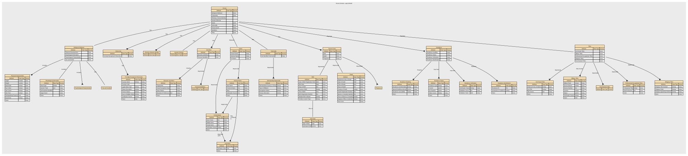

## Renditions

| Format | Link |
|--------|------|
| Graphviz DOT | [dot.txt](./dot.txt) |
| DSD JSON | [dsd.json](./dsd.json) |
| CSV | [logicalmodel.csv](./logicalmodel.csv) |
| RDF Schema (Turtle) | [logicalmodel.ttl](./logicalmodel.ttl) |
| XSD | [Person_Domain,_Logical_Model.xsd](./Person_Domain,_Logical_Model.xsd) |

## Index

### Entities

| Entity | Description |
|--------|-------------|
| [Biological Attributes](#69a49610f751de507cd5766e) | Inherent physical, physiological, or genetic characteristics of a Natural Person that arise from biology rather than social, cultural, or legal identity. Biological Attributes describe intrinsic properties of the human body and are distinct from personal identity attributes (e.g., name), demographic identity (e.g. ethnicity), or legal identity (e.g, citizenship).  _Implements Concepts_ • Biological Attributes — Inherent physical, physiological, or genetic characteristics of a Natural Person… |
| [Biometric Identifiers](#69a4a1c2f751de507cd5c494) | Biometric Identifiers are data elements that capture a person’s unique biological or behavioural traits for the purpose of identification, authentication, or verification. This includes raw biometric measurements (e.g., fingerprints), biometric templates derived from those measurements, and any metadata required to process or match them.  _Implements Concepts_ • Biometric Identifiers — Biometric Identifiers are data elements that capture a person’s unique biologica… |
| [Birth](#69a48be5f751de507cd4e22e) | Birth covers data elements that record the circumstances of an individual’s birth. It includes factual, verifiable attributes such as date, place, and conditions of birth, along with any official registration details issued by an authority.  _Implements Concepts_ • Birth — Birth covers data elements that record the circumstances of an individual’s birt… |
| [Birth Date](#69fb660aea1f7a349307ba09) | This is the structure defining date of birth and how it's been defined.&#x20;  _Implements Concepts_ • Date of Birth — Date of Birth (DOB) is the official calendar date on which an individual was bor… |
| [Citizenship](#69a49420f751de507cd55a75) | A person’s legal relationship with a state, which grants rights, protections, and obligations under that state’s laws. In a conceptual model, Citizenship is a legal‑status attribute of a Natural Person that identifies the country or sovereign entity recognising them as a citizen.  _Implements Concepts_ • Citizenship — A person’s legal relationship with a state, which grants rights, protections, an… |
| [Civil Social Titles](#69a4a99af751de507cd6242d) | Civil Social Titles are non‑professional, non‑noble honorifics used in everyday civil contexts to address or refer to individuals (e.g., Mr, Mrs, Miss, Ms, Mx). They facilitate respectful forms of address, correspondence, and identity presentation but do not indicate rank, role, or qualification.  _Implements Concepts_ • Civil Social Titles — Civil Social Titles are non‑professional, non‑noble honorifics used in everyday … |
| [Death](#69a49009f751de507cd507d6) | The factual, legally recognised details surrounding the end of an individual’s life. It includes authoritative attributes such as the date, time, and location of death, as well as official registration information issued by a competent authority. This event provides a definitive closure point for identity records and downstream operational processes.  _Implements Concepts_ • Death — The factual, legally recognised details surrounding the end of an individual’s l… |
| [Ethnicity (Cultural identify)](#69a4a915f751de507cd611f1) | Ethnicity is a cultural identity concept that reflects a person’s connection to a group or community defined by shared heritage, ancestry, traditions, culture, language, and/or social experience. It describes how people identify culturally, socially, or historically, not their legal status or nationality. In a conceptual model, Ethnicity is a self‑identified, culturally grounded attribute of a Natural Person and is separate from Nationality (cultural/national belonging) and Citizenship (legal status).  _Implements Concepts_ • Ethnicity (Cultural identify) — Ethnicity is a cultural identity concept that reflects a person’s connection to … |
| [Formal Name](#69a49187f751de507cd52317) | Formal Name represents the official, legally recognised version of an individual’s name, as recorded by an authoritative source such as a civil registry, passport, birth certificate, or government-issued identity document. It is the canonical name used in contexts requiring legal identity, compliance, or formal verification.  _Implements Concepts_ • Formal Name — Formal Name represents the official, legally recognised version of an individual… |
| [Formally Recognised Citizenship ](#69a4943ff751de507cd5619b) | Formally Recognised Citizenship captures a person’s legally conferred nationality status as recognised by a sovereign state or authority. It reflects official citizenship(s) in force, with provenance to authoritative sources (e.g., passport, national identity registry, certificate of naturalisation).  _Implements Concepts_ • Formally Recognised Citizenship — Formally Recognised Citizenship captures a person’s legally conferred nationalit… |
| [Full Name](#6a182eac4055a62b0ab568ab) | Full Name represents a combined or displayable expression of a person’s name. It may be formed from formal name components, informal name components, or both, depending on context. In some cases, Full Name may reflect the authoritative identity as it is presented or used. However, it is not the authoritative structured identity record and must not replace Formal Name or Informal Name in the underlying model.  _Implements Concepts_ • Full Name — Full Name represents a combined or displayable expression of a person’s name. It… |
| [Genetic Ethnicity](#69a4a737f751de507cd60353) | A scientific estimate of a person’s ancestral origins based on the analysis of their DNA. It represents inferred biological population groups, expressed as probabilities or percentages, and reflects patterns of genetic similarity shared with reference populations. It does not represent cultural identity, heritage, nationality, or citizenship—it is a biologically inferred attribute, not a social or legal one.  _Implements Concepts_ • Genetic Ethnicity — A scientific estimate of a person’s ancestral origins based on the analysis of t… |
| [Identifiers](#69a4a242f751de507cd5cfb1) | Unique references that distinguish one Natural Person from all others within a given context, system, or jurisdiction. They are assigned by an authority (e.g., a government, organisation, or system) for the purpose of uniquely recognising, managing, or relating to that person across processes and datasets. Identifiers are not the person, and they are not personal attributes (like name, gender, or date of birth). They are tokens that point to the person.  _Implements Concepts_ • Identifiers — Unique references that distinguish one Natural Person from all others within a g… |
| [Informal Name](#69a4939cf751de507cd54f65) | The Informal Name sub‑domain captures non‑legal, non‑official name forms that an individual uses in everyday social, cultural, or operational contexts. These names support familiarity, personal preference, and communication ease but hold no legal standing and should not be used for identity verification or regulatory decisioning.  _Implements Concepts_ • Informal Name — The Informal Name sub‑domain captures non‑legal, non‑official name forms that an… |
| [Military Titles](#69a4bc47f751de507cd64638) | Military Titles represent the official ranks, grades, and honorific forms of address assigned to individuals within armed forces or uniformed services (e.g., Lieutenant, Captain, Colonel). These titles indicate hierarchical position, authority, and command responsibility. They are role‑based, not personal, and may change throughout a career.  _Implements Concepts_ • Military Titles — Military Titles represent the official ranks, grades, and honorific forms of add… |
| [Name](#69a4741df751de507cd3f284) | A textual identifier used to refer to or represent a Natural Person, Organisation, Place, or other entity. In conceptual modelling, a Name describes how something is known or addressed, not what it is. Names may consist of multiple components, may vary by context, and may change over time. At least one Formal Name is required for a Person to ensure a minimum identity representation, while Informal Name remains optional.  _Implements Concepts_ • Name — A textual identifier used to refer to or represent a Natural Person, Organisatio… |
| [Nationality](#69a4a3e2f751de507cd5e547) | Describes how an individual identifies with one or more nations, countries, or national groups. In the Person domain, nationality is treated as a matter of personal identity and self‑expression, rather than legal status. Formal legal nationality or citizenship is modelled separately under Citizenship.  _Implements Concepts_ • Nationality — A person’s formal affiliation to a nation or cultural identity, typically associ… |
| [Person](#699dbdecf751de507cd233fc) | An individual human who participates in business activities or interactions. The Person concept represents the identity of a human being independent of the roles they may perform, the relationships they may have, or the contexts in which they act.  _Implements Concepts_ • Person — An individual human who participates in business activities or interactions. The… |
| [Person Event](#699dbe0ef751de507cd23a3f) | An occurrence or change in circumstance that happens to a specific Natural Person at a point in time (or over a period of time) and is relevant to business processes, reporting, or understanding that person’s history. It captures something that happens to or is experienced by the person, rather than a role or relationship they hold.  _Implements Concepts_ • Person Event — An occurrence or change in circumstance that happens to a specific Natural Perso… |
| [Personal Identifiers](#69a4a2f7f751de507cd5d9d0) | Personal Identifier IDs are unique identifiers assigned to a person by an authority or system for identification, linkage, or entitlement. This domain includes government‑issued IDs (e.g., national IDs), organisational master IDs, and cross‑system surrogate keys used to unambiguously reference a person across processes and systems.  _Implements Concepts_ • Personal Identifiers — Personal Identifier IDs are unique identifiers assigned to a person by an author… |
| [Physical Characteristics](#69a49864f751de507cd59150) | Physical Characteristics refers to observable, measurable, and non‑biometric biological traits of an individual. These features describe physical form or appearance but do not uniquely identify a person on their own. The sub‑domain includes raw descriptive attributes and standardised measurements recorded for classification, profiling, or operational purposes.  _Implements Concepts_ • Physical Characteristics — Physical Characteristics refers to observable, measurable, and non‑biometric bio… |
| [Physiological Information](#69a49fbdf751de507cd5a26c) | Physiological Information describes non‑clinical, non‑diagnostic information about an individual’s biological and bodily functions. It includes physiological or biologically‑derived attributes such as blood type, genetic traits, self‑reported disability, and organ donor status. These attributes are descriptive and operational in nature, rather than cognitive, emotional, or behavioural characteristics, and do not uniquely identify a person  _Implements Concepts_ • Physiological Information — Physiological Information in the Person domain represents non‑clinical, non‑diag… |
| [Post-Nominal Titles](#69a4bd06f751de507cd65b7f) | Post‑Nominal Titles are letters placed after a person’s name that denote orders, decorations, honours, academic degrees, professional memberships, licensure, or fellowships (e.g., OBE, PhD, FRCS, CPA). They confer recognition or qualification, not forms of address, and are typically governed by awarding bodies with formal usage rules.  _Implements Concepts_ • Post-Nominal Titles — Post‑Nominal Titles are letters placed after a person’s name that denote orders,… |
| [Pregnancy](#69a87051f751de507cd77aec) | Pregnancy is a time‑bound life event that records the fact that an individual is pregnant, including the start, expected milestones, and outcome of the pregnancy where relevant for operational, safeguarding, or service‑eligibility purposes. It captures non‑clinical, administrative facts only—not medical diagnoses, treatment notes, or clinical assessments.  _Implements Concepts_ • Pregnancy — Pregnancy is a time‑bound life event that records the fact that an individual is… |
| [Professional Occupational Titles](#69a4aa60f751de507cd6338d) | Professional Occupational Titles are titles or prefixes associated with a person’s profession, occupation, or accredited role, used to indicate an individual’s professional standing, qualification, or occupational function. They are not academic degrees or post‑nominals, but pre‑nominal markers tied to recognised professions (e.g., Dr, Prof, Eng, Nurse, Architect). These titles support appropriate address, professional recognition, and role‑based communication.  _Implements Concepts_ • Professional Occupational Titles — Professional Occupational Titles are titles or prefixes associated with a person… |
| [Psychological Characteristics](#69a4a08df751de507cd5b7c3) | Psychological Characteristics refer to non‑clinical, non‑diagnostic attributes that describe an individual’s typical cognitive, emotional, and behavioural tendencies. These characteristics represent stable patterns of thinking and behaviour, not mental health conditions, and do not uniquely identify a person. They may include personality traits, cognitive style descriptors, and general behavioural dispositions. |
| [Religious Titles](#69a4bccef751de507cd651e0) | Religious Titles are formal honorifics, ranks, or styles of address associated with roles, positions, or consecrated statuses within recognised religious traditions (e.g., Reverend, Rabbi, Imam, Sister, Monsignor, Guru). These titles indicate spiritual authority, clerical office, or religious vocation, and are used in formal or community contexts to show respect and denote role-based standing.  _Implements Concepts_ • Religious Titles — Religious Titles are formal honorifics, ranks, or styles of address associated w… |
| [Residence](#69b2a6ddc3a89f06e1a0de69) | A time‑bounded assertion that a Person resides at a Location with a specified Residence. Includes legal/primary residence, secondary residences, historical changes, validation against jurisdictional reference data. Excludes temporary contact addresses, delivery addresses, lodging/travel events, property ownership details (unless used to evidence residence).  _Implements Concepts_ • Residence — A time‑bounded assertion that a Person resides at a Location with a specified Re… |
| [Residence Handling](#69b2e04bc3a89f06e1a1850f) | Residence Handling refers to the governed rules, behaviours, and constraints that define how residency data may be collected, processed, stored, shared, updated, retained, secured, and used within a data domain.  _Implements Concepts_ • Residence Handling — Residence Handling refers to the governed rules, behaviours, and constraints tha… |
| [Residence Status](#69b2df27c3a89f06e1a16153) | Residence Type specifies the role, purpose, and legal/operational meaning of a residency relationship between a place or property and a person.  _Implements Concepts_ • Residence Status — Residence Type specifies the role, purpose, and legal/operational meaning of a r… |
| [Residence Verification](#69b2e007c3a89f06e1a17a7d) | Residence Verification describes the degree of confidence, method, and evidence supporting the assertion that a Party (Person or Legal Entity) resides at a given Location.  _Implements Concepts_ • Residence Verification — Residence Verification describes the degree of confidence, method, and evidence … |
| [Residence identification](#69b2a79fc3a89f06e1a0e8c8) | Residence Identification refers uniquely and consistently identify, reference, and distinguish one residence fact from another within a Party domain.  _Implements Concepts_ • Residence identification — Residence Identification refers uniquely and consistently identify, reference, a… |
| [Self-Identified Nationality](#69a4a6a0f751de507cd5f910) | Self‑Identified Nationality represents how an individual personally defines or expresses their own national identity, independent of citizenship, passport, or legal status. It reflects cultural affiliation, heritage, or personal identification, and is self‑reported, non‑authoritative, and used solely for demographic, engagement, or inclusion‑related purposes. This attribute does not confer any legal rights or obligations.  _Implements Concepts_ • Self-Identified Nationality — Self‑Identified Nationality represents how an individual personally defines or e… |
| [Sex and Gender](#69a4a038f751de507cd5b038) | The Sex and Gender sub‑domain covers data elements that describe an individual’s biological sex characteristics and gender identity attributes for the purposes of identity management, demographic classification, and service personalisation. It differentiates between sex‑related biological attributes and self‑described gender identity, reflecting both regulatory expectations and modern data‑standards practice. It also include how these relate to and define Legal Sex. |
| [Titles](#69a4a95ef751de507cd61b0a) | An honorific or form of address associated with a Natural Person, used to indicate courtesy, social status, professional standing, or preference. It does not identify the person and does not imply any legal role or relationship—it's simply an attribute describing how the person chooses (or is required) to be addressed.  _Implements Concepts_ • Titles — An honorific or form of address associated with a Natural Person, used to indica… |

### Relationships

| Label | Entity from | Entity to | Cardinality |
|-------|-------------|-----------|-------------|
| [Person May have Residence](#69b2cab8c3a89f06e1a0fb00) | [Person](#699dbdecf751de507cd233fc) | [Residence](#69b2a6ddc3a89f06e1a0de69) | one to many |
| [Nationality MayInclude Self-Identified Nationality](#69a4a6ddf751de507cd5fb94) | [Nationality](#69a4a3e2f751de507cd5e547) | [Self-Identified Nationality](#69a4a6a0f751de507cd5f910) | one to many |
| [Person Has Genetic Ethnicity](#69a4a8fdf751de507cd60a2e) | [Person](#699dbdecf751de507cd233fc) | [Genetic Ethnicity](#69a4a737f751de507cd60353) | one to one |
| [Person has Ethnicity (Cultural identify)](#69a4a92bf751de507cd61341) | [Person](#699dbdecf751de507cd233fc) | [Ethnicity (Cultural identify)](#69a4a915f751de507cd611f1) | one to many |
| [Person MayHave Titles](#69a4a973f751de507cd61c5e) | [Person](#699dbdecf751de507cd233fc) | [Titles](#69a4a95ef751de507cd61b0a) | one to one |
| [Titles MayInclude Civil Social Titles](#69a4aa2ff751de507cd62bac) | [Titles](#69a4a95ef751de507cd61b0a) | [Civil Social Titles](#69a4a99af751de507cd6242d) | one to many |
| [Titles May Include Military Titles](#69a4bc5ef751de507cd647c1) | [Titles](#69a4a95ef751de507cd61b0a) | [Military Titles](#69a4bc47f751de507cd64638) | one to many |
| [Titles MayInclude Religious Titles](#69a4bce3f751de507cd65374) | [Titles](#69a4a95ef751de507cd61b0a) | [Religious Titles](#69a4bccef751de507cd651e0) | one to many |
| [Titles MayInclude Post-Nominal Titles](#69a4bd1bf751de507cd65d15) | [Titles](#69a4a95ef751de507cd61b0a) | [Post-Nominal Titles](#69a4bd06f751de507cd65b7f) | one to many |
| [Person Event MayInclude Pregnancy](#69a87073f751de507cd77c94) | [Person Event](#699dbe0ef751de507cd23a3f) | [Pregnancy](#69a87051f751de507cd77aec) | one to many |
| [Person Has Nationality](#69a4a6bdf751de507cd5fa55) | [Person](#699dbdecf751de507cd233fc) | [Nationality](#69a4a3e2f751de507cd5e547) | one to one |
| [Residence MayHave Residence identification](#69b2cae2c3a89f06e1a0fcae) | [Residence](#69b2a6ddc3a89f06e1a0de69) | [Residence identification](#69b2a79fc3a89f06e1a0e8c8) | one to many |
| [Residence may have Residence Status](#69b2df3ec3a89f06e1a1655f) | [Residence](#69b2a6ddc3a89f06e1a0de69) | [Residence Status](#69b2df27c3a89f06e1a16153) | one to many |
| [Residence may have Residence Verification](#69b2e018c3a89f06e1a17e95) | [Residence](#69b2a6ddc3a89f06e1a0de69) | [Residence Verification](#69b2e007c3a89f06e1a17a7d) | one to many |
| [Residence Requires Residence Handling](#69b2e072c3a89f06e1a18933) | [Residence](#69b2a6ddc3a89f06e1a0de69) | [Residence Handling](#69b2e04bc3a89f06e1a1850f) | one to many |
| [Informal Name MayInclude Formal Name](#69c6d3d59f84c55e29926b22) | [Informal Name](#69a4939cf751de507cd54f65) | [Formal Name](#69a49187f751de507cd52317) | one to many |
| [Informal Name May contribute to Full Name](#69d4ee109f84c55e2993a1aa) | [Informal Name](#69a4939cf751de507cd54f65) | [Full Name](#6a182eac4055a62b0ab568ab) | one to many |
| [Birth Was on Date of Birth](#69fb6770ea1f7a349307e89d) | [Birth](#69a48be5f751de507cd4e22e) | [Birth Date](#69fb660aea1f7a349307ba09) | one to one |
| [Formal Name MayContributeTo Full Name](#6a1834fe4055a62b0ab5926a) | [Formal Name](#69a49187f751de507cd52317) | [Full Name](#6a182eac4055a62b0ab568ab) | one to many |
| [Informal Name May Be Included In Full Name](#6a183a704055a62b0ab5a6b7) | [Informal Name](#69a4939cf751de507cd54f65) | [Full Name](#69a4929af751de507cd542c8) | one to many |
| [Person has Biological Attributes](#69a49621f751de507cd5773a) | [Person](#699dbdecf751de507cd233fc) | [Biological Attributes](#69a49610f751de507cd5766e) | one to one |
| [Person MayHave Name](#69a4743cf751de507cd3f2b3) | [Person](#699dbdecf751de507cd233fc) | [Name](#69a4741df751de507cd3f284) | one to one |
| [Person Event MayInclude Birth](#69a48c8ff751de507cd4eac0) | [Person Event](#699dbe0ef751de507cd23a3f) | [Birth](#69a48be5f751de507cd4e22e) | one to one |
| [Person Event MayInclude Death](#69a4901bf751de507cd50856) | [Person Event](#699dbe0ef751de507cd23a3f) | [Death](#69a49009f751de507cd507d6) | one to one |
| [Name MayInclude Formal Name](#69a491a2f751de507cd5239e) | [Name](#69a4741df751de507cd3f284) | [Formal Name](#69a49187f751de507cd52317) | one to many |
| [Formal Name MayContributeTo Full Name](#69a492b2f751de507cd5435b) | [Full Name](#69a4929af751de507cd542c8) | [Formal Name](#69a49187f751de507cd52317) | one to many |
| [Name MayInclude Full Name](#69a492c8f751de507cd543ec) | [Name](#69a4741df751de507cd3f284) | [Full Name](#69a4929af751de507cd542c8) | one to one |
| [Name MayInclude Informal Name](#69a493f2f751de507cd55354) | [Name](#69a4741df751de507cd3f284) | [Informal Name](#69a4939cf751de507cd54f65) | one to many |
| [Citizenship Has Formally Recognised Citizenship](#69a49565f751de507cd56e68) | [Citizenship](#69a49420f751de507cd55a75) | [Formally Recognised Citizenship ](#69a4943ff751de507cd5619b) | one to many |
| [Person Has Citizenship](#69a49576f751de507cd56f2d) | [Person](#699dbdecf751de507cd233fc) | [Citizenship](#69a49420f751de507cd55a75) | one to many |
| [Person Has Person Event](#699dbe50f751de507cd23a63) | [Person](#699dbdecf751de507cd233fc) | [Person Event](#699dbe0ef751de507cd23a3f) | one to many |
| [Biological Attributes Includes Physical Characteristics](#69a49878f751de507cd59245) | [Biological Attributes](#69a49610f751de507cd5766e) | [Physical Characteristics](#69a49864f751de507cd59150) | one to many |
| [Titles MayInclude Professional Occupational Titles](#69a49fd8f751de507cd5a36d) | [Titles](#69a4a95ef751de507cd61b0a) | [Professional Occupational Titles](#69a4aa60f751de507cd6338d) | one to many |
| [Biological Attributes Has Sex and Gender](#69a4a0c7f751de507cd5b8cb) | [Biological Attributes](#69a49610f751de507cd5766e) | [Sex and Gender](#69a4a038f751de507cd5b038) | one to one |
| [Biological Attributes Includes Physiological Information](#69a4a0dbf751de507cd5b9d4) | [Biological Attributes](#69a49610f751de507cd5766e) | [Physiological Information](#69a49fbdf751de507cd5a26c) | one to one |
| [Biological Attributes Includes Psychological Characteristics](#69a4a127f751de507cd5bc26) | [Biological Attributes](#69a49610f751de507cd5766e) | [Psychological Characteristics](#69a4a08df751de507cd5b7c3) | one to many |
| [Person Has Identifiers](#69a4a25bf751de507cd5d0d5) | [Person](#699dbdecf751de507cd233fc) | [Identifiers](#69a4a242f751de507cd5cfb1) | one to many |
| [Identifiers Includes Biometric Identifiers](#69a4a288f751de507cd5d20d) | [Identifiers](#69a4a242f751de507cd5cfb1) | [Biometric Identifiers](#69a4a1c2f751de507cd5c494) | one to many |
| [Identifiers MayInclude Personal Identifiers](#69a4a312f751de507cd5dafa) | [Identifiers](#69a4a242f751de507cd5cfb1) | [Personal Identifiers](#69a4a2f7f751de507cd5d9d0) | one to many |

## Entities

### Biological Attributes

Inherent physical, physiological, or genetic characteristics of a Natural Person that arise from biology rather than social, cultural, or legal identity.

Biological Attributes describe intrinsic properties of the human body and are distinct from personal identity attributes (e.g., name), demographic identity (e.g. ethnicity), or legal identity (e.g, citizenship).

#### Implements Concepts from Person Domain, Concept Model

| Concept | Description |
|---------|-------------|
| Biological Attributes | Inherent physical, physiological, or genetic characteristics of a Natural Person that arise from biology rather than social, cultural, or legal identity.&#x20;  Biological Attributes describe intrinsic properties of the human body and are distinct from personal identity attributes (e.g., name), demographic identity (e.g., ethnicity), or legal identity (e.g., citizenship). |

#### Attributes

| Attribute | Description | Data type | Occurs |
|-----------|-------------|-----------|--------|
| Physical Characteristics |  | data type | once |
| Physiological Information |  | data type | once |
| Psychological Characteristics |  | data type | once |
| Sex and Gender |  | data type | once |

#### Relationships

- [Person has Biological Attributes](#69a49621f751de507cd5773a) ← [Person](#699dbdecf751de507cd233fc)
- [Biological Attributes Includes Physical Characteristics](#69a49878f751de507cd59245) → [Physical Characteristics](#69a49864f751de507cd59150)
- [Biological Attributes Has Sex and Gender](#69a4a0c7f751de507cd5b8cb) → [Sex and Gender](#69a4a038f751de507cd5b038)
- [Biological Attributes Includes Physiological Information](#69a4a0dbf751de507cd5b9d4) → [Physiological Information](#69a49fbdf751de507cd5a26c)
- [Biological Attributes Includes Psychological Characteristics](#69a4a127f751de507cd5bc26) → [Psychological Characteristics](#69a4a08df751de507cd5b7c3)

---

### Biometric Identifiers

Biometric Identifiers are data elements that capture a person’s unique biological or behavioural traits for the purpose of identification, authentication, or verification. This includes raw biometric measurements (e.g., fingerprints), biometric templates derived from those measurements, and any metadata required to process or match them.

#### Implements Concepts from Person Domain, Concept Model

| Concept | Description |
|---------|-------------|
| Biometric Identifiers | Biometric Identifiers are data elements that capture a person’s unique biological or behavioural traits for the purpose of identification, authentication, or verification. This includes raw biometric measurements (e.g., fingerprints), biometric templates derived from those measurements, and any metadata required to process or match them. |

#### Attributes

| Attribute | Description | Data type | Occurs |
|-----------|-------------|-----------|--------|
| Fingerprints | Fingerprints are unique biometric identifiers derived from the ridge patterns present on an individual’s fingers. They are captured as digital biometric templates, images, or encoded representations, and used solely for high‑assurance identity verification, authentication, or law‑enforcement purposes where legally justified.  Fingerprints are immutable, uniquely identifying, and classified as special category biometric data under data‑protection law.  This attribute does not store raw images unless explicitly permitted. Biometric templates (mathematically encoded forms) are the standard for secure storage. | structure | many |
| Facial Recognition Data | Facial Recognition Data refers to biometric templates or encoded vectors generated from an individual’s facial features for the purpose of identity verification, authentication, or uniqueness checks, under strictly governed legal circumstances.  It may include:  * Face embeddings (vectorised mathematical representations) * Biometric templates compliant with standards (e.g., ISO/IEC 19794‑5) * Minimal faceprint data necessary for matching  It does not include raw photographs unless stored separately under distinct image-governance policies.  Facial recognition data is unique, unavoidable, permanent, and highly sensitive, and therefore must never be used outside lawful, authorised workflows. | structure | many |
| Voice Pattern | Voice Pattern refers to the digitally captured and mathematically encoded representation of an individual’s vocal characteristics (pitch, timbre, rhythm, formants, spectral features). It is stored as a voice biometric template or voiceprint, not as raw audio.  Voice patterns enable high‑assurance identity verification or authentication when legally authorised, but must never be used for emotion detection, demographic inference, or behavioural profiling.  Voice Pattern ≠ raw recording; it is an irreversible, encrypted biometric template. | structure | many |
| Biometric ID Reference | Biometric IDs are unique, immutable physiological or behavioural identifiers derived from an individual's biological characteristics (e.g., fingerprints, facial geometry, iris patterns, voice patterns) used for high‑assurance identity verification or authentication under strict legal and governance controls.  A Biometric ID refers specifically to the unique biometric template or identifier representing a biometric modality—not the raw data itself. Examples: fingerprint template ID, facial recognition template ID, iris scan template ID.  Biometric IDs must be stored as non-reversible encrypted templates or reference tokens, never as raw biometric images or recordings. | line | many |
| Dates | Biometrics are time‑bounded credentials  Biometric Identifier Valid From (Effective From) - The date/time from which the biometric identifier is considered valid for use (e.g., after successful enrolment and any required verification/quality checks).  Biometric Identifier Valid To (Effective To) - The date/time at which the biometric identifier ceases to be valid for use, due to expiry, revocation, replacement, compromise, or policy change. | structure | many |

#### Relationships

- [Identifiers Includes Biometric Identifiers](#69a4a288f751de507cd5d20d) ← [Identifiers](#69a4a242f751de507cd5cfb1)

---

### Birth

Birth covers data elements that record the circumstances of an individual’s birth. It includes factual, verifiable attributes such as date, place, and conditions of birth, along with any official registration details issued by an authority.

#### Implements Concepts from Person Domain, Concept Model

| Concept | Description |
|---------|-------------|
| Birth | Birth covers data elements that record the circumstances of an individual’s birth. It includes factual, verifiable attributes such as date, place, and conditions of birth, along with any official registration details issued by an authority. |

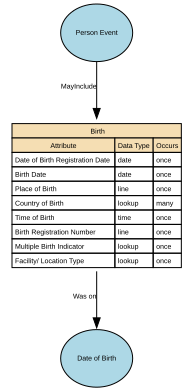

#### Attributes

| Attribute | Description | Data type | Occurs |
|-----------|-------------|-----------|--------|
| Date of Birth Registration Date  | Date of Birth Registration Date is the official date on which a birth is formally recorded by the relevant civil authority (e.g., civil registry, vital records office, statistical authority). It reflects the administrative recognition of the birth event and is distinct from the Date of Birth itself.  This date marks when the birth record enters the official civil registration system, thereby enabling issuance of certificates, identity documentation, and subsequent legal processes. | date | once |
| Birth Date | Date of Birth (DOB) is the official calendar date on which an individual was born, as recognised by the appropriate civil authority or as evidenced by legally accepted documentation. It is a core identity anchor, used across legal, administrative, operational, and analytical systems, and is typically immutable once verified.  DOB is distinct from the Birth Registration Date (administrative) and the Birth Notification Date (clinical/operational). | date | once |
| Place of Birth | Place of Birth is the geographical location where the birth took place, as recorded by the relevant civil authority or evidenced through legally recognised documentation. It is a core identity attribute, supporting identity verification, eligibility checks, historical lineage, and demographic reporting. It denotes the physical location of the birth event, not the parents’ domicile, ancestral origins, or nationality. | line | once |
| Country of Birth | Country of Birth is the sovereign state or recognised territory in which an individual was born, recorded as part of the Birth life event. It reflects the geopolitical jurisdiction at the time of birth, typically captured using ISO‑3166‑1 country codes, and is often used as part of a person’s core identity record.  It is distinct from:  * Place of Birth (full locality: region, town, facility) * Nationality (legal status) * Self‑Identified Nationality (identity expression) * Ancestry or ethnicity (demographic domain) | lookup | many |
| Time of Birth | Time of Birth is the precise time at which an individual was born, recorded in hours and minutes (and optionally seconds) according to the local time zone of the birth location. It is a supplementary birth event attribute, not always available in all jurisdictions, and is typically captured when medically or administratively relevant (e.g., in maternity hospitals or civil registries that store time).  Time of Birth supports identity accuracy, medical lineage, and birth event completeness, but is not a core identity anchor in the same way that Date of Birth is. | time | once |
| Birth Registration Number | Birth Registration Number is the unique identifier assigned by a civil registration authority to a recorded birth event. It serves as the official reference number for the birth within the civil registry system and is used to:  * Link the birth record to authoritative registers * Support identity establishment * Enable issuance of certificates and identity documents * Ensure auditability and traceability of birth‑related updates  This number is assigned by the registering authority, not by the individual or the organisation storing it. | line | once |
| Multiple Birth Indicator | Multiple Birth Indicator identifies whether an individual is part of a multiple birth event, such as twins, triplets, quadruplets, or higher‑order multiples. It provides a binary and/or categorical classification that indicates:  * Whether the birth was part of a multi‑child event, and * Optionally, which child in the birth order the individual is.  This attribute supports identity integrity, clinical lineage, and birth record linkage. It does not store medical detail about pregnancy or delivery. | lookup | once |
| Facility/ Location Type | Birth Facility Location Type identifies the kind of location where an individual was born. It classifies the type of physical setting in which the birth occurred — such as a hospital, clinic, home, or other medically or administratively recognised environment.  This attribute enables a structured and standardised classification, independent of the specific facility name or address.  It does not store clinical details or health outcomes. | lookup | once |

#### Relationships

- [Birth Was on Date of Birth](#69fb6770ea1f7a349307e89d) → [Birth Date](#69fb660aea1f7a349307ba09)
- [Person Event MayInclude Birth](#69a48c8ff751de507cd4eac0) ← [Person Event](#699dbe0ef751de507cd23a3f)

---

### Birth Date

This is the structure defining date of birth and how it's been defined.&#x20;

#### Implements Concepts from Person Domain, Concept Model

| Concept | Description |
|---------|-------------|
| Date of Birth | Date of Birth (DOB) is the official calendar date on which an individual was born, as recognised by the appropriate civil authority or as evidenced by legally accepted documentation.  It is a core identity anchor, used across legal, administrative, operational, and analytical systems, and is typically immutable once verified.  DOB is distinct from the Birth Registration Date (administrative) and the Birth Notification Date (clinical/operational).  It may be an estimate.&#x20; |

#### Attributes

| Attribute | Description | Data type | Occurs |
|-----------|-------------|-----------|--------|
| Date of Birth | Date of Birth (DOB) is the official calendar date on which an individual was born, as recognised by the appropriate civil authority or as evidenced by legally accepted documentation.  It is a core identity anchor, used across legal, administrative, operational, and analytical systems, and is typically immutable once verified.  DOB is distinct from the Birth Registration Date (administrative) and the Birth Notification Date (clinical/operational). | date | once |
| Estimated DOB | Estimated DOB is a data quality indicator used when precise dates of birth are unavailable for identification purposes. Per POLE Data Standards, estimated DOB must pass validation checks: must not be future dates, current dates, or ages exceeding 120 years | yes/no | once |

#### Relationships

- [Birth Was on Date of Birth](#69fb6770ea1f7a349307e89d) ← [Birth](#69a48be5f751de507cd4e22e)

---

### Citizenship

A person’s legal relationship with a state, which grants rights, protections, and obligations under that state’s laws. In a conceptual model, Citizenship is a legal‑status attribute of a Natural Person that identifies the country or sovereign entity recognising them as a citizen.

#### Implements Concepts from Person Domain, Concept Model

| Concept | Description |
|---------|-------------|
| Citizenship | A person’s legal relationship with a state, which grants rights, protections, and obligations under that state’s laws. In a conceptual model, Citizenship is a legal‑status attribute of a Natural Person that identifies the country or sovereign entity recognising them as a citizen. |

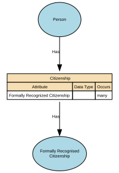

#### Attributes

| Attribute | Description | Data type | Occurs |
|-----------|-------------|-----------|--------|
| Formally Recognized Citizenship  |  | structure | many |

#### Relationships

- [Citizenship Has Formally Recognised Citizenship](#69a49565f751de507cd56e68) → [Formally Recognised Citizenship ](#69a4943ff751de507cd5619b)
- [Person Has Citizenship](#69a49576f751de507cd56f2d) ← [Person](#699dbdecf751de507cd233fc)

---

### Civil Social Titles

Civil Social Titles are non‑professional, non‑noble honorifics used in everyday civil contexts to address or refer to individuals (e.g., Mr, Mrs, Miss, Ms, Mx). They facilitate respectful forms of address, correspondence, and identity presentation but do not indicate rank, role, or qualification.

#### Implements Concepts from Person Domain, Concept Model

| Concept | Description |
|---------|-------------|
| Civil Social Titles | Civil Social Titles are non‑professional, non‑noble honorifics used in everyday civil contexts to address or refer to individuals (e.g., Mr, Mrs, Miss, Ms, Mx). They facilitate respectful forms of address, correspondence, and identity presentation but do not indicate rank, role, or qualification. |

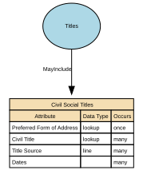

#### Attributes

| Attribute | Description | Data type | Occurs |
|-----------|-------------|-----------|--------|
| Preferred Form of Address | Preferred Form of Address captures how a person wishes to be addressed in communications, independent of legal name or formal titles.  It reflects user preference, not legal identity. | lookup | once |
| Civil Title | Civil Social Titles are non‑professional, non‑noble honorifics used in everyday civil contexts to address or refer to individuals (e.g., Mr, Mrs, Miss, Ms, Mx). They facilitate respectful forms of address, correspondence, and identity presentation but do not indicate rank, role, or qualification. | lookup | many |
| Title Source | Title Source identifies where a person’s title comes from, i.e., the origin, authority, or method by which the title is recognised. It specifies whether the title:  * is legally granted, * assigned by a professional body, * self‑declared, * organisationally assigned, * or derived from official documents.  Title Source tells the system why this title exists and how it should be trusted, without conflating different types of titles.  It is critical for determining verification, usage rights, display rules, and legal compliance. | line | many |
| Dates | Dates for Titles define the period of time during which a given title is valid, active, recognised, or in use for an individual. Titles may be permanent (e.g., “Sir”), fixed-term (e.g., elected roles), conditional (e.g., military rank), or time-limited (e.g., honorary fellowships). Temporal attributes allow organisations to manage title history, render names correctly, and respect changes in status, role, or personal preference.  Typical date fields include:  * effective\_from — when the title became valid or was first adopted * effective\_to — when the title ceased being valid or used (nullable if active) * capture\_date — when the system recorded the title (optional)  These dates apply per title record. | structure | many |

#### Relationships

- [Titles MayInclude Civil Social Titles](#69a4aa2ff751de507cd62bac) ← [Titles](#69a4a95ef751de507cd61b0a)

---

### Death

The factual, legally recognised details surrounding the end of an individual’s life. It includes authoritative attributes such as the date, time, and location of death, as well as official registration information issued by a competent authority. This event provides a definitive closure point for identity records and downstream operational processes.

#### Implements Concepts from Person Domain, Concept Model

| Concept | Description |
|---------|-------------|
| Death | The factual, legally recognised details surrounding the end of an individual’s life. It includes authoritative attributes such as the date, time, and location of death, as well as official registration information issued by a competent authority. This event provides a definitive closure point for identity records and downstream operational processes. |

#### Attributes

| Attribute | Description | Data type | Occurs |
|-----------|-------------|-----------|--------|
| Registered Date of Death | Registered Date of Death is the official date on which a death is formally recorded by the competent civil authority (e.g., civil registry, vital statistics office, municipal registration authority). It reflects the administrative timestamp at which the death was legally recognised and entered into the official civil registration system. It is distinct from the Date of Death (the factual date the individual died).  This attribute underpins legality, auditability, entitlement cessation, and identity lifecycle closure. | date | once |
| Date of Death | Date of Death is the official calendar date on which an individual died, as determined by an authorised certifying professional (e.g., medical practitioner, coroner) or documented on an official death certificate. It represents the actual event date of death — distinct from administrative or registration dates.  This attribute is a core life‑event anchor used across legal, identity, civil‑registration, financial, and operational systems. | date | once |
| Time of Death | Time of Death is the precise time at which an individual is determined to have died, as recorded by a qualified certifying authority (e.g., medical practitioner, coroner, forensic examiner). It is a clinical and/or legal timestamp, distinct from the Date of Death and the Registered Date of Death, and may represent:  * Physiological time of death (actual biological death), or * Pronounced time of death (time a clinician confirmed death), depending on jurisdictional standards. | time | once |
| Place of Death | Place of Death is the geographical location where the individual died, as recorded by the certifying authority (medical practitioner, coroner, hospital administrator) or entered by a civil registration body. It describes the physical setting and locality of the death event, not the registration location or the place where the body was later moved.  Place of Death is a legally relevant identity event attribute that provides context for verification, audit, lineage, and civil‑registration accuracy. | line | once |
| Country of Death | Country of Death is the sovereign state or recognised territory in which an individual died, as recorded by a certifying authority (medical practitioner, coroner, registrar) or by an official civil registration system. It identifies the geopolitical jurisdiction where the death event occurred, using ISO‑3166‑1 country codes for canonical storage.  It is separate from:  * Place of Death (region, city, facility name) * Registered Place of Death (administrative location) * Cause of Death (clinical domain) * Country of Birth (birth event) | lookup | once |
| Death Registration Number | Death Registration Number is the unique identifier assigned by a civil registration authority to the official record of an individual’s death. It provides the authoritative reference for the death entry within the vital records or civil registration system, enabling:  * Legal recognition of the death * Issuance of death certificates * Identity lifecycle closure across systems * Audit and verification of death‑related updates  This identifier is assigned by the registering authority, not by the data‑processing organisation. | line | once |
| Burial or Cremation Number | Burial or Cremation Number is the official identifier assigned to a burial or cremation event by the relevant authority (e.g., cemetery authority, crematorium, local registrar, funeral director, or municipal burial office). It serves as a formal reference number linking the deceased to the specific burial or cremation record, supporting auditability, traceability, and compliance with local regulatory requirements.  It is distinct from the Death Registration Number and any Coroner/Medical Examiner references. | line | once |
| Place of Burial or Cremation | Place of Burial or Cremation is the geographical location where the deceased was formally buried, cremated, or otherwise disposed of, according to the disposition method legally recorded. It identifies the country, region, locality, and facility associated with the post‑death disposition event and is distinct from:  * Place of Death (where the person died) * Registered Place of Death (administrative) * Death Registration Number (legal identifier) * Burial/Cremation Number (disposition identifier)  It provides auditability, lineage, and compliance‑grade traceability for post‑death arrangements. | lookup | once |
| Registrar Office or Authority | Death Registrar Office or Authority identifies the official organisation, governmental body, or authorised civil registration office responsible for formally registering the death and issuing the death registration number or the death certificate. It represents the legal authority of record for the death event and forms part of the authoritative identity lineage.  This attribute ensures auditability, jurisdictional clarity, and traceability across public‑sector, health, and identity‑management systems. | lookup | once |
| Next of Kin | Next of Kin (NoK) is the designated individual(s) identified by a person — or recognised by law or policy — as their primary emergency, legal, or contact person in the event of serious illness, incapacity, or death. It expresses a relationship link, not a legal authority, unless explicitly granted through additional documentation (e.g., power of attorney).  Next of Kin is a person-to-person relationship attribute, not an identity attribute of the individual being described. | structure | many |

#### Relationships

- [Person Event MayInclude Death](#69a4901bf751de507cd50856) ← [Person Event](#699dbe0ef751de507cd23a3f)

---

### Ethnicity (Cultural identify)

Ethnicity is a cultural identity concept that reflects a person’s connection to a group or community defined by shared heritage, ancestry, traditions, culture, language, and/or social experience. It describes how people identify culturally, socially, or historically, not their legal status or nationality.

In a conceptual model, Ethnicity is a self‑identified, culturally grounded attribute of a Natural Person and is separate from Nationality (cultural/national belonging) and Citizenship (legal status).

#### Implements Concepts from Person Domain, Concept Model

| Concept | Description |
|---------|-------------|
| Ethnicity (Cultural identify) | Ethnicity is a cultural identity concept that reflects a person’s connection to a group or community defined by shared heritage, ancestry, traditions, culture, language, and/or social experience. It describes how people identify culturally, socially, or historically, not their legal status or nationality.  In a conceptual model, Ethnicity is a self‑identified, culturally grounded attribute of a Natural Person and is separate from Nationality (cultural/national belonging) and Citizenship (legal status). |

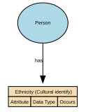

#### Attributes

| Attribute | Description | Data type | Occurs |
|-----------|-------------|-----------|--------|
|  |  |  |  |

#### Relationships

- [Person has Ethnicity (Cultural identify)](#69a4a92bf751de507cd61341) ← [Person](#699dbdecf751de507cd233fc)

---

### Formal Name

Formal Name represents the official, legally recognised version of an individual’s name, as recorded by an authoritative source such as a civil registry, passport, birth certificate, or government-issued identity document. It is the canonical name used in contexts requiring legal identity, compliance, or formal verification.

#### Implements Concepts from Person Domain, Concept Model

| Concept | Description |
|---------|-------------|
| Formal Name | Formal Name represents the official, legally recognised version of an individual’s name, as recorded by an authoritative source such as a civil registry, passport, birth certificate, or government-issued identity document. It is the canonical name used in contexts requiring legal identity, compliance, or formal verification. |

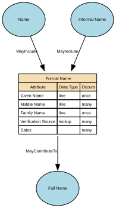

#### Attributes

| Attribute | Description | Data type | Occurs |
|-----------|-------------|-----------|--------|
| Given Name | Given Name is the primary personal name(s) assigned to an individual, typically at birth or legal registration, and used to identify the person within family, social, and formal contexts. It represents the individual’s personal identifier within their full name structure and appears as the first name in many Western naming conventions, but may represent one or more names depending on cultural naming patterns.  This may exist in multiple forms (legal, preferred, informal), depending on the name sub‑domain. | line | once |
| Middle Name | Middle Name refers to any personal name component that appears between the Given Name and the Family Name in an individual’s full name structure. It may consist of one or more name elements, and may serve cultural, familial, religious, or administrative purposes. It is a core structural name attribute, but not always used in every naming tradition.  Middle Names may appear in legal/formal contexts or as optional identity components depending on the jurisdiction. | line | many |
| Family Name | Family Name (also known as surname, last name, or patronymic/matronymic element depending on culture) is the inherited or legally recorded component of a person’s name that identifies their family, lineage, or household grouping. It is a core identifier used across legal, administrative, and social systems and is typically stable across life except where changed through legal processes.  Family Name forms one of the principal anchors of identity and is part of the official full name in most naming systems worldwide. | line | once |
| Verification Source | Verification Source for Name identifies the authoritative channel, document, registry, or method used to confirm the accuracy of a person’s name—whether legal, preferred, or alias—depending on the name sub‑domain. It records where the verification originated, not the document itself.  It underpins trust, traceability, and compliance for name‑related identity management. | lookup | many |
| Dates | Dates for When a Name Is in Use describe the time period during which a specific name record is valid, active, or recognised by the organisation or by legal/authoritative sources. They provide temporal boundaries for each name entry, enabling accurate historical reconstruction, identity auditing, and compliance with legal name‑change processes.  This typically consists of two attributes:  * effective\_from — when the name began being valid or used * effective\_to — when the name ceased to be valid or used (nullable if still active)  These dates apply to each name record, not to the person. | structure | many |

#### Relationships

- [Informal Name MayInclude Formal Name](#69c6d3d59f84c55e29926b22) ← [Informal Name](#69a4939cf751de507cd54f65)
- [Formal Name MayContributeTo Full Name](#6a1834fe4055a62b0ab5926a) → [Full Name](#6a182eac4055a62b0ab568ab)
- [Name MayInclude Formal Name](#69a491a2f751de507cd5239e) ← [Name](#69a4741df751de507cd3f284)
- [Formal Name MayContributeTo Full Name](#69a492b2f751de507cd5435b) ← [Full Name](#69a4929af751de507cd542c8)

---

### Formally Recognised Citizenship 

Formally Recognised Citizenship captures a person’s legally conferred nationality status as recognised by a sovereign state or authority. It reflects official citizenship(s) in force, with provenance to authoritative sources (e.g., passport, national identity registry, certificate of naturalisation).

#### Implements Concepts from Person Domain, Concept Model

| Concept | Description |
|---------|-------------|
| Formally Recognised Citizenship | Formally Recognised Citizenship captures a person’s legally conferred nationality status as recognised by a sovereign state or authority. It reflects official citizenship(s) in force, with provenance to authoritative sources (e.g., passport, national identity registry, certificate of naturalisation). |

#### Attributes

| Attribute | Description | Data type | Occurs |
|-----------|-------------|-----------|--------|
| Country Name | Country Name (Official) is the authoritative, internationally recognised full name of a sovereign state or territory, as recorded in a trusted external standard such as ISO‑3166, the United Nations Terminology Bulletin, or a national government’s official designation. It provides a stable, canonical reference for interoperability, compliance, jurisdictional mapping, and cross‑system alignment. | lookup | many |
| Country Code | Country Code is the standardised alphanumeric or numeric code assigned to a country or territory by an authoritative international standard—most commonly ISO‑3166‑1. It provides a canonical, compact, and language‑independent identifier for countries, enabling consistent interoperability, integration, and global reporting across systems.  This attribute is part of core reference data and must be stable, globally consistent, and governed. | structure | many |
| Legal Status Type | Legal Status of Citizenship describes the formal, legally recognised standing of an individual’s citizenship with respect to a specific country or jurisdiction. It indicates whether citizenship is legally conferred, retained, suspended, revoked, renounced, conditional, or otherwise formally determined under that state's nationality laws.  It reflects legal fact, not self‑identification, residency rights, or application stage. It must be based on authoritative government records, never inferred. | lookup | once |
| Status Description | Citizenship Status Description is a categorical attribute that describes the current legal standing of an individual’s citizenship with respect to a specific country or authority. It expresses whether citizenship is active, revoked, renounced, suspended, conditional, or historical, and, where relevant, the administrative or legal context behind that status.  It does not store legal reasoning, detailed case information, immigration status, or residency rights. | lookup | many |
| Proof of Status | Proof of Status for Citizenship is a structured evidence attribute that records the authoritative documentation or verification method used to confirm an individual’s legally recognised citizenship with a specific country. It captures what evidence was provided, how it was validated, and by whom, without storing the document itself. This attribute provides the audit trail underpinning the Legal Status of Citizenship and Citizenship Status Description records. | lookup | many |
| Dual or Multiple Status | Dual or Multiple Citizenship Status indicates whether an individual holds more than one legally recognised citizenship at the same time. It is a derived, categorical attribute summarising the number of active citizenships linked to the individual, based on authoritative legal citizenship records.  This attribute expresses the cardinality of citizenship, not the legal details of each citizenship.  It does not infer hierarchy, privilege, or rights — it simply describes whether citizenship is single, dual, or multiple. | lookup | once |
| Verification Source | Verification Source (Citizenship) identifies the authoritative channel, system, or method through which a person’s citizenship was validated. It records where the verification came from, such as a government registry, document check, consular confirmation, or trusted digital identity service. It does not store the document itself or legal reasoning — only the verification provenance. It is metadata about how citizenship was confirmed, not evidence itself.  This attribute ensures transparency, auditability, and trust in citizenship status. | lookup | many |
| Dates | Dates for Formally Recognised Citizenship define the legal and administrative time periods during which a person’s citizenship in a specific country is valid, active, suspended, revoked, renounced, or historically recognised. These dates provide a temporal record of citizenship lifecycle, enabling accurate legal interpretation, compliance operations, and historical identity reconstruction.  The attribute set typically includes:  * citizenship\_effective\_from — when citizenship legally begins * citizenship\_effective\_to — when it legally ends (nullable if still active) * status\_change\_date — date a legal status transition occurs (optional) * verification\_date — date citizenship was last officially verified (stored separately or linked)  These dates apply per citizenship record, not globally to the individual. | date | many |

#### Relationships

- [Citizenship Has Formally Recognised Citizenship](#69a49565f751de507cd56e68) ← [Citizenship](#69a49420f751de507cd55a75)

---

### Full Name

Full Name represents a combined or displayable expression of a person’s name.

It may be formed from formal name components, informal name components, or both, depending on context.

In some cases, Full Name may reflect the authoritative identity as it is presented or used.

However, it is not the authoritative structured identity record and must not replace Formal Name or Informal Name in the underlying model.

#### Implements Concepts from Person Domain, Concept Model

| Concept | Description |
|---------|-------------|
| Full Name | Full Name represents a combined or displayable expression of a person’s name. It may be formed from formal name components, informal name components, or both, depending on context. In some cases, Full Name may reflect the authoritative identity as it is presented or used. However, it is not the authoritative structured identity record and must not replace Formal Name or Informal Name in the underlying model |

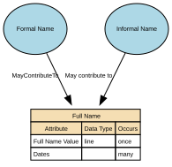

#### Attributes

| Attribute | Description | Data type | Occurs |
|-----------|-------------|-----------|--------|
| Full Name Value | Full Name Value stores the combined or displayable expression of a person’s name. It may be formed from formal name components, informal name components, or both, depending on context. In some cases, it may reflect the authoritative identity as it is presented or used; however, it is not the authoritative structured identity record. | line | once |
| Dates | Dates describe the period during which a Full Name instance is valid or in use.  This may include attributes such as effective\_from, effective\_to, and capture\_date.  Temporal information enables the representation of name history and supports multiple Full Name instances over time. | data type | many |

#### Relationships

- [Informal Name May contribute to Full Name](#69d4ee109f84c55e2993a1aa) ← [Informal Name](#69a4939cf751de507cd54f65)
- [Formal Name MayContributeTo Full Name](#6a1834fe4055a62b0ab5926a) ← [Formal Name](#69a49187f751de507cd52317)

---

### Genetic Ethnicity

A scientific estimate of a person’s ancestral origins based on the analysis of their DNA. It represents inferred biological population groups, expressed as probabilities or percentages, and reflects patterns of genetic similarity shared with reference populations.

It does not represent cultural identity, heritage, nationality, or citizenship—it is a biologically inferred attribute, not a social or legal one.

#### Implements Concepts from Person Domain, Concept Model

| Concept | Description |
|---------|-------------|
| Genetic Ethnicity | A scientific estimate of a person’s ancestral origins based on the analysis of their DNA. It represents inferred biological population groups, expressed as probabilities or percentages, and reflects patterns of genetic similarity shared with reference populations.  It does not represent cultural identity, heritage, nationality, or citizenship—it is a biologically inferred attribute, not a social or legal one. |

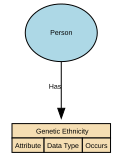

#### Attributes

| Attribute | Description | Data type | Occurs |
|-----------|-------------|-----------|--------|
|  |  |  |  |

#### Relationships

- [Person Has Genetic Ethnicity](#69a4a8fdf751de507cd60a2e) ← [Person](#699dbdecf751de507cd233fc)

---

### Identifiers

Unique references that distinguish one Natural Person from all others within a given context, system, or jurisdiction. They are assigned by an authority (e.g., a government, organisation, or system) for the purpose of uniquely recognising, managing, or relating to that person across processes and datasets.

Identifiers are not the person, and they are not personal attributes (like name, gender, or date of birth). They are tokens that point to the person.

#### Implements Concepts from Person Domain, Concept Model

| Concept | Description |
|---------|-------------|
| Identifiers | Unique references that distinguish one Natural Person from all others within a given context, system, or jurisdiction. They are assigned by an authority (e.g., a government, organisation, or system) for the purpose of uniquely recognising, managing, or relating to that person across processes and datasets.  Identifiers are not the person, and they are not personal attributes (like name, gender, or date of birth). They are tokens that point to the person. |

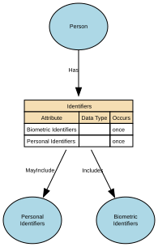

#### Attributes

| Attribute | Description | Data type | Occurs |
|-----------|-------------|-----------|--------|
| Biometric Identifiers |  | structure | once |
| Personal Identifiers | Reference numbers | structure | once |

#### Relationships

- [Person Has Identifiers](#69a4a25bf751de507cd5d0d5) ← [Person](#699dbdecf751de507cd233fc)
- [Identifiers Includes Biometric Identifiers](#69a4a288f751de507cd5d20d) → [Biometric Identifiers](#69a4a1c2f751de507cd5c494)
- [Identifiers MayInclude Personal Identifiers](#69a4a312f751de507cd5dafa) → [Personal Identifiers](#69a4a2f7f751de507cd5d9d0)

---

### Informal Name

The Informal Name sub‑domain captures non‑legal, non‑official name forms that an individual uses in everyday social, cultural, or operational contexts. These names support familiarity, personal preference, and communication ease but hold no legal standing and should not be used for identity verification or regulatory decisioning.

#### Implements Concepts from Person Domain, Concept Model

| Concept | Description |
|---------|-------------|
| Informal Name | The Informal Name sub‑domain captures non‑legal, non‑official name forms that an individual uses in everyday social, cultural, or operational contexts. These names support familiarity, personal preference, and communication ease but hold no legal standing and should not be used for identity verification or regulatory decisioning. It may be used as formal name, informal name, or family name. It can be a shortened version of the formal given name or middle name, or family name.&#x20; |

#### Attributes

| Attribute | Description | Data type | Occurs |
|-----------|-------------|-----------|--------|
| Nick Name | A Nick Name is an informal, non‑legal, personally or socially used variant of an individual’s name. It is a familiar, casual, or culturally specific form that the person may be known by in social, internal, or low‑formality contexts.  It is not legally authoritative, not used for identity verification, and must only be stored when voluntarily self‑reported.  A Nick Name may:  * Shorten a formal name (e.g., Ben for Benjamin) * Modify it culturally (e.g., Sasha for Alexander, Lulu for Louise) * Be an informal or affectionate form (e.g., Buddy, Ace) * Be used only in certain communities or internal teams | line | many |
| Preferred Name | Preferred Name is the non‑legal, self‑chosen name an individual wishes to be addressed by in day‑to‑day communication, services, internal systems, or user‑experience contexts. It may or may not match the person’s legal/formal name. Preferred Name may change over time as the individual's preferences evolve and may include:  * A shortened form of the legal given name * A culturally chosen name used in social or professional contexts * An anglicised or localised form * A chosen first name reflecting personal identity  Preferred Name is authoritative for communication, but not valid for legal, regulatory, or identity verification purposes. | line | many |
| Alias | An Alias is an alternative name that an individual uses in a specific professional, legal, operational, cultural, or pseudonymous context, distinct from their legal name, preferred name, or informal nickname. Aliases may include professional names, stage names, pseudonyms, maiden names used professionally, or documented historical names used in particular roles or activities.  An Alias is not self‑evidently a legal name, but may still require governance depending on usage.  Aliases are used where a person is known by multiple identities in different legitimate contexts. | line | many |
| Verification Source | Verification Source for Informal Names identifies how an informal name (nickname or casual name) was obtained, confirming its origin, provenance, and reliability. Because informal names are non‑legal, non‑authoritative, and self‑expressive, the verification source typically indicates self‑report or low‑assurance internal capture, rather than any formal identity check.  It supports auditability and appropriate use of informal names without elevating them to official identity attributes. | line | many |
| Dates | Dates for Informal Name specify the period of time during which a specific informal name (nickname or casual name) is valid, active, or in use for an individual. Because informal names are self‑reported, non‑legal, and changeable, these dates provide temporal boundaries that support correct display, respectful communication, and accurate identity history without elevating informal names to legal status.  Typical fields include:  * effective\_from — the date the informal name began being used or recorded * effective\_to — the date the informal name ceased being used (nullable if still active) * capture\_date — when the name entry was created (optional but common)  These dates apply per informal name record. | structure | many |

#### Relationships

- [Informal Name MayInclude Formal Name](#69c6d3d59f84c55e29926b22) → [Formal Name](#69a49187f751de507cd52317)
- [Informal Name May contribute to Full Name](#69d4ee109f84c55e2993a1aa) → [Full Name](#6a182eac4055a62b0ab568ab)
- [Informal Name May Be Included In Full Name](#6a183a704055a62b0ab5a6b7) → [Full Name](#69a4929af751de507cd542c8)
- [Name MayInclude Informal Name](#69a493f2f751de507cd55354) ← [Name](#69a4741df751de507cd3f284)

---

### Military Titles

Military Titles represent the official ranks, grades, and honorific forms of address assigned to individuals within armed forces or uniformed services (e.g., Lieutenant, Captain, Colonel). These titles indicate hierarchical position, authority, and command responsibility. They are role‑based, not personal, and may change throughout a career.

#### Implements Concepts from Person Domain, Concept Model

| Concept | Description |
|---------|-------------|
| Military Titles | Military Titles represent the official ranks, grades, and honorific forms of address assigned to individuals within armed forces or uniformed services (e.g., Lieutenant, Captain, Colonel). These titles indicate hierarchical position, authority, and command responsibility. They are role‑based, not personal, and may change throughout a career. |

#### Attributes

| Attribute | Description | Data type | Occurs |
|-----------|-------------|-----------|--------|
| Military Rank | Military Rank is an official, authority‑granted title that indicates an individual’s position, hierarchy level, and role status within an armed forces organisation (e.g., Army, Navy, Air Force, Marines, Space Force). It is a formal, regulated, and legally controlled title issued by a recognised military authority and subject to strict rules, protocols, and temporal validity.  Military Rank is distinct from:  * Job role titles (e.g., Platoon Commander) * Professional titles (e.g., Dr, Prof) * Civil courtesy titles (Mr, Ms) * Honorary military titles (different governance) | lookup | many |
| Service Branch | Service Branch identifies the specific branch of the armed forces in which an individual serves or has served (e.g., Army, Navy, Air Force, Marine Corps, Space Force). It provides the contextual organisational structure for interpreting military rank, military titles, service numbers, and authority-based entitlements.  It is a formal identity attribute within the military domain and must be authoritatively sourced from official service records. | lookup | many |
| Service Number | Service Number is the unique identifier assigned to an individual by a military authority upon enlistment, commission, or service enrolment. It serves as the primary official identifier for the individual within the context of military personnel systems, similar to but distinct from:  * National identity numbers * Unit assignment identifiers * Veteran reference numbers * Military occupational codes  It enables unambiguous identification of service members throughout their military career, across promotions, transfers, deployments, and administrative processes. | line | many |
| Country | Country of Defence Force identifies the nation‑state or recognised sovereign entity to which the defence force the individual serves (or has served) belongs. It anchors the Service Branch, Military Rank, and Service Number to the correct national military authority, clarifying jurisdiction, regulatory rules, rank hierarchy, and entitlements.  It does not infer nationality, citizenship, or ethnicity — it strictly identifies the country that operates the defence force. | lookup | many |
| Status | Country of Defence Force identifies the nation‑state or recognised sovereign entity to which the defence force the individual serves (or has served) belongs. It anchors the Service Branch, Military Rank, and Service Number to the correct national military authority, clarifying jurisdiction, regulatory rules, rank hierarchy, and entitlements.  It does not infer nationality, citizenship, or ethnicity — it strictly identifies the country that operates the defence force. | yes/no | many |
| Verification Source | Verification Source of Rank identifies the authoritative system, documentation, or military body used to verify the accuracy, legitimacy, and current status of an individual’s military rank. It answers the question: “Where did we confirm this rank came from, and how do we know it is valid?”  This attribute ensures that only evidence-backed, formally recognised ranks are reflected in identity and personnel systems. It also supports governance, entitlement validation, and auditability. | lookup | many |
| Dates | Dates for Rank specify the time period during which a specific military rank is valid, active, or historically recorded for an individual. These dates define the rank lifecycle — when the rank was granted, active, suspended, superseded, revoked, or transitioned to another status (e.g., retired).  Military rank is temporal and authoritative, meaning these dates must represent official, evidence‑based events (e.g., promotion orders, demotion decisions, retirement notices).  Typical fields include:  * rank\_effective\_from — the date the rank officially took effect * rank\_effective\_to — the date the rank ceased to be active (nullable if current) * rank\_grant\_date — when promotion/appointment was formally approved * rank\_revocation\_date — where applicable * capture\_date — when the system recorded the rank  These dates apply per rank record, not per person. | date | many |

#### Relationships

- [Titles May Include Military Titles](#69a4bc5ef751de507cd647c1) ← [Titles](#69a4a95ef751de507cd61b0a)

---

### Name

A textual identifier used to refer to or represent a Natural Person, Organisation, Place, or other entity. In conceptual modelling, a Name describes how something is known or addressed, not what it is. Names may consist of multiple components, may vary by context, and may change over time.

At least one Formal Name is required for a Person to ensure a minimum identity representation, while Informal Name remains optional.

#### Implements Concepts from Person Domain, Concept Model

| Concept | Description |
|---------|-------------|
| Name | A textual identifier used to refer to or represent a Natural Person, Organisation, Place, or other entity. In conceptual modelling, a Name describes how something is known or addressed, not what it is. Names may consist of multiple components, may vary by context, and may change over time. |

#### Attributes

| Attribute | Description | Data type | Occurs |
|-----------|-------------|-----------|--------|
| Formal Name |  | structure | many |
| Informal Name |  | structure | many |
| Full Name |  |  | many |

#### Relationships

- [Person MayHave Name](#69a4743cf751de507cd3f2b3) ← [Person](#699dbdecf751de507cd233fc)
- [Name MayInclude Formal Name](#69a491a2f751de507cd5239e) → [Formal Name](#69a49187f751de507cd52317)
- [Name MayInclude Full Name](#69a492c8f751de507cd543ec) → [Full Name](#69a4929af751de507cd542c8)
- [Name MayInclude Informal Name](#69a493f2f751de507cd55354) → [Informal Name](#69a4939cf751de507cd54f65)

---

### Nationality

Describes how an individual identifies with one or more nations, countries, or national groups.

In the Person domain, nationality is treated as a matter of personal identity and self‑expression, rather than legal status. Formal legal nationality or citizenship is modelled separately under Citizenship.

#### Implements Concepts from Person Domain, Concept Model

| Concept | Description |
|---------|-------------|
| Nationality | A person’s formal affiliation to a nation or cultural identity, typically associated with the country or nation with which they identify or are recognised as belonging. In a conceptual model, Nationality represents a descriptive, identity‑based attribute of a Natural Person that may be based on heritage, birth, culture, or personal identification. |

#### Attributes

| Attribute | Description | Data type | Occurs |
|-----------|-------------|-----------|--------|
| Self-Identified Nationality | Represents how an individual self-identifies their nationality or affiliation to one or more countries or recognised groups. Values should be drawn from a controlled vocabulary (e.g. ISO country codes or recognised classifications), rather than free text input. A specific value set is not mandated at this stage and will be defined through future governance. This attribute captures self-identified identity and is distinct from formal legal nationality or citizenship, which is modelled separately. | structure | many |

#### Relationships

- [Nationality MayInclude Self-Identified Nationality](#69a4a6ddf751de507cd5fb94) → [Self-Identified Nationality](#69a4a6a0f751de507cd5f910)
- [Person Has Nationality](#69a4a6bdf751de507cd5fa55) ← [Person](#699dbdecf751de507cd233fc)

---

### Person

An individual human who participates in business activities or interactions. The Person concept represents the identity of a human being independent of the roles they may perform, the relationships they may have, or the contexts in which they act.

#### Implements Concepts from Person Domain, Concept Model

| Concept | Description |
|---------|-------------|
| Person | An individual human who participates in business activities or interactions. The Person concept represents the identity of a human being independent of the roles they may perform, the relationships they may have, or the contexts in which they act. |

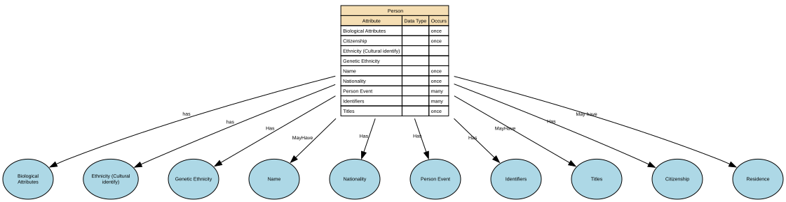

#### Attributes

| Attribute | Description | Data type | Occurs |
|-----------|-------------|-----------|--------|
| Biological Attributes |  | structure | once |
| Citizenship |  | structure | once |
| Ethnicity (Cultural identify) |  | structure |  |
| Genetic Ethnicity |  | structure |  |
| Name |  | structure | once |
| Nationality |  | structure | once |
| Person Event |  | structure | many |
| Identifiers |  | structure | many |
| Titles |  | structure | once |

#### Relationships

- [Person May have Residence](#69b2cab8c3a89f06e1a0fb00) → [Residence](#69b2a6ddc3a89f06e1a0de69)
- [Person Has Genetic Ethnicity](#69a4a8fdf751de507cd60a2e) → [Genetic Ethnicity](#69a4a737f751de507cd60353)
- [Person has Ethnicity (Cultural identify)](#69a4a92bf751de507cd61341) → [Ethnicity (Cultural identify)](#69a4a915f751de507cd611f1)
- [Person MayHave Titles](#69a4a973f751de507cd61c5e) → [Titles](#69a4a95ef751de507cd61b0a)
- [Person Has Nationality](#69a4a6bdf751de507cd5fa55) → [Nationality](#69a4a3e2f751de507cd5e547)
- [Person has Biological Attributes](#69a49621f751de507cd5773a) → [Biological Attributes](#69a49610f751de507cd5766e)
- [Person MayHave Name](#69a4743cf751de507cd3f2b3) → [Name](#69a4741df751de507cd3f284)
- [Person Has Citizenship](#69a49576f751de507cd56f2d) → [Citizenship](#69a49420f751de507cd55a75)
- [Person Has Person Event](#699dbe50f751de507cd23a63) → [Person Event](#699dbe0ef751de507cd23a3f)
- [Person Has Identifiers](#69a4a25bf751de507cd5d0d5) → [Identifiers](#69a4a242f751de507cd5cfb1)

---

### Person Event

An occurrence or change in circumstance that happens to a specific Natural Person at a point in time (or over a period of time) and is relevant to business processes, reporting, or understanding that person’s history. It captures something that happens to or is experienced by the person, rather than a role or relationship they hold.

#### Implements Concepts from Person Domain, Concept Model

| Concept | Description |
|---------|-------------|
| Person Event | An occurrence or change in circumstance that happens to a specific Natural Person at a point in time (or over a period of time) and is relevant to business processes, reporting, or understanding that person’s history. It captures something that happens to or is experienced by the person, rather than a role or relationship they hold. |

#### Attributes

| Attribute | Description | Data type | Occurs |
|-----------|-------------|-----------|--------|
| Birth |  | structure | once |
| Death |  | structure | once |
| Pregnancy |  | structure | many |

#### Relationships

- [Person Event MayInclude Pregnancy](#69a87073f751de507cd77c94) → [Pregnancy](#69a87051f751de507cd77aec)
- [Person Event MayInclude Birth](#69a48c8ff751de507cd4eac0) → [Birth](#69a48be5f751de507cd4e22e)
- [Person Event MayInclude Death](#69a4901bf751de507cd50856) → [Death](#69a49009f751de507cd507d6)
- [Person Has Person Event](#699dbe50f751de507cd23a63) ← [Person](#699dbdecf751de507cd233fc)

---

### Personal Identifiers

Personal Identifier IDs are unique identifiers assigned to a person by an authority or system for identification, linkage, or entitlement. This domain includes government‑issued IDs (e.g., national IDs), organisational master IDs, and cross‑system surrogate keys used to unambiguously reference a person across processes and systems.

#### Implements Concepts from Person Domain, Concept Model

| Concept | Description |
|---------|-------------|
| Personal Identifiers | Personal Identifier IDs are unique identifiers assigned to a person by an authority or system for identification, linkage, or entitlement. This domain includes government‑issued IDs (e.g., national IDs), organisational master IDs, and cross‑system surrogate keys used to unambiguously reference a person across processes and systems. |

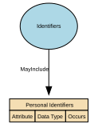

#### Attributes

| Attribute | Description | Data type | Occurs |
|-----------|-------------|-----------|--------|
|  |  |  |  |

#### Relationships

- [Identifiers MayInclude Personal Identifiers](#69a4a312f751de507cd5dafa) ← [Identifiers](#69a4a242f751de507cd5cfb1)

---

### Physical Characteristics

Physical Characteristics refers to observable, measurable, and non‑biometric biological traits of an individual. These features describe physical form or appearance but do not uniquely identify a person on their own. The sub‑domain includes raw descriptive attributes and standardised measurements recorded for classification, profiling, or operational purposes.

#### Implements Concepts from Person Domain, Concept Model

| Concept | Description |
|---------|-------------|
| Physical Characteristics | Physical Characteristics refers to observable, measurable, and non‑biometric biological traits of an individual. These features describe physical form or appearance but do not uniquely identify a person on their own. The sub‑domain includes raw descriptive attributes and standardised measurements recorded for classification, profiling, or operational purposes. |

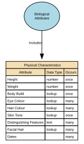

#### Attributes

| Attribute | Description | Data type | Occurs |
|-----------|-------------|-----------|--------|
| Height | Height is a measured physical attribute representing an individual’s vertical body length from the soles of the feet to the top of the head. It is a non‑biometric, non‑clinical, descriptive physical characteristic, used for identification support, profiling, equipment fitting, health & safety contexts, and demographic analytics. It is not unique enough to identify a person on its own. | number | once |
| Weight | Weight is a measured physical attribute representing the mass of an individual’s body at a specific point in time. It is a non‑biometric, non‑clinical physiological measurement used for operational safety, sizing, wellness, and descriptive profiling. It cannot uniquely identify a person and must not be treated as a health diagnosis. | number | once |
| Body Build | Body Build (also known as body frame or body shape) is a general, non‑clinical descriptive attribute that characterises the overall physique or structural appearance of an individual. It captures broad physical proportions (e.g., slim, stocky, athletic, broad) or frame types (e.g., small, medium, large frame) for identification support, equipment provisioning, and anthropometric profiling.  It is not a health assessment, diagnostic category, or body‑composition measurement. | lookup | once |
| Eye Colour | A visible physical characteristic describing the colour(s) of an individual’s irises. It is a non‑biometric, non‑clinical, descriptive attribute used for identification support, profiling, documentation, and certain operational or compliance contexts.  Multiple values may be recorded to support rare but valid cases (for example differing eye colours), without prescribing anatomical detail (such as left/right eye). This attribute is not unique enough to identify a person on its own and does not reveal medical conditions or genetic diagnoses.  Tranche 1 does not mandate a controlled value set; standardisation may be introduced in later iterations where supported by use case evidence. | lookup | many |
| Hair Colour | Hair Colour is a descriptive physical attribute representing either:  1. Natural Hair Colour — the genetically determined or typical baseline hair colour; or 2. Current Hair Colour — the individual’s present hair colour, which may be natural or non‑natural (e.g., dyed, bleached, fashion colours).  This attribute is non‑biometric, non‑clinical, and used solely for descriptive and operational purposes. Neither natural nor current hair colour may be used to infer health, age, ethnicity, or identity. | lookup | many |
| Skin Tone | Skin Tone is a visible physical characteristic describing the general pigmentation or colour range of a person’s skin. It is a non‑clinical, non‑biometric, non‑diagnostic descriptor captured only for specific, justified operational purposes (e.g., identity support, safeguarding, uniform or equipment contexts). It must be broad, neutral, respectful, and standardised—never evaluative or culturally loaded.  Skin Tone cannot be used to infer ethnicity, race, health status, or genetic traits. | lookup | once |
| Distinguishing Features | Distinguishing Features are visible, non‑clinical physical attributes that can help differentiate an individual from others in descriptive or identity‑support contexts. These features are voluntary, non‑sensitive descriptors such as scars, tattoos, birthmarks, moles, or other notable visible characteristics. They must be non‑judgmental, categorical, and minimally descriptive—never detailed, medical, or identifying in a forensic or biometric sense.  This attribute supports operational identification, not biometric matching or surveillance. | text | many |
| Facial Hair | Facial Hair is a visible, non‑clinical, non-biometric physical characteristic describing the presence, absence, type, and general style of hair on the face (e.g., beard, moustache, stubble). It is used for descriptive identification, operational contexts, and appearance‑based workflows where relevant. It is not used for biometric identification, profiling, or inference of age, culture, or gender. | lookup | many |
| Dates | Dates for Physical Characteristics specify the time period during which a specific physical characteristic value is valid or actively in use for the individual. This includes when the characteristic was observed, self‑reported, measured, confirmed, or superseded.  This attribute set creates a temporal identity record, ensuring accurate history and preventing outdated or inaccurate physical descriptors from being used operationally.  Common fields include:  * observation\_date — when the characteristic was captured * effective\_from — start of validity * effective\_to — end of validity (nullable if still active)  These dates are per characteristic, not global. | structure | many |

#### Relationships

- [Biological Attributes Includes Physical Characteristics](#69a49878f751de507cd59245) ← [Biological Attributes](#69a49610f751de507cd5766e)

---

### Physiological Information

Physiological Information describes non‑clinical, non‑diagnostic information about an individual’s biological and bodily functions. It includes physiological or biologically‑derived attributes such as blood type, genetic traits, self‑reported disability, and organ donor status. These attributes are descriptive and operational in nature, rather than cognitive, emotional, or behavioural characteristics, and do not uniquely identify a person

#### Implements Concepts from Person Domain, Concept Model

| Concept | Description |
|---------|-------------|
| Physiological Information | Physiological Information in the Person domain represents non‑clinical, non‑diagnostic information about an individual’s biological and bodily functions. This includes measurable or observable physiological attributes that describe how the body operates (for example blood type, genetic traits, or organ donor status), rather than cognitive, emotional, or behavioural characteristics. These attributes are descriptive and operational in nature and do not, by themselves, uniquely identify a person |

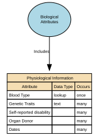

#### Attributes

| Attribute | Description | Data type | Occurs |
|-----------|-------------|-----------|--------|
| Blood Type | Blood Type is a categorical physiological attribute representing an individual’s blood group classification based on recognised antigen systems, primarily the ABO and RhD systems (e.g., A+, O‑, AB−). It describes a stable biological characteristic with operational relevance in certain safety, welfare, and emergency contexts. It is not a diagnostic or medical condition. | lookup | once |
| Genetic Traits | Genetic Traits represent stable, inherited biological characteristics that are encoded in an individual’s DNA and manifest as observable, non‑clinical traits (e.g., eye colour predisposition, lactose tolerance, natural hair colour tendency). This attribute captures general genetic tendencies, not medical diagnoses, disease markers, or full genomic data. | text | many |
| Self-reported disability | Also known as impairment.  Self-reported disability is a rights‑based characteristic indicating that an individual has a long‑term physical, mental, cognitive, or sensory impairment which, in interaction with barriers, may limit equal participation in daily activities or environments. This attribute reflects functional impact and support needs, not medical diagnoses or clinical details. | structure | many |
| Organ Donor | Organ Donor indicates whether an individual has formally recorded consent, objection, or preference regarding the donation of their organs and/or tissues after death. This attribute reflects a person’s legally or administratively recognized donor decision, not medical suitability or clinical screening.  It records consent status, not medical data.  May be known as Tissue donor. | structure | many |
| Dates | Dates for Physiological Information define the time period during which a specific physiological measurement or observation is valid, active, or considered accurate for operational or analytical use. Because physiological attributes (e.g., heart rate, oxygen saturation, resting blood pressure, metabolic rate) can change frequently, these dates provide temporal context for correctness, safety, and interpretation.  The attribute set typically includes:  * measurement\_date — when the physiological value was captured * effective\_from — when the value first becomes valid for use * effective\_to — when it stops being valid (nullable if still active)  These are per‑attribute timestamps, not global to the person. | structure | many |

#### Relationships

- [Biological Attributes Includes Physiological Information](#69a4a0dbf751de507cd5b9d4) ← [Biological Attributes](#69a49610f751de507cd5766e)

---

### Post-Nominal Titles

Post‑Nominal Titles are letters placed after a person’s name that denote orders, decorations, honours, academic degrees, professional memberships, licensure, or fellowships (e.g., OBE, PhD, FRCS, CPA). They confer recognition or qualification, not forms of address, and are typically governed by awarding bodies with formal usage rules.

#### Implements Concepts from Person Domain, Concept Model

| Concept | Description |
|---------|-------------|
| Post-Nominal Titles | Post‑Nominal Titles are letters placed after a person’s name that denote orders, decorations, honours, academic degrees, professional memberships, licensure, or fellowships (e.g., OBE, PhD, FRCS, CPA). They confer recognition or qualification, not forms of address, and are typically governed by awarding bodies with formal usage rules. |

#### Attributes

| Attribute | Description | Data type | Occurs |
|-----------|-------------|-----------|--------|
|  |  |  |  |

#### Relationships

- [Titles MayInclude Post-Nominal Titles](#69a4bd1bf751de507cd65d15) ← [Titles](#69a4a95ef751de507cd61b0a)

---

### Pregnancy

Pregnancy is a time‑bound life event that records the fact that an individual is pregnant, including the start, expected milestones, and outcome of the pregnancy where relevant for operational, safeguarding, or service‑eligibility purposes. It captures non‑clinical, administrative facts only—not medical diagnoses, treatment notes, or clinical assessments.

#### Implements Concepts from Person Domain, Concept Model

| Concept | Description |
|---------|-------------|
| Pregnancy | Pregnancy is a time‑bound life event that records the fact that an individual is pregnant, including the start, expected milestones, and outcome of the pregnancy where relevant for operational, safeguarding, or service‑eligibility purposes. It captures non‑clinical, administrative facts only—not medical diagnoses, treatment notes, or clinical assessments. |

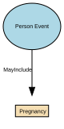

#### Relationships

- [Person Event MayInclude Pregnancy](#69a87073f751de507cd77c94) ← [Person Event](#699dbe0ef751de507cd23a3f)

---

### Professional Occupational Titles

Professional Occupational Titles are titles or prefixes associated with a person’s profession, occupation, or accredited role, used to indicate an individual’s professional standing, qualification, or occupational function. They are not academic degrees or post‑nominals, but pre‑nominal markers tied to recognised professions (e.g., Dr, Prof, Eng, Nurse, Architect). These titles support appropriate address, professional recognition, and role‑based communication.

#### Implements Concepts from Person Domain, Concept Model

| Concept | Description |
|---------|-------------|
| Professional Occupational Titles | Professional Occupational Titles are titles or prefixes associated with a person’s profession, occupation, or accredited role, used to indicate an individual’s professional standing, qualification, or occupational function. They are not academic degrees or post‑nominals, but pre‑nominal markers tied to recognised professions (e.g., Dr, Prof, Eng, Nurse, Architect). These titles support appropriate address, professional recognition, and role‑based communication. |

#### Attributes

| Attribute | Description | Data type | Occurs |
|-----------|-------------|-----------|--------|
| Professional Title | A Professional Title is a formally recognised title, credential, or designation that indicates an individual’s professional status, qualification, licensure, accreditation, or role-based authority within a specific domain (e.g., medicine, law, engineering, academia). It signals that a person has achieved a professionally governed standing, often regulated by a professional body, accreditation authority, educational institution, or licensing regulator.  Professional Titles differ from:  * Civil courtesy titles (Mr, Ms, Mx) * Military ranks (Captain, Major) * Religious titles (Rev, Imam) * Job role titles (Head of Digital, Finance Manager) * Post‑nominals (PhD, MSc, CPA — qualification identifiers)  Professional Titles are role-, competence-, or licence‑based and often carry legal or operational implications. | lookup | once |
| Field Profession | Field Profession describes the broad professional field, discipline, or domain of practice within which an individual’s professional title, occupation, or role is situated. It captures the sector‑level classification (e.g., Medicine, Engineering, Law, Education) rather than a specific job title or qualification.  Field Profession creates a normalised, high‑level professional grouping that supports reporting, entitlement logic, governance, and rendering rules without storing overly granular occupational details.  It is not a job title, skill, qualification, or occupational code—rather, it is the professionally recognised field or discipline. | line | once |
| Dates | Dates Professional Title Held specify the time period during which an individual legitimately holds, is authorised to use, or is recognised as possessing a specific professional title (e.g., Dr (Medical), Professor, Chartered Engineer, Solicitor). These dates define the validity window of a professional title, reflecting licensure, certification, employment status, or accreditation from a professional body or authority.  Unlike Preferred Name or Courtesy Titles, professional titles are not self-declared — their timeline must reflect formal evidence.  Typical fields include:  * effective\_from — when the professional title became valid * effective\_to — when the professional title ceased being valid (nullable if still active) * grant\_date / conferment\_date — when the accrediting authority formally awarded the title * expiry\_date (if the title requires renewal, e.g., licences) * capture\_date — when the system recorded it (optional)  These dates are per professional title, not person‑wide. | structure | many |

#### Relationships

- [Titles MayInclude Professional Occupational Titles](#69a49fd8f751de507cd5a36d) ← [Titles](#69a4a95ef751de507cd61b0a)

---

### Psychological Characteristics

Psychological Characteristics refer to non‑clinical, non‑diagnostic attributes that describe an individual’s typical cognitive, emotional, and behavioural tendencies. These characteristics represent stable patterns of thinking and behaviour, not mental health conditions, and do not uniquely identify a person. They may include personality traits, cognitive style descriptors, and general behavioural dispositions.

#### Relationships

- [Biological Attributes Includes Psychological Characteristics](#69a4a127f751de507cd5bc26) ← [Biological Attributes](#69a49610f751de507cd5766e)

---

### Religious Titles

Religious Titles are formal honorifics, ranks, or styles of address associated with roles, positions, or consecrated statuses within recognised religious traditions (e.g., Reverend, Rabbi, Imam, Sister, Monsignor, Guru). These titles indicate spiritual authority, clerical office, or religious vocation, and are used in formal or community contexts to show respect and denote role-based standing.

#### Implements Concepts from Person Domain, Concept Model

| Concept | Description |
|---------|-------------|
| Religious Titles | Religious Titles are formal honorifics, ranks, or styles of address associated with roles, positions, or consecrated statuses within recognised religious traditions (e.g., Reverend, Rabbi, Imam, Sister, Monsignor, Guru). These titles indicate spiritual authority, clerical office, or religious vocation, and are used in formal or community contexts to show respect and denote role-based standing. |

#### Attributes

| Attribute | Description | Data type | Occurs |
|-----------|-------------|-----------|--------|
| Religious Title Granted | Religious Title Granted refers to the formal religious title, rank, or designation conferred on an individual by a recognised religious authority, institution, or governing body. It reflects a spiritually or institutionally recognised status, such as ordination, consecration, clergy appointment, or religious office.  Religious titles differ from civil courtesy titles (Mr, Ms), professional titles (Dr, Prof), military ranks (Captain), and job roles. They often carry ceremonial, pastoral, or leadership responsibilities within a faith community. | lookup | many |
| Religious Order | Religious Order identifies the specific monastic, clerical, or spiritual community, congregation, or tradition to which an individual belongs, has taken vows within, or is formally associated with. It represents a structured affiliation within a broader religion, typically defined by:  * A rule or charism (e.g., Franciscan, Benedictine) * A community or organisation (e.g., Jesuit community, Carmelite Order) * A tradition or lineage (e.g., Nichiren Buddhist order, Sufi tariqa)  This attribute is not the same as a religious title; it captures affiliation, not rank. | lookup | many |
| Religious Appointing Authority | Religious Order identifies the specific monastic, clerical, or spiritual community, congregation, or tradition to which an individual belongs, has taken vows within, or is formally associated with. It represents a structured affiliation within a broader religion, typically defined by:  * A rule or charism (e.g., Franciscan, Benedictine) * A community or organisation (e.g., Jesuit community, Carmelite Order) * A tradition or lineage (e.g., Nichiren Buddhist order, Sufi tariqa)  This attribute is not the same as a religious title; it captures affiliation, not rank. | lookup | many |
| Dates | Dates of Religious Title define the time period during which a specific religious title, role, clerical status, or spiritual office is valid, active, recognised, or historically recorded for an individual. These dates reflect formal ecclesiastical or religious processes such as ordination, appointment, consecration, commissioning, elevation, transfer, emeritus designation, revocation, or release.  This attribute ensures temporal accuracy, lineage, and authority-compliant handling of religious titles. | structure | many |

#### Relationships

- [Titles MayInclude Religious Titles](#69a4bce3f751de507cd65374) ← [Titles](#69a4a95ef751de507cd61b0a)

---

### Residence

A time‑bounded assertion that a Person resides at a Location with a specified Residence. Includes legal/primary residence, secondary residences, historical changes, validation against jurisdictional reference data. Excludes temporary contact addresses, delivery addresses, lodging/travel events, property ownership details (unless used to evidence residence).

#### Implements Concepts from Person Domain, Concept Model

| Concept | Description |
|---------|-------------|
| Residence | A time‑bounded assertion that a Person resides at a Location with a specified Residence. Includes legal/primary residence, secondary residences, historical changes, validation against jurisdictional reference data. Excludes temporary contact addresses, delivery addresses, lodging/travel events, property ownership details (unless used to evidence residence). |

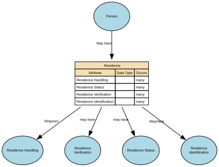

#### Attributes

| Attribute | Description | Data type | Occurs |
|-----------|-------------|-----------|--------|
| Residence Handling |  | structure | many |
| Residence Status |  | structure | many |
| Residence Verification |  | structure | many |
| Residence Identification |  | structure | many |

#### Relationships

- [Person May have Residence](#69b2cab8c3a89f06e1a0fb00) ← [Person](#699dbdecf751de507cd233fc)
- [Residence MayHave Residence identification](#69b2cae2c3a89f06e1a0fcae) → [Residence identification](#69b2a79fc3a89f06e1a0e8c8)
- [Residence may have Residence Status](#69b2df3ec3a89f06e1a1655f) → [Residence Status](#69b2df27c3a89f06e1a16153)
- [Residence may have Residence Verification](#69b2e018c3a89f06e1a17e95) → [Residence Verification](#69b2e007c3a89f06e1a17a7d)
- [Residence Requires Residence Handling](#69b2e072c3a89f06e1a18933) → [Residence Handling](#69b2e04bc3a89f06e1a1850f)

---

### Residence Handling

Residence Handling refers to the governed rules, behaviours, and constraints that define how residency data may be collected, processed, stored, shared, updated, retained, secured, and used within a data domain.

#### Implements Concepts from Person Domain, Concept Model

| Concept | Description |
|---------|-------------|
| Residence Handling | Residence Handling refers to the governed rules, behaviours, and constraints that define how residency data may be collected, processed, stored, shared, updated, retained, secured, and used within a data domain. |

#### Attributes

| Attribute | Description | Data type | Occurs |
|-----------|-------------|-----------|--------|
| Residence Confidentiality | Residence Confidentiality is the governed classification that determines the level of privacy protection applied to a residency fact, ensuring that residence information is disclosed, stored, accessed, and shared only in accordance with the required confidentiality level. | lookup | many |
| Special Handling indicator | Residence Special Handling indicator confirms if additional controls are required and how access will be permitted.&#x20; | yes/no | many |
| Residence accessibility | Residence Data Accessibility specifies the authorised access levels for residency facts, determining how much information can be viewed, by whom, and in which contexts, aligned with privacy, risk, legal, and safeguarding constraints. | lookup | many |
| Dates |  | structure | many |

#### Relationships

- [Residence Requires Residence Handling](#69b2e072c3a89f06e1a18933) ← [Residence](#69b2a6ddc3a89f06e1a0de69)

---

### Residence Status

Residence Type specifies the role, purpose, and legal/operational meaning of a residency relationship between a place or property and a person.

#### Implements Concepts from Person Domain, Concept Model

| Concept | Description |
|---------|-------------|
| Residence Status | Residence Type specifies the role, purpose, and legal/operational meaning of a residency relationship between a place or property and a person. |

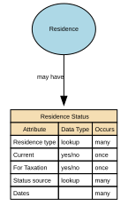

#### Attributes

| Attribute | Description | Data type | Occurs |
|-----------|-------------|-----------|--------|
| Residence type | Residence Type describes what kind of residence a Residence Fact represents — such as primary, secondary, historical, declared, inferred, or statutory — providing semantic clarity for business rules, compliance, and interpretation. | lookup | many |
| Current | Current Residence is the Residence Fact for which the Residence Status is Active, the effective period includes today, and the record has not been superseded or ended. | yes/no | once |
| For Taxation | Residence for Tax is the legally recognised tax residency of a Party, determined by statutory criteria and supported by verified residency facts, used to establish tax obligations, compliance, reporting, and regulatory responsibilities. | yes/no | once |
| Status source | Declared and Observed are semantic qualifiers that describe how a residence fact was created or asserted:  * Declared Residence — the Party (person or legal entity representative) told you this is their residence. * Observed Residence — the organisation inferred or detected this residence from system behaviour, external signals, or passive data sources. | lookup | many |
| Dates |  | structure | many |

#### Relationships

- [Residence may have Residence Status](#69b2df3ec3a89f06e1a1655f) ← [Residence](#69b2a6ddc3a89f06e1a0de69)

---

### Residence Verification

Residence Verification describes the degree of confidence, method, and evidence supporting the assertion that a Party (Person or Legal Entity) resides at a given Location.

#### Implements Concepts from Person Domain, Concept Model

| Concept | Description |
|---------|-------------|
| Residence Verification | Residence Verification describes the degree of confidence, method, and evidence supporting the assertion that a Party (Person or Legal Entity) resides at a given Location. |

#### Attributes

| Attribute | Description | Data type | Occurs |
|-----------|-------------|-----------|--------|
| Verification Status | Verification Status indicates whether a residency fact has been confirmed, is awaiting verification, remains unverified, or has been rejected based on the evaluation of evidence and authorised checks. | lookup | many |
| Validation source | Residence Validation Source describes the origin of the information or evidence used to confirm, refute, or assess the validity of a residence fact. | line | many |
| Validation Dates | Residence Validation Dates are the time‑based semantic properties that define the verification timestamp, validity window, and re‑verification schedule associated with a residency fact. | date | many |

#### Relationships

- [Residence may have Residence Verification](#69b2e018c3a89f06e1a17e95) ← [Residence](#69b2a6ddc3a89f06e1a0de69)

---

### Residence identification

Residence Identification refers uniquely and consistently identify, reference, and distinguish one residence fact from another within a Party domain.

#### Implements Concepts from Person Domain, Concept Model

| Concept | Description |
|---------|-------------|
| Residence identification | Residence Identification refers uniquely and consistently identify, reference, and distinguish one residence fact from another within a Party domain. |

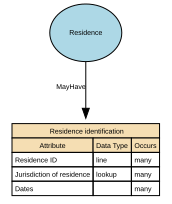

#### Attributes

| Attribute | Description | Data type | Occurs |
|-----------|-------------|-----------|--------|
| Residence ID | Residence ID is the globally unique, immutable identifier assigned to a Residence Fact — the relationship between a Person and a Location, with associated type, status, verification, and temporal attributes. | line | many |
| Jurisdiction of residence | Jurisdiction of Residence is the legal or administrative authority that governs the residences Location. | lookup | many |
| Dates |  | structure | many |

#### Relationships

- [Residence MayHave Residence identification](#69b2cae2c3a89f06e1a0fcae) ← [Residence](#69b2a6ddc3a89f06e1a0de69)

---

### Self-Identified Nationality

Self‑Identified Nationality represents how an individual personally defines or expresses their own national identity, independent of citizenship, passport, or legal status. It reflects cultural affiliation, heritage, or personal identification, and is self‑reported, non‑authoritative, and used solely for demographic, engagement, or inclusion‑related purposes.

This attribute does not confer any legal rights or obligations.

#### Implements Concepts from Person Domain, Concept Model

| Concept | Description |
|---------|-------------|
| Self-Identified Nationality | Self‑Identified Nationality represents how an individual personally defines or expresses their own national identity, independent of citizenship, passport, or legal status. It reflects cultural affiliation, heritage, or personal identification, and is self‑reported, non‑authoritative, and used solely for demographic, engagement, or inclusion‑related purposes.  This attribute does not confer any legal rights or obligations. |

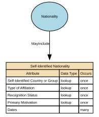

#### Attributes

| Attribute | Description | Data type | Occurs |
|-----------|-------------|-----------|--------|
| Self-Identified Country or Group | Self‑Identified Country or Group represents the country, cultural group, territory, people, or national identity that an individual personally associates with, irrespective of legal citizenship or official nationality. It is self‑reported, non‑authoritative, and used exclusively for demographic insight, inclusion, and respectful identity handling.  This attribute captures the label the individual uses for their own national or cultural identity, such as Scottish, Basque, Catalan, Hong Konger, Welsh, Kurdish, Sámi, Galician, Palestinian, Tamil, Bavarian, Inuit, or American.  It is a personal identity expression, not a legal classification. | lookup | once |
| Type of Affiliation | Type of Affiliation describes the basis or nature of a person’s self‑identified national or group identity. It categorises how an individual relates to a self‑identified country, territory, cultural group, or people — whether through heritage, cultural identity, lived experience, belonging, community membership, or personal self‑identification.  This attribute is self‑reported, non‑authoritative, and strictly for demographic insight, inclusion, and respectful representation — not for legal, operational, or compliance decisions.  Values should be drawn from a controlled vocabulary rather than free text, to ensure consistency and interoperability. A specific value set is not mandated at this stage and will be defined through future governance and alignment. | lookup | once |
| Recognition Status | Recognition Status indicates how receiving organisations or systems may acknowledge, interpret, or display an individual’s self‑identified nationality, country, or group in operational systems or reporting.&#x20;  It captures organisational handling rules (e.g. approved, restricted, suppressed) applied to a self‑reported identity that has no legal standing but is relevant to inclusion, engagement, or user experience.&#x20;  Values should be drawn from a controlled vocabulary rather than free text, to ensure consistency and interoperability.&#x20;  This represents how the self‑identified value is handled in practice, not whether a state or international body formally recognises the group. | lookup | once |
| Primary Motivation | Primary Motivation describes the main reason or basis an individual chooses to self‑identify with a specific nationality, country, territory, cultural group, or people.  It captures the personal rationale behind the identity — such as heritage, upbringing, cultural alignment, lived experience, or personal meaning — and is self‑reported, non‑authoritative, and used solely for identity expression, inclusion, and engagement insights.  This attribute clarifies why the self‑identified nationality is meaningful to the individual.  Values should be drawn from a controlled vocabulary rather than free text, to ensure consistency and interoperability | lookup | once |
| Dates | A self‑identified nationality is a statement made by the person about the nationality (or nationalities) they identify with. The date fields should describe the validity period of that self‑identification, not necessarily legal citizenship dates.  Self‑Identified Nationality Start Date (Valid From) - The date the person first reports (or you first record) that they self‑identify with the specified nationality.  Self‑Identified Nationality End Date (Valid To) - The date the person stops reporting (or you stop treating as current) that they self‑identify with the specified nationality. | structure | many |

#### Relationships

- [Nationality MayInclude Self-Identified Nationality](#69a4a6ddf751de507cd5fb94) ← [Nationality](#69a4a3e2f751de507cd5e547)

---

### Sex and Gender

The Sex and Gender sub‑domain covers data elements that describe an individual’s biological sex characteristics and gender identity attributes for the purposes of identity management, demographic classification, and service personalisation. It differentiates between sex‑related biological attributes and self‑described gender identity, reflecting both regulatory expectations and modern data‑standards practice. It also include how these relate to and define Legal Sex.

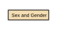

#### Relationships

- [Biological Attributes Has Sex and Gender](#69a4a0c7f751de507cd5b8cb) ← [Biological Attributes](#69a49610f751de507cd5766e)

---

### Titles

An honorific or form of address associated with a Natural Person, used to indicate courtesy, social status, professional standing, or preference. It does not identify the person and does not imply any legal role or relationship—it's simply an attribute describing how the person chooses (or is required) to be addressed.

#### Implements Concepts from Person Domain, Concept Model

| Concept | Description |
|---------|-------------|
| Titles | An honorific or form of address associated with a Natural Person, used to indicate courtesy, social status, professional standing, or preference. It does not identify the person and does not imply any legal role or relationship—it's simply an attribute describing how the person chooses (or is required) to be addressed. |

#### Attributes

| Attribute | Description | Data type | Occurs |
|-----------|-------------|-----------|--------|
| Civil Social Titles | Professional Occupational Titles are titles or prefixes associated with a person’s profession, occupation, or accredited role, used to indicate an individual’s professional standing, qualification, or occupational function. They are not academic degrees or post‑nominals, but pre‑nominal markers tied to recognised professions (e.g., Dr, Prof, Eng, Nurse, Architect). These titles support appropriate address, professional recognition, and role‑based communication. | structure | once |
| Military Titles | Military Titles represent the official ranks, grades, and honorific forms of address assigned to individuals within armed forces or uniformed services (e.g., Lieutenant, Captain, Colonel). These titles indicate hierarchical position, authority, and command responsibility. They are role‑based, not personal, and may change throughout a career. | structure | once |
| Professional Occupational Titles | Professional / Occupational Titles are role‑based or qualification‑based titles that indicate a person’s profession, occupation, licensure, position, or accredited status within a recognised field. They reflect professional standing, licensed capacity, or institutionally granted rank, and may be:  * legally protected, * regulated by a professional body, or * organisationally assigned.  These titles are distinct from civil courtesy titles (Mr, Ms), preferred/social titles (Mx, preferred forms), religious titles (Rev), and military ranks (Captain). | structure | once |
| Religious Titles | Religious Titles are formal honorifics, ranks, or styles of address associated with roles, positions, or consecrated statuses within recognised religious traditions (e.g., Reverend, Rabbi, Imam, Sister, Monsignor, Guru). These titles indicate spiritual authority, clerical office, or religious vocation, and are used in formal or community contexts to show respect and denote role-based standing. | structure | once |
| Post-Nominal Titles | Post‑Nominal Titles are letters placed after a person’s name that denote orders, decorations, honours, academic degrees, professional memberships, licensure, or fellowships (e.g., OBE, PhD, FRCS, CPA). They confer recognition or qualification, not forms of address, and are typically governed by awarding bodies with formal usage rules. |  | once |

#### Relationships

- [Person MayHave Titles](#69a4a973f751de507cd61c5e) ← [Person](#699dbdecf751de507cd233fc)
- [Titles MayInclude Civil Social Titles](#69a4aa2ff751de507cd62bac) → [Civil Social Titles](#69a4a99af751de507cd6242d)
- [Titles May Include Military Titles](#69a4bc5ef751de507cd647c1) → [Military Titles](#69a4bc47f751de507cd64638)
- [Titles MayInclude Religious Titles](#69a4bce3f751de507cd65374) → [Religious Titles](#69a4bccef751de507cd651e0)
- [Titles MayInclude Post-Nominal Titles](#69a4bd1bf751de507cd65d15) → [Post-Nominal Titles](#69a4bd06f751de507cd65b7f)
- [Titles MayInclude Professional Occupational Titles](#69a49fd8f751de507cd5a36d) → [Professional Occupational Titles](#69a4aa60f751de507cd6338d)

## Relationships

### Person May have Residence

**Entity from:** [Person](#699dbdecf751de507cd233fc)  
**Entity to:** [Residence](#69b2a6ddc3a89f06e1a0de69)  
**Cardinality:** one to many  

---

### Nationality MayInclude Self-Identified Nationality

**Entity from:** [Nationality](#69a4a3e2f751de507cd5e547)  
**Entity to:** [Self-Identified Nationality](#69a4a6a0f751de507cd5f910)  
**Cardinality:** one to many  

---

### Person Has Genetic Ethnicity

**Entity from:** [Person](#699dbdecf751de507cd233fc)  
**Entity to:** [Genetic Ethnicity](#69a4a737f751de507cd60353)  
**Cardinality:** one to one  

---

### Person has Ethnicity (Cultural identify)

**Entity from:** [Person](#699dbdecf751de507cd233fc)  
**Entity to:** [Ethnicity (Cultural identify)](#69a4a915f751de507cd611f1)  
**Cardinality:** one to many  

---

### Person MayHave Titles

**Entity from:** [Person](#699dbdecf751de507cd233fc)  
**Entity to:** [Titles](#69a4a95ef751de507cd61b0a)  
**Cardinality:** one to one  

---

### Titles MayInclude Civil Social Titles

**Entity from:** [Titles](#69a4a95ef751de507cd61b0a)  
**Entity to:** [Civil Social Titles](#69a4a99af751de507cd6242d)  
**Cardinality:** one to many  

---

### Titles May Include Military Titles

**Entity from:** [Titles](#69a4a95ef751de507cd61b0a)  
**Entity to:** [Military Titles](#69a4bc47f751de507cd64638)  
**Cardinality:** one to many  

---

### Titles MayInclude Religious Titles

**Entity from:** [Titles](#69a4a95ef751de507cd61b0a)  
**Entity to:** [Religious Titles](#69a4bccef751de507cd651e0)  
**Cardinality:** one to many  

---

### Titles MayInclude Post-Nominal Titles

**Entity from:** [Titles](#69a4a95ef751de507cd61b0a)  
**Entity to:** [Post-Nominal Titles](#69a4bd06f751de507cd65b7f)  
**Cardinality:** one to many  

---

### Person Event MayInclude Pregnancy

**Entity from:** [Person Event](#699dbe0ef751de507cd23a3f)  
**Entity to:** [Pregnancy](#69a87051f751de507cd77aec)  
**Cardinality:** one to many  

---

### Person Has Nationality

**Entity from:** [Person](#699dbdecf751de507cd233fc)  
**Entity to:** [Nationality](#69a4a3e2f751de507cd5e547)  
**Cardinality:** one to one  

---

### Residence MayHave Residence identification

**Entity from:** [Residence](#69b2a6ddc3a89f06e1a0de69)  
**Entity to:** [Residence identification](#69b2a79fc3a89f06e1a0e8c8)  
**Cardinality:** one to many  

---

### Residence may have Residence Status

**Entity from:** [Residence](#69b2a6ddc3a89f06e1a0de69)  
**Entity to:** [Residence Status](#69b2df27c3a89f06e1a16153)  
**Cardinality:** one to many  

---

### Residence may have Residence Verification

**Entity from:** [Residence](#69b2a6ddc3a89f06e1a0de69)  
**Entity to:** [Residence Verification](#69b2e007c3a89f06e1a17a7d)  
**Cardinality:** one to many  

---

### Residence Requires Residence Handling

**Entity from:** [Residence](#69b2a6ddc3a89f06e1a0de69)  
**Entity to:** [Residence Handling](#69b2e04bc3a89f06e1a1850f)  
**Cardinality:** one to many  

---

### Informal Name MayInclude Formal Name

**Entity from:** [Informal Name](#69a4939cf751de507cd54f65)  
**Entity to:** [Formal Name](#69a49187f751de507cd52317)  
**Cardinality:** one to many  

---

### Informal Name May contribute to Full Name

**Entity from:** [Informal Name](#69a4939cf751de507cd54f65)  
**Entity to:** [Full Name](#6a182eac4055a62b0ab568ab)  
**Cardinality:** one to many  

Informal Name may contribute to a Full Name representation. Full Name may be composed from informal or contextual name components depending on context.

---

### Birth Was on Date of Birth

**Entity from:** [Birth](#69a48be5f751de507cd4e22e)  
**Entity to:** [Birth Date](#69fb660aea1f7a349307ba09)  
**Cardinality:** one to one  

---

### Formal Name MayContributeTo Full Name

**Entity from:** [Formal Name](#69a49187f751de507cd52317)  
**Entity to:** [Full Name](#6a182eac4055a62b0ab568ab)  
**Cardinality:** one to many  

---

### Informal Name May Be Included In Full Name

**Entity from:** [Informal Name](#69a4939cf751de507cd54f65)  
**Entity to:** [Full Name](#69a4929af751de507cd542c8)  
**Cardinality:** one to many  

Informal Name may contribute to a Full Name representation. Full Name may include informal or contextual name components depending on context.

---

### Person has Biological Attributes

**Entity from:** [Person](#699dbdecf751de507cd233fc)  
**Entity to:** [Biological Attributes](#69a49610f751de507cd5766e)  
**Cardinality:** one to one  

---

### Person MayHave Name

**Entity from:** [Person](#699dbdecf751de507cd233fc)  
**Entity to:** [Name](#69a4741df751de507cd3f284)  
**Cardinality:** one to one  

---

### Person Event MayInclude Birth

**Entity from:** [Person Event](#699dbe0ef751de507cd23a3f)  
**Entity to:** [Birth](#69a48be5f751de507cd4e22e)  
**Cardinality:** one to one  

---

### Person Event MayInclude Death

**Entity from:** [Person Event](#699dbe0ef751de507cd23a3f)  
**Entity to:** [Death](#69a49009f751de507cd507d6)  
**Cardinality:** one to one  

---

### Name MayInclude Formal Name

**Entity from:** [Name](#69a4741df751de507cd3f284)  
**Entity to:** [Formal Name](#69a49187f751de507cd52317)  
**Cardinality:** one to many  

---

### Formal Name MayContributeTo Full Name

**Entity from:** [Full Name](#69a4929af751de507cd542c8)  
**Entity to:** [Formal Name](#69a49187f751de507cd52317)  
**Cardinality:** one to many  

---

### Name MayInclude Full Name

**Entity from:** [Name](#69a4741df751de507cd3f284)  
**Entity to:** [Full Name](#69a4929af751de507cd542c8)  
**Cardinality:** one to one  

---

### Name MayInclude Informal Name

**Entity from:** [Name](#69a4741df751de507cd3f284)  
**Entity to:** [Informal Name](#69a4939cf751de507cd54f65)  
**Cardinality:** one to many  

---

### Citizenship Has Formally Recognised Citizenship

**Entity from:** [Citizenship](#69a49420f751de507cd55a75)  
**Entity to:** [Formally Recognised Citizenship ](#69a4943ff751de507cd5619b)  
**Cardinality:** one to many  

---

### Person Has Citizenship

**Entity from:** [Person](#699dbdecf751de507cd233fc)  
**Entity to:** [Citizenship](#69a49420f751de507cd55a75)  
**Cardinality:** one to many  

---

### Person Has Person Event

**Entity from:** [Person](#699dbdecf751de507cd233fc)  
**Entity to:** [Person Event](#699dbe0ef751de507cd23a3f)  
**Cardinality:** one to many  

has a person event

---

### Biological Attributes Includes Physical Characteristics

**Entity from:** [Biological Attributes](#69a49610f751de507cd5766e)  
**Entity to:** [Physical Characteristics](#69a49864f751de507cd59150)  
**Cardinality:** one to many  

---

### Titles MayInclude Professional Occupational Titles

**Entity from:** [Titles](#69a4a95ef751de507cd61b0a)  
**Entity to:** [Professional Occupational Titles](#69a4aa60f751de507cd6338d)  
**Cardinality:** one to many  

---

### Biological Attributes Has Sex and Gender

**Entity from:** [Biological Attributes](#69a49610f751de507cd5766e)  
**Entity to:** [Sex and Gender](#69a4a038f751de507cd5b038)  
**Cardinality:** one to one  

---

### Biological Attributes Includes Physiological Information

**Entity from:** [Biological Attributes](#69a49610f751de507cd5766e)  
**Entity to:** [Physiological Information](#69a49fbdf751de507cd5a26c)  
**Cardinality:** one to one  

---

### Biological Attributes Includes Psychological Characteristics

**Entity from:** [Biological Attributes](#69a49610f751de507cd5766e)  
**Entity to:** [Psychological Characteristics](#69a4a08df751de507cd5b7c3)  
**Cardinality:** one to many  

---

### Person Has Identifiers

**Entity from:** [Person](#699dbdecf751de507cd233fc)  
**Entity to:** [Identifiers](#69a4a242f751de507cd5cfb1)  
**Cardinality:** one to many  

---

### Identifiers Includes Biometric Identifiers

**Entity from:** [Identifiers](#69a4a242f751de507cd5cfb1)  
**Entity to:** [Biometric Identifiers](#69a4a1c2f751de507cd5c494)  
**Cardinality:** one to many  

---

### Identifiers MayInclude Personal Identifiers

**Entity from:** [Identifiers](#69a4a242f751de507cd5cfb1)  
**Entity to:** [Personal Identifiers](#69a4a2f7f751de507cd5d9d0)  
**Cardinality:** one to many  
