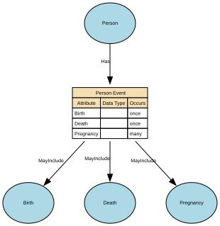

# Person Event

An occurrence or change in circumstance that happens to a specific Natural Person at a point in time (or over a period of time) and is relevant to business processes, reporting, or understanding that person’s history. It captures something that happens to or is experienced by the person, rather than a role or relationship they hold.

## Implements Concepts from Person Domain, Concept Model

| Concept | Description |
|---------|-------------|
| Person Event | An occurrence or change in circumstance that happens to a specific Natural Person at a point in time (or over a period of time) and is relevant to business processes, reporting, or understanding that person’s history. It captures something that happens to or is experienced by the person, rather than a role or relationship they hold. |

## Attributes

| Attribute | Description | Data type | Occurs |
|-----------|-------------|-----------|--------|
| Birth |  | structure | once |
| Death |  | structure | once |
| Pregnancy |  | structure | many |

## Relationships

- [Person Event MayInclude Pregnancy](../../relationships/69a87073f751de507cd77c94/index.html) → [Pregnancy](../../entities/69a87051f751de507cd77aec/index.html)
- [Person Event MayInclude Birth](../../relationships/69a48c8ff751de507cd4eac0/index.html) → [Birth](../../entities/69a48be5f751de507cd4e22e/index.html)
- [Person Event MayInclude Death](../../relationships/69a4901bf751de507cd50856/index.html) → [Death](../../entities/69a49009f751de507cd507d6/index.html)
- [Person Has Person Event](../../relationships/699dbe50f751de507cd23a63/index.html) ← [Person](../../entities/699dbdecf751de507cd233fc/index.html)
