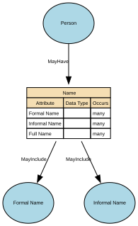

# Name

A textual identifier used to refer to or represent a Natural Person, Organisation, Place, or other entity. In conceptual modelling, a Name describes how something is known or addressed, not what it is. Names may consist of multiple components, may vary by context, and may change over time.

At least one Formal Name is required for a Person to ensure a minimum identity representation, while Informal Name remains optional.

## Implements Concepts from Person Domain, Concept Model

| Concept | Description |
|---------|-------------|
| Name | A textual identifier used to refer to or represent a Natural Person, Organisation, Place, or other entity. In conceptual modelling, a Name describes how something is known or addressed, not what it is. Names may consist of multiple components, may vary by context, and may change over time. |

## Attributes

| Attribute | Description | Data type | Occurs |
|-----------|-------------|-----------|--------|
| Formal Name |  | structure | many |
| Informal Name |  | structure | many |
| Full Name |  |  | many |

## Relationships

- [Person MayHave Name](../../relationships/69a4743cf751de507cd3f2b3/index.html) ← [Person](../../entities/699dbdecf751de507cd233fc/index.html)
- [Name MayInclude Formal Name](../../relationships/69a491a2f751de507cd5239e/index.html) → [Formal Name](../../entities/69a49187f751de507cd52317/index.html)
- [Name MayInclude Full Name](../../relationships/69a492c8f751de507cd543ec/index.html) → [Full Name](../../entities/69a4929af751de507cd542c8/index.html)
- [Name MayInclude Informal Name](../../relationships/69a493f2f751de507cd55354/index.html) → [Informal Name](../../entities/69a4939cf751de507cd54f65/index.html)
