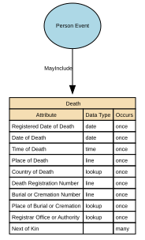

# Death

The factual, legally recognised details surrounding the end of an individual’s life. It includes authoritative attributes such as the date, time, and location of death, as well as official registration information issued by a competent authority. This event provides a definitive closure point for identity records and downstream operational processes.

## Implements Concepts from Person Domain, Concept Model

| Concept | Description |
|---------|-------------|
| Death | The factual, legally recognised details surrounding the end of an individual’s life. It includes authoritative attributes such as the date, time, and location of death, as well as official registration information issued by a competent authority. This event provides a definitive closure point for identity records and downstream operational processes. |

## Attributes

| Attribute | Description | Data type | Occurs |
|-----------|-------------|-----------|--------|
| Registered Date of Death | Registered Date of Death is the official date on which a death is formally recorded by the competent civil authority (e.g., civil registry, vital statistics office, municipal registration authority). It reflects the administrative timestamp at which the death was legally recognised and entered into the official civil registration system. It is distinct from the Date of Death (the factual date the individual died).  This attribute underpins legality, auditability, entitlement cessation, and identity lifecycle closure. | date | once |
| Date of Death | Date of Death is the official calendar date on which an individual died, as determined by an authorised certifying professional (e.g., medical practitioner, coroner) or documented on an official death certificate. It represents the actual event date of death — distinct from administrative or registration dates.  This attribute is a core life‑event anchor used across legal, identity, civil‑registration, financial, and operational systems. | date | once |
| Time of Death | Time of Death is the precise time at which an individual is determined to have died, as recorded by a qualified certifying authority (e.g., medical practitioner, coroner, forensic examiner). It is a clinical and/or legal timestamp, distinct from the Date of Death and the Registered Date of Death, and may represent:  * Physiological time of death (actual biological death), or * Pronounced time of death (time a clinician confirmed death), depending on jurisdictional standards. | time | once |
| Place of Death | Place of Death is the geographical location where the individual died, as recorded by the certifying authority (medical practitioner, coroner, hospital administrator) or entered by a civil registration body. It describes the physical setting and locality of the death event, not the registration location or the place where the body was later moved.  Place of Death is a legally relevant identity event attribute that provides context for verification, audit, lineage, and civil‑registration accuracy. | line | once |
| Country of Death | Country of Death is the sovereign state or recognised territory in which an individual died, as recorded by a certifying authority (medical practitioner, coroner, registrar) or by an official civil registration system. It identifies the geopolitical jurisdiction where the death event occurred, using ISO‑3166‑1 country codes for canonical storage.  It is separate from:  * Place of Death (region, city, facility name) * Registered Place of Death (administrative location) * Cause of Death (clinical domain) * Country of Birth (birth event) | lookup | once |
| Death Registration Number | Death Registration Number is the unique identifier assigned by a civil registration authority to the official record of an individual’s death. It provides the authoritative reference for the death entry within the vital records or civil registration system, enabling:  * Legal recognition of the death * Issuance of death certificates * Identity lifecycle closure across systems * Audit and verification of death‑related updates  This identifier is assigned by the registering authority, not by the data‑processing organisation. | line | once |
| Burial or Cremation Number | Burial or Cremation Number is the official identifier assigned to a burial or cremation event by the relevant authority (e.g., cemetery authority, crematorium, local registrar, funeral director, or municipal burial office). It serves as a formal reference number linking the deceased to the specific burial or cremation record, supporting auditability, traceability, and compliance with local regulatory requirements.  It is distinct from the Death Registration Number and any Coroner/Medical Examiner references. | line | once |
| Place of Burial or Cremation | Place of Burial or Cremation is the geographical location where the deceased was formally buried, cremated, or otherwise disposed of, according to the disposition method legally recorded. It identifies the country, region, locality, and facility associated with the post‑death disposition event and is distinct from:  * Place of Death (where the person died) * Registered Place of Death (administrative) * Death Registration Number (legal identifier) * Burial/Cremation Number (disposition identifier)  It provides auditability, lineage, and compliance‑grade traceability for post‑death arrangements. | lookup | once |
| Registrar Office or Authority | Death Registrar Office or Authority identifies the official organisation, governmental body, or authorised civil registration office responsible for formally registering the death and issuing the death registration number or the death certificate. It represents the legal authority of record for the death event and forms part of the authoritative identity lineage.  This attribute ensures auditability, jurisdictional clarity, and traceability across public‑sector, health, and identity‑management systems. | lookup | once |
| Next of Kin | Next of Kin (NoK) is the designated individual(s) identified by a person — or recognised by law or policy — as their primary emergency, legal, or contact person in the event of serious illness, incapacity, or death. It expresses a relationship link, not a legal authority, unless explicitly granted through additional documentation (e.g., power of attorney).  Next of Kin is a person-to-person relationship attribute, not an identity attribute of the individual being described. | structure | many |

## Relationships

- [Person Event MayInclude Death](../../relationships/69a4901bf751de507cd50856/index.html) ← [Person Event](../../entities/699dbe0ef751de507cd23a3f/index.html)
