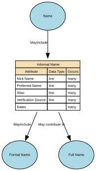

# Informal Name

The Informal Name sub‑domain captures non‑legal, non‑official name forms that an individual uses in everyday social, cultural, or operational contexts. These names support familiarity, personal preference, and communication ease but hold no legal standing and should not be used for identity verification or regulatory decisioning.

## Implements Concepts from Person Domain, Concept Model

| Concept | Description |
|---------|-------------|
| Informal Name | The Informal Name sub‑domain captures non‑legal, non‑official name forms that an individual uses in everyday social, cultural, or operational contexts. These names support familiarity, personal preference, and communication ease but hold no legal standing and should not be used for identity verification or regulatory decisioning. It may be used as formal name, informal name, or family name. It can be a shortened version of the formal given name or middle name, or family name.&#x20; |

## Attributes

| Attribute | Description | Data type | Occurs |
|-----------|-------------|-----------|--------|
| Nick Name | A Nick Name is an informal, non‑legal, personally or socially used variant of an individual’s name. It is a familiar, casual, or culturally specific form that the person may be known by in social, internal, or low‑formality contexts.  It is not legally authoritative, not used for identity verification, and must only be stored when voluntarily self‑reported.  A Nick Name may:  * Shorten a formal name (e.g., Ben for Benjamin) * Modify it culturally (e.g., Sasha for Alexander, Lulu for Louise) * Be an informal or affectionate form (e.g., Buddy, Ace) * Be used only in certain communities or internal teams | line | many |
| Preferred Name | Preferred Name is the non‑legal, self‑chosen name an individual wishes to be addressed by in day‑to‑day communication, services, internal systems, or user‑experience contexts. It may or may not match the person’s legal/formal name. Preferred Name may change over time as the individual's preferences evolve and may include:  * A shortened form of the legal given name * A culturally chosen name used in social or professional contexts * An anglicised or localised form * A chosen first name reflecting personal identity  Preferred Name is authoritative for communication, but not valid for legal, regulatory, or identity verification purposes. | line | many |
| Alias | An Alias is an alternative name that an individual uses in a specific professional, legal, operational, cultural, or pseudonymous context, distinct from their legal name, preferred name, or informal nickname. Aliases may include professional names, stage names, pseudonyms, maiden names used professionally, or documented historical names used in particular roles or activities.  An Alias is not self‑evidently a legal name, but may still require governance depending on usage.  Aliases are used where a person is known by multiple identities in different legitimate contexts. | line | many |
| Verification Source | Verification Source for Informal Names identifies how an informal name (nickname or casual name) was obtained, confirming its origin, provenance, and reliability. Because informal names are non‑legal, non‑authoritative, and self‑expressive, the verification source typically indicates self‑report or low‑assurance internal capture, rather than any formal identity check.  It supports auditability and appropriate use of informal names without elevating them to official identity attributes. | line | many |
| Dates | Dates for Informal Name specify the period of time during which a specific informal name (nickname or casual name) is valid, active, or in use for an individual. Because informal names are self‑reported, non‑legal, and changeable, these dates provide temporal boundaries that support correct display, respectful communication, and accurate identity history without elevating informal names to legal status.  Typical fields include:  * effective\_from — the date the informal name began being used or recorded * effective\_to — the date the informal name ceased being used (nullable if still active) * capture\_date — when the name entry was created (optional but common)  These dates apply per informal name record. | structure | many |

## Relationships

- [Informal Name MayInclude Formal Name](../../relationships/69c6d3d59f84c55e29926b22/index.html) → [Formal Name](../../entities/69a49187f751de507cd52317/index.html)
- [Informal Name May contribute to Full Name](../../relationships/69d4ee109f84c55e2993a1aa/index.html) → [Full Name](../../entities/6a182eac4055a62b0ab568ab/index.html)
- [Informal Name May Be Included In Full Name](../../relationships/6a183a704055a62b0ab5a6b7/index.html) → [Full Name](../../entities/69a4929af751de507cd542c8/index.html)
- [Name MayInclude Informal Name](../../relationships/69a493f2f751de507cd55354/index.html) ← [Name](../../entities/69a4741df751de507cd3f284/index.html)
