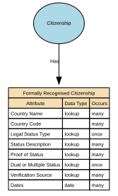

# Formally Recognised Citizenship 

Formally Recognised Citizenship captures a person’s legally conferred nationality status as recognised by a sovereign state or authority. It reflects official citizenship(s) in force, with provenance to authoritative sources (e.g., passport, national identity registry, certificate of naturalisation).

## Implements Concepts from Person Domain, Concept Model

| Concept | Description |
|---------|-------------|
| Formally Recognised Citizenship | Formally Recognised Citizenship captures a person’s legally conferred nationality status as recognised by a sovereign state or authority. It reflects official citizenship(s) in force, with provenance to authoritative sources (e.g., passport, national identity registry, certificate of naturalisation). |

## Attributes

| Attribute | Description | Data type | Occurs |
|-----------|-------------|-----------|--------|
| Country Name | Country Name (Official) is the authoritative, internationally recognised full name of a sovereign state or territory, as recorded in a trusted external standard such as ISO‑3166, the United Nations Terminology Bulletin, or a national government’s official designation. It provides a stable, canonical reference for interoperability, compliance, jurisdictional mapping, and cross‑system alignment. | lookup | many |
| Country Code | Country Code is the standardised alphanumeric or numeric code assigned to a country or territory by an authoritative international standard—most commonly ISO‑3166‑1. It provides a canonical, compact, and language‑independent identifier for countries, enabling consistent interoperability, integration, and global reporting across systems.  This attribute is part of core reference data and must be stable, globally consistent, and governed. | structure | many |
| Legal Status Type | Legal Status of Citizenship describes the formal, legally recognised standing of an individual’s citizenship with respect to a specific country or jurisdiction. It indicates whether citizenship is legally conferred, retained, suspended, revoked, renounced, conditional, or otherwise formally determined under that state's nationality laws.  It reflects legal fact, not self‑identification, residency rights, or application stage. It must be based on authoritative government records, never inferred. | lookup | once |
| Status Description | Citizenship Status Description is a categorical attribute that describes the current legal standing of an individual’s citizenship with respect to a specific country or authority. It expresses whether citizenship is active, revoked, renounced, suspended, conditional, or historical, and, where relevant, the administrative or legal context behind that status.  It does not store legal reasoning, detailed case information, immigration status, or residency rights. | lookup | many |
| Proof of Status | Proof of Status for Citizenship is a structured evidence attribute that records the authoritative documentation or verification method used to confirm an individual’s legally recognised citizenship with a specific country. It captures what evidence was provided, how it was validated, and by whom, without storing the document itself. This attribute provides the audit trail underpinning the Legal Status of Citizenship and Citizenship Status Description records. | lookup | many |
| Dual or Multiple Status | Dual or Multiple Citizenship Status indicates whether an individual holds more than one legally recognised citizenship at the same time. It is a derived, categorical attribute summarising the number of active citizenships linked to the individual, based on authoritative legal citizenship records.  This attribute expresses the cardinality of citizenship, not the legal details of each citizenship.  It does not infer hierarchy, privilege, or rights — it simply describes whether citizenship is single, dual, or multiple. | lookup | once |
| Verification Source | Verification Source (Citizenship) identifies the authoritative channel, system, or method through which a person’s citizenship was validated. It records where the verification came from, such as a government registry, document check, consular confirmation, or trusted digital identity service. It does not store the document itself or legal reasoning — only the verification provenance. It is metadata about how citizenship was confirmed, not evidence itself.  This attribute ensures transparency, auditability, and trust in citizenship status. | lookup | many |
| Dates | Dates for Formally Recognised Citizenship define the legal and administrative time periods during which a person’s citizenship in a specific country is valid, active, suspended, revoked, renounced, or historically recognised. These dates provide a temporal record of citizenship lifecycle, enabling accurate legal interpretation, compliance operations, and historical identity reconstruction.  The attribute set typically includes:  * citizenship\_effective\_from — when citizenship legally begins * citizenship\_effective\_to — when it legally ends (nullable if still active) * status\_change\_date — date a legal status transition occurs (optional) * verification\_date — date citizenship was last officially verified (stored separately or linked)  These dates apply per citizenship record, not globally to the individual. | date | many |

## Relationships

- [Citizenship Has Formally Recognised Citizenship](../../relationships/69a49565f751de507cd56e68/index.html) ← [Citizenship](../../entities/69a49420f751de507cd55a75/index.html)
