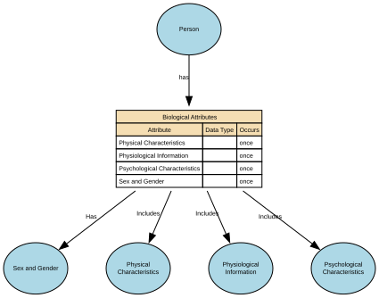

# Biological Attributes

Inherent physical, physiological, or genetic characteristics of a Natural Person that arise from biology rather than social, cultural, or legal identity.

Biological Attributes describe intrinsic properties of the human body and are distinct from personal identity attributes (e.g., name), demographic identity (e.g. ethnicity), or legal identity (e.g, citizenship).

## Implements Concepts from Person Domain, Concept Model

| Concept | Description |
|---------|-------------|
| Biological Attributes | Inherent physical, physiological, or genetic characteristics of a Natural Person that arise from biology rather than social, cultural, or legal identity.&#x20;  Biological Attributes describe intrinsic properties of the human body and are distinct from personal identity attributes (e.g., name), demographic identity (e.g., ethnicity), or legal identity (e.g., citizenship). |

## Attributes

| Attribute | Description | Data type | Occurs |
|-----------|-------------|-----------|--------|
| Physical Characteristics |  | data type | once |
| Physiological Information |  | data type | once |
| Psychological Characteristics |  | data type | once |
| Sex and Gender |  | data type | once |

## Relationships

- [Person has Biological Attributes](../../relationships/69a49621f751de507cd5773a/index.html) ← [Person](../../entities/699dbdecf751de507cd233fc/index.html)
- [Biological Attributes Includes Physical Characteristics](../../relationships/69a49878f751de507cd59245/index.html) → [Physical Characteristics](../../entities/69a49864f751de507cd59150/index.html)
- [Biological Attributes Has Sex and Gender](../../relationships/69a4a0c7f751de507cd5b8cb/index.html) → [Sex and Gender](../../entities/69a4a038f751de507cd5b038/index.html)
- [Biological Attributes Includes Physiological Information](../../relationships/69a4a0dbf751de507cd5b9d4/index.html) → [Physiological Information](../../entities/69a49fbdf751de507cd5a26c/index.html)
- [Biological Attributes Includes Psychological Characteristics](../../relationships/69a4a127f751de507cd5bc26/index.html) → [Psychological Characteristics](../../entities/69a4a08df751de507cd5b7c3/index.html)
