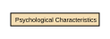

# Psychological Characteristics

Psychological Characteristics refer to non‑clinical, non‑diagnostic attributes that describe an individual’s typical cognitive, emotional, and behavioural tendencies. These characteristics represent stable patterns of thinking and behaviour, not mental health conditions, and do not uniquely identify a person. They may include personality traits, cognitive style descriptors, and general behavioural dispositions.

## Relationships

- [Biological Attributes Includes Psychological Characteristics](../../relationships/69a4a127f751de507cd5bc26/index.html) ← [Biological Attributes](../../entities/69a49610f751de507cd5766e/index.html)
