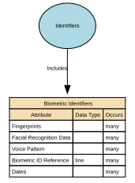

# Biometric Identifiers

Biometric Identifiers are data elements that capture a person’s unique biological or behavioural traits for the purpose of identification, authentication, or verification. This includes raw biometric measurements (e.g., fingerprints), biometric templates derived from those measurements, and any metadata required to process or match them.

## Implements Concepts from Person Domain, Concept Model

| Concept | Description |
|---------|-------------|
| Biometric Identifiers | Biometric Identifiers are data elements that capture a person’s unique biological or behavioural traits for the purpose of identification, authentication, or verification. This includes raw biometric measurements (e.g., fingerprints), biometric templates derived from those measurements, and any metadata required to process or match them. |

## Attributes

| Attribute | Description | Data type | Occurs |
|-----------|-------------|-----------|--------|
| Fingerprints | Fingerprints are unique biometric identifiers derived from the ridge patterns present on an individual’s fingers. They are captured as digital biometric templates, images, or encoded representations, and used solely for high‑assurance identity verification, authentication, or law‑enforcement purposes where legally justified.  Fingerprints are immutable, uniquely identifying, and classified as special category biometric data under data‑protection law.  This attribute does not store raw images unless explicitly permitted. Biometric templates (mathematically encoded forms) are the standard for secure storage. | structure | many |
| Facial Recognition Data | Facial Recognition Data refers to biometric templates or encoded vectors generated from an individual’s facial features for the purpose of identity verification, authentication, or uniqueness checks, under strictly governed legal circumstances.  It may include:  * Face embeddings (vectorised mathematical representations) * Biometric templates compliant with standards (e.g., ISO/IEC 19794‑5) * Minimal faceprint data necessary for matching  It does not include raw photographs unless stored separately under distinct image-governance policies.  Facial recognition data is unique, unavoidable, permanent, and highly sensitive, and therefore must never be used outside lawful, authorised workflows. | structure | many |
| Voice Pattern | Voice Pattern refers to the digitally captured and mathematically encoded representation of an individual’s vocal characteristics (pitch, timbre, rhythm, formants, spectral features). It is stored as a voice biometric template or voiceprint, not as raw audio.  Voice patterns enable high‑assurance identity verification or authentication when legally authorised, but must never be used for emotion detection, demographic inference, or behavioural profiling.  Voice Pattern ≠ raw recording; it is an irreversible, encrypted biometric template. | structure | many |
| Biometric ID Reference | Biometric IDs are unique, immutable physiological or behavioural identifiers derived from an individual's biological characteristics (e.g., fingerprints, facial geometry, iris patterns, voice patterns) used for high‑assurance identity verification or authentication under strict legal and governance controls.  A Biometric ID refers specifically to the unique biometric template or identifier representing a biometric modality—not the raw data itself. Examples: fingerprint template ID, facial recognition template ID, iris scan template ID.  Biometric IDs must be stored as non-reversible encrypted templates or reference tokens, never as raw biometric images or recordings. | line | many |
| Dates | Biometrics are time‑bounded credentials  Biometric Identifier Valid From (Effective From) - The date/time from which the biometric identifier is considered valid for use (e.g., after successful enrolment and any required verification/quality checks).  Biometric Identifier Valid To (Effective To) - The date/time at which the biometric identifier ceases to be valid for use, due to expiry, revocation, replacement, compromise, or policy change. | structure | many |

## Relationships

- [Identifiers Includes Biometric Identifiers](../../relationships/69a4a288f751de507cd5d20d/index.html) ← [Identifiers](../../entities/69a4a242f751de507cd5cfb1/index.html)
