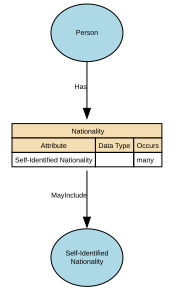

# Nationality

Describes how an individual identifies with one or more nations, countries, or national groups.

In the Person domain, nationality is treated as a matter of personal identity and self‑expression, rather than legal status. Formal legal nationality or citizenship is modelled separately under Citizenship.

## Implements Concepts from Person Domain, Concept Model

| Concept | Description |
|---------|-------------|
| Nationality | A person’s formal affiliation to a nation or cultural identity, typically associated with the country or nation with which they identify or are recognised as belonging. In a conceptual model, Nationality represents a descriptive, identity‑based attribute of a Natural Person that may be based on heritage, birth, culture, or personal identification. |

## Attributes

| Attribute | Description | Data type | Occurs |
|-----------|-------------|-----------|--------|
| Self-Identified Nationality | Represents how an individual self-identifies their nationality or affiliation to one or more countries or recognised groups. Values should be drawn from a controlled vocabulary (e.g. ISO country codes or recognised classifications), rather than free text input. A specific value set is not mandated at this stage and will be defined through future governance. This attribute captures self-identified identity and is distinct from formal legal nationality or citizenship, which is modelled separately. | structure | many |

## Relationships

- [Nationality MayInclude Self-Identified Nationality](../../relationships/69a4a6ddf751de507cd5fb94/index.html) → [Self-Identified Nationality](../../entities/69a4a6a0f751de507cd5f910/index.html)
- [Person Has Nationality](../../relationships/69a4a6bdf751de507cd5fa55/index.html) ← [Person](../../entities/699dbdecf751de507cd233fc/index.html)
