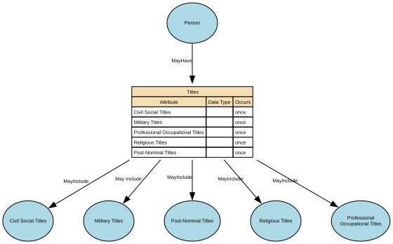

# Titles

An honorific or form of address associated with a Natural Person, used to indicate courtesy, social status, professional standing, or preference. It does not identify the person and does not imply any legal role or relationship—it's simply an attribute describing how the person chooses (or is required) to be addressed.

## Implements Concepts from Person Domain, Concept Model

| Concept | Description |
|---------|-------------|
| Titles | An honorific or form of address associated with a Natural Person, used to indicate courtesy, social status, professional standing, or preference. It does not identify the person and does not imply any legal role or relationship—it's simply an attribute describing how the person chooses (or is required) to be addressed. |

## Attributes

| Attribute | Description | Data type | Occurs |
|-----------|-------------|-----------|--------|
| Civil Social Titles | Professional Occupational Titles are titles or prefixes associated with a person’s profession, occupation, or accredited role, used to indicate an individual’s professional standing, qualification, or occupational function. They are not academic degrees or post‑nominals, but pre‑nominal markers tied to recognised professions (e.g., Dr, Prof, Eng, Nurse, Architect). These titles support appropriate address, professional recognition, and role‑based communication. | structure | once |
| Military Titles | Military Titles represent the official ranks, grades, and honorific forms of address assigned to individuals within armed forces or uniformed services (e.g., Lieutenant, Captain, Colonel). These titles indicate hierarchical position, authority, and command responsibility. They are role‑based, not personal, and may change throughout a career. | structure | once |
| Professional Occupational Titles | Professional / Occupational Titles are role‑based or qualification‑based titles that indicate a person’s profession, occupation, licensure, position, or accredited status within a recognised field. They reflect professional standing, licensed capacity, or institutionally granted rank, and may be:  * legally protected, * regulated by a professional body, or * organisationally assigned.  These titles are distinct from civil courtesy titles (Mr, Ms), preferred/social titles (Mx, preferred forms), religious titles (Rev), and military ranks (Captain). | structure | once |
| Religious Titles | Religious Titles are formal honorifics, ranks, or styles of address associated with roles, positions, or consecrated statuses within recognised religious traditions (e.g., Reverend, Rabbi, Imam, Sister, Monsignor, Guru). These titles indicate spiritual authority, clerical office, or religious vocation, and are used in formal or community contexts to show respect and denote role-based standing. | structure | once |
| Post-Nominal Titles | Post‑Nominal Titles are letters placed after a person’s name that denote orders, decorations, honours, academic degrees, professional memberships, licensure, or fellowships (e.g., OBE, PhD, FRCS, CPA). They confer recognition or qualification, not forms of address, and are typically governed by awarding bodies with formal usage rules. |  | once |

## Relationships

- [Person MayHave Titles](../../relationships/69a4a973f751de507cd61c5e/index.html) ← [Person](../../entities/699dbdecf751de507cd233fc/index.html)
- [Titles MayInclude Civil Social Titles](../../relationships/69a4aa2ff751de507cd62bac/index.html) → [Civil Social Titles](../../entities/69a4a99af751de507cd6242d/index.html)
- [Titles May Include Military Titles](../../relationships/69a4bc5ef751de507cd647c1/index.html) → [Military Titles](../../entities/69a4bc47f751de507cd64638/index.html)
- [Titles MayInclude Religious Titles](../../relationships/69a4bce3f751de507cd65374/index.html) → [Religious Titles](../../entities/69a4bccef751de507cd651e0/index.html)
- [Titles MayInclude Post-Nominal Titles](../../relationships/69a4bd1bf751de507cd65d15/index.html) → [Post-Nominal Titles](../../entities/69a4bd06f751de507cd65b7f/index.html)
- [Titles MayInclude Professional Occupational Titles](../../relationships/69a49fd8f751de507cd5a36d/index.html) → [Professional Occupational Titles](../../entities/69a4aa60f751de507cd6338d/index.html)
