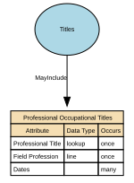

# Professional Occupational Titles

Professional Occupational Titles are titles or prefixes associated with a person’s profession, occupation, or accredited role, used to indicate an individual’s professional standing, qualification, or occupational function. They are not academic degrees or post‑nominals, but pre‑nominal markers tied to recognised professions (e.g., Dr, Prof, Eng, Nurse, Architect). These titles support appropriate address, professional recognition, and role‑based communication.

## Implements Concepts from Person Domain, Concept Model

| Concept | Description |
|---------|-------------|
| Professional Occupational Titles | Professional Occupational Titles are titles or prefixes associated with a person’s profession, occupation, or accredited role, used to indicate an individual’s professional standing, qualification, or occupational function. They are not academic degrees or post‑nominals, but pre‑nominal markers tied to recognised professions (e.g., Dr, Prof, Eng, Nurse, Architect). These titles support appropriate address, professional recognition, and role‑based communication. |

## Attributes

| Attribute | Description | Data type | Occurs |
|-----------|-------------|-----------|--------|
| Professional Title | A Professional Title is a formally recognised title, credential, or designation that indicates an individual’s professional status, qualification, licensure, accreditation, or role-based authority within a specific domain (e.g., medicine, law, engineering, academia). It signals that a person has achieved a professionally governed standing, often regulated by a professional body, accreditation authority, educational institution, or licensing regulator.  Professional Titles differ from:  * Civil courtesy titles (Mr, Ms, Mx) * Military ranks (Captain, Major) * Religious titles (Rev, Imam) * Job role titles (Head of Digital, Finance Manager) * Post‑nominals (PhD, MSc, CPA — qualification identifiers)  Professional Titles are role-, competence-, or licence‑based and often carry legal or operational implications. | lookup | once |
| Field Profession | Field Profession describes the broad professional field, discipline, or domain of practice within which an individual’s professional title, occupation, or role is situated. It captures the sector‑level classification (e.g., Medicine, Engineering, Law, Education) rather than a specific job title or qualification.  Field Profession creates a normalised, high‑level professional grouping that supports reporting, entitlement logic, governance, and rendering rules without storing overly granular occupational details.  It is not a job title, skill, qualification, or occupational code—rather, it is the professionally recognised field or discipline. | line | once |
| Dates | Dates Professional Title Held specify the time period during which an individual legitimately holds, is authorised to use, or is recognised as possessing a specific professional title (e.g., Dr (Medical), Professor, Chartered Engineer, Solicitor). These dates define the validity window of a professional title, reflecting licensure, certification, employment status, or accreditation from a professional body or authority.  Unlike Preferred Name or Courtesy Titles, professional titles are not self-declared — their timeline must reflect formal evidence.  Typical fields include:  * effective\_from — when the professional title became valid * effective\_to — when the professional title ceased being valid (nullable if still active) * grant\_date / conferment\_date — when the accrediting authority formally awarded the title * expiry\_date (if the title requires renewal, e.g., licences) * capture\_date — when the system recorded it (optional)  These dates are per professional title, not person‑wide. | structure | many |

## Relationships

- [Titles MayInclude Professional Occupational Titles](../../relationships/69a49fd8f751de507cd5a36d/index.html) ← [Titles](../../entities/69a4a95ef751de507cd61b0a/index.html)
