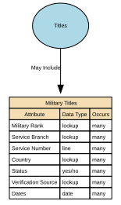

# Military Titles

Military Titles represent the official ranks, grades, and honorific forms of address assigned to individuals within armed forces or uniformed services (e.g., Lieutenant, Captain, Colonel). These titles indicate hierarchical position, authority, and command responsibility. They are role‑based, not personal, and may change throughout a career.

## Implements Concepts from Person Domain, Concept Model

| Concept | Description |
|---------|-------------|
| Military Titles | Military Titles represent the official ranks, grades, and honorific forms of address assigned to individuals within armed forces or uniformed services (e.g., Lieutenant, Captain, Colonel). These titles indicate hierarchical position, authority, and command responsibility. They are role‑based, not personal, and may change throughout a career. |

## Attributes

| Attribute | Description | Data type | Occurs |
|-----------|-------------|-----------|--------|
| Military Rank | Military Rank is an official, authority‑granted title that indicates an individual’s position, hierarchy level, and role status within an armed forces organisation (e.g., Army, Navy, Air Force, Marines, Space Force). It is a formal, regulated, and legally controlled title issued by a recognised military authority and subject to strict rules, protocols, and temporal validity.  Military Rank is distinct from:  * Job role titles (e.g., Platoon Commander) * Professional titles (e.g., Dr, Prof) * Civil courtesy titles (Mr, Ms) * Honorary military titles (different governance) | lookup | many |
| Service Branch | Service Branch identifies the specific branch of the armed forces in which an individual serves or has served (e.g., Army, Navy, Air Force, Marine Corps, Space Force). It provides the contextual organisational structure for interpreting military rank, military titles, service numbers, and authority-based entitlements.  It is a formal identity attribute within the military domain and must be authoritatively sourced from official service records. | lookup | many |
| Service Number | Service Number is the unique identifier assigned to an individual by a military authority upon enlistment, commission, or service enrolment. It serves as the primary official identifier for the individual within the context of military personnel systems, similar to but distinct from:  * National identity numbers * Unit assignment identifiers * Veteran reference numbers * Military occupational codes  It enables unambiguous identification of service members throughout their military career, across promotions, transfers, deployments, and administrative processes. | line | many |
| Country | Country of Defence Force identifies the nation‑state or recognised sovereign entity to which the defence force the individual serves (or has served) belongs. It anchors the Service Branch, Military Rank, and Service Number to the correct national military authority, clarifying jurisdiction, regulatory rules, rank hierarchy, and entitlements.  It does not infer nationality, citizenship, or ethnicity — it strictly identifies the country that operates the defence force. | lookup | many |
| Status | Country of Defence Force identifies the nation‑state or recognised sovereign entity to which the defence force the individual serves (or has served) belongs. It anchors the Service Branch, Military Rank, and Service Number to the correct national military authority, clarifying jurisdiction, regulatory rules, rank hierarchy, and entitlements.  It does not infer nationality, citizenship, or ethnicity — it strictly identifies the country that operates the defence force. | yes/no | many |
| Verification Source | Verification Source of Rank identifies the authoritative system, documentation, or military body used to verify the accuracy, legitimacy, and current status of an individual’s military rank. It answers the question: “Where did we confirm this rank came from, and how do we know it is valid?”  This attribute ensures that only evidence-backed, formally recognised ranks are reflected in identity and personnel systems. It also supports governance, entitlement validation, and auditability. | lookup | many |
| Dates | Dates for Rank specify the time period during which a specific military rank is valid, active, or historically recorded for an individual. These dates define the rank lifecycle — when the rank was granted, active, suspended, superseded, revoked, or transitioned to another status (e.g., retired).  Military rank is temporal and authoritative, meaning these dates must represent official, evidence‑based events (e.g., promotion orders, demotion decisions, retirement notices).  Typical fields include:  * rank\_effective\_from — the date the rank officially took effect * rank\_effective\_to — the date the rank ceased to be active (nullable if current) * rank\_grant\_date — when promotion/appointment was formally approved * rank\_revocation\_date — where applicable * capture\_date — when the system recorded the rank  These dates apply per rank record, not per person. | date | many |

## Relationships

- [Titles May Include Military Titles](../../relationships/69a4bc5ef751de507cd647c1/index.html) ← [Titles](../../entities/69a4a95ef751de507cd61b0a/index.html)
