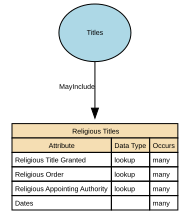

# Religious Titles

Religious Titles are formal honorifics, ranks, or styles of address associated with roles, positions, or consecrated statuses within recognised religious traditions (e.g., Reverend, Rabbi, Imam, Sister, Monsignor, Guru). These titles indicate spiritual authority, clerical office, or religious vocation, and are used in formal or community contexts to show respect and denote role-based standing.

## Implements Concepts from Person Domain, Concept Model

| Concept | Description |
|---------|-------------|
| Religious Titles | Religious Titles are formal honorifics, ranks, or styles of address associated with roles, positions, or consecrated statuses within recognised religious traditions (e.g., Reverend, Rabbi, Imam, Sister, Monsignor, Guru). These titles indicate spiritual authority, clerical office, or religious vocation, and are used in formal or community contexts to show respect and denote role-based standing. |

## Attributes

| Attribute | Description | Data type | Occurs |
|-----------|-------------|-----------|--------|
| Religious Title Granted | Religious Title Granted refers to the formal religious title, rank, or designation conferred on an individual by a recognised religious authority, institution, or governing body. It reflects a spiritually or institutionally recognised status, such as ordination, consecration, clergy appointment, or religious office.  Religious titles differ from civil courtesy titles (Mr, Ms), professional titles (Dr, Prof), military ranks (Captain), and job roles. They often carry ceremonial, pastoral, or leadership responsibilities within a faith community. | lookup | many |
| Religious Order | Religious Order identifies the specific monastic, clerical, or spiritual community, congregation, or tradition to which an individual belongs, has taken vows within, or is formally associated with. It represents a structured affiliation within a broader religion, typically defined by:  * A rule or charism (e.g., Franciscan, Benedictine) * A community or organisation (e.g., Jesuit community, Carmelite Order) * A tradition or lineage (e.g., Nichiren Buddhist order, Sufi tariqa)  This attribute is not the same as a religious title; it captures affiliation, not rank. | lookup | many |
| Religious Appointing Authority | Religious Order identifies the specific monastic, clerical, or spiritual community, congregation, or tradition to which an individual belongs, has taken vows within, or is formally associated with. It represents a structured affiliation within a broader religion, typically defined by:  * A rule or charism (e.g., Franciscan, Benedictine) * A community or organisation (e.g., Jesuit community, Carmelite Order) * A tradition or lineage (e.g., Nichiren Buddhist order, Sufi tariqa)  This attribute is not the same as a religious title; it captures affiliation, not rank. | lookup | many |
| Dates | Dates of Religious Title define the time period during which a specific religious title, role, clerical status, or spiritual office is valid, active, recognised, or historically recorded for an individual. These dates reflect formal ecclesiastical or religious processes such as ordination, appointment, consecration, commissioning, elevation, transfer, emeritus designation, revocation, or release.  This attribute ensures temporal accuracy, lineage, and authority-compliant handling of religious titles. | structure | many |

## Relationships

- [Titles MayInclude Religious Titles](../../relationships/69a4bce3f751de507cd65374/index.html) ← [Titles](../../entities/69a4a95ef751de507cd61b0a/index.html)
