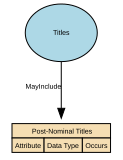

# Post-Nominal Titles

Post‑Nominal Titles are letters placed after a person’s name that denote orders, decorations, honours, academic degrees, professional memberships, licensure, or fellowships (e.g., OBE, PhD, FRCS, CPA). They confer recognition or qualification, not forms of address, and are typically governed by awarding bodies with formal usage rules.

## Implements Concepts from Person Domain, Concept Model

| Concept | Description |
|---------|-------------|
| Post-Nominal Titles | Post‑Nominal Titles are letters placed after a person’s name that denote orders, decorations, honours, academic degrees, professional memberships, licensure, or fellowships (e.g., OBE, PhD, FRCS, CPA). They confer recognition or qualification, not forms of address, and are typically governed by awarding bodies with formal usage rules. |

## Attributes

| Attribute | Description | Data type | Occurs |
|-----------|-------------|-----------|--------|
|  |  |  |  |

## Relationships

- [Titles MayInclude Post-Nominal Titles](../../relationships/69a4bd1bf751de507cd65d15/index.html) ← [Titles](../../entities/69a4a95ef751de507cd61b0a/index.html)
