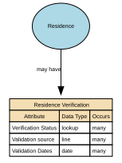

# Residence Verification

Residence Verification describes the degree of confidence, method, and evidence supporting the assertion that a Party (Person or Legal Entity) resides at a given Location.

## Implements Concepts from Person Domain, Concept Model

| Concept | Description |
|---------|-------------|
| Residence Verification | Residence Verification describes the degree of confidence, method, and evidence supporting the assertion that a Party (Person or Legal Entity) resides at a given Location. |

## Attributes

| Attribute | Description | Data type | Occurs |
|-----------|-------------|-----------|--------|
| Verification Status | Verification Status indicates whether a residency fact has been confirmed, is awaiting verification, remains unverified, or has been rejected based on the evaluation of evidence and authorised checks. | lookup | many |
| Validation source | Residence Validation Source describes the origin of the information or evidence used to confirm, refute, or assess the validity of a residence fact. | line | many |
| Validation Dates | Residence Validation Dates are the time‑based semantic properties that define the verification timestamp, validity window, and re‑verification schedule associated with a residency fact. | date | many |

## Relationships

- [Residence may have Residence Verification](../../relationships/69b2e018c3a89f06e1a17e95/index.html) ← [Residence](../../entities/69b2a6ddc3a89f06e1a0de69/index.html)
