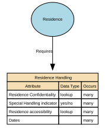

# Residence Handling

Residence Handling refers to the governed rules, behaviours, and constraints that define how residency data may be collected, processed, stored, shared, updated, retained, secured, and used within a data domain.

## Implements Concepts from Person Domain, Concept Model

| Concept | Description |
|---------|-------------|
| Residence Handling | Residence Handling refers to the governed rules, behaviours, and constraints that define how residency data may be collected, processed, stored, shared, updated, retained, secured, and used within a data domain. |

## Attributes

| Attribute | Description | Data type | Occurs |
|-----------|-------------|-----------|--------|
| Residence Confidentiality | Residence Confidentiality is the governed classification that determines the level of privacy protection applied to a residency fact, ensuring that residence information is disclosed, stored, accessed, and shared only in accordance with the required confidentiality level. | lookup | many |
| Special Handling indicator | Residence Special Handling indicator confirms if additional controls are required and how access will be permitted.&#x20; | yes/no | many |
| Residence accessibility | Residence Data Accessibility specifies the authorised access levels for residency facts, determining how much information can be viewed, by whom, and in which contexts, aligned with privacy, risk, legal, and safeguarding constraints. | lookup | many |
| Dates |  | structure | many |

## Relationships

- [Residence Requires Residence Handling](../../relationships/69b2e072c3a89f06e1a18933/index.html) ← [Residence](../../entities/69b2a6ddc3a89f06e1a0de69/index.html)
