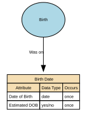

# Birth Date

This is the structure defining date of birth and how it's been defined.&#x20;

## Implements Concepts from Person Domain, Concept Model

| Concept | Description |
|---------|-------------|
| Date of Birth | Date of Birth (DOB) is the official calendar date on which an individual was born, as recognised by the appropriate civil authority or as evidenced by legally accepted documentation.  It is a core identity anchor, used across legal, administrative, operational, and analytical systems, and is typically immutable once verified.  DOB is distinct from the Birth Registration Date (administrative) and the Birth Notification Date (clinical/operational).  It may be an estimate.&#x20; |

## Attributes

| Attribute | Description | Data type | Occurs |
|-----------|-------------|-----------|--------|
| Date of Birth | Date of Birth (DOB) is the official calendar date on which an individual was born, as recognised by the appropriate civil authority or as evidenced by legally accepted documentation.  It is a core identity anchor, used across legal, administrative, operational, and analytical systems, and is typically immutable once verified.  DOB is distinct from the Birth Registration Date (administrative) and the Birth Notification Date (clinical/operational). | date | once |
| Estimated DOB | Estimated DOB is a data quality indicator used when precise dates of birth are unavailable for identification purposes. Per POLE Data Standards, estimated DOB must pass validation checks: must not be future dates, current dates, or ages exceeding 120 years | yes/no | once |

## Relationships

- [Birth Was on Date of Birth](../../relationships/69fb6770ea1f7a349307e89d/index.html) ← [Birth](../../entities/69a48be5f751de507cd4e22e/index.html)
